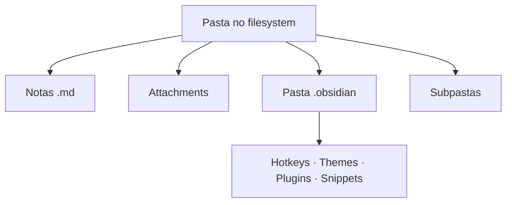

> [!abstract]
> Um **vault** é uma pasta do sistema de arquivos — incluindo todas as suas subpastas — que contém as notas, os [[Attachment|attachments]] e uma pasta `.obsidian` com a configuração específica daquela coleção.

## Conceito

O vault é a unidade de escopo do Obsidian: tudo o que existe é *dentro de um vault*. Não há banco de dados nem servidor no meio — a pasta **é** a base de conhecimento, e o app apenas a lê e escreve. Essa escolha é o que sustenta o [[Local-first]]: como as notas são arquivos de texto simples, outros editores e gerenciadores de arquivos podem alterá-las, e o Obsidian atualiza o vault automaticamente para acompanhar mudanças externas.

Você pode manter tudo em um único vault ou criar vários — por exemplo, para separar notas de trabalho e de estudo. Um vault pode ser criado em qualquer lugar que o sistema operacional permita, e sincronizado por [[Obsidian Sync]], Dropbox, iCloud, OneDrive, Git e outros serviços.

O escopo é literal: [[Internal Link (Wikilink)|internal links]] são locais ao vault. É por isso que o Obsidian precisa enxergar a coleção *inteira* — só assim consegue atualizar automaticamente os links quando um arquivo é renomeado (comportamento controlado por **Settings → Files and links → Automatically update internal links**).

## Estrutura

## Características

- **Formatos aceitos**: Markdown `.md`, Bases `.base`, JSON Canvas `.canvas`, imagens (`.avif`, `.bmp`, `.gif`, `.jpeg`, `.jpg`, `.png`, `.svg`, `.webp`), áudio (`.flac`, `.m4a`, `.mp3`, `.ogg`, `.wav`, `.webm`, `.3gp`), vídeo (`.mkv`, `.mov`, `.mp4`, `.ogv`, `.webm`) e PDF `.pdf`
- **Duas formas de começar**: *Create new vault* (pasta vazia nova) ou *Open folder as vault* (adotar uma pasta existente)
- **Renomear o vault renomeia a pasta** — nome do vault e nome da pasta são a mesma coisa
- **Remover da lista não apaga nada**: *Remove from list* só tira o vault do Vault switcher
- Copiar a pasta `.obsidian` de um vault para outro transfere as configurações — ver [[Configuration Folder]]

> [!warning] Duas proibições explícitas da doc
> Não crie **vault dentro de vault** — como os internal links são locais ao vault, os links podem não ser atualizados corretamente. E não crie vault **dentro da system folder** de configurações globais: isso pode levar a corrupção ou perda de dados.

> [!danger] Symbolic links e junctions
> A doc desaconselha fortemente symlinks dentro do vault: risco de perder ou corromper dados, ou derrubar o Obsidian. Loops são bloqueados, os alvos precisam ser disjuntos da raiz do vault, e symlinkar coisas sob `.obsidian/` para compartilhar entre vaults *tem alta chance de corromper as configurações*.

## Comparação

| | Vault (local) | Remote vault |
|---|---|---|
| Onde vive | Pasta no seu disco | Cópia mantida pelo [[Obsidian Sync]] |
| Fonte de verdade | Sim | Reflete mudanças do local |
| Contém `.obsidian` | Sim | Estado de sincronização |
| Funciona offline | Sim | Depende do serviço |

## Veja também

- [[Local-first]]
- [[Configuration Folder]]
- [[Attachment]]
- [[Criar e Organizar um Vault]]
- [[Backup]]
