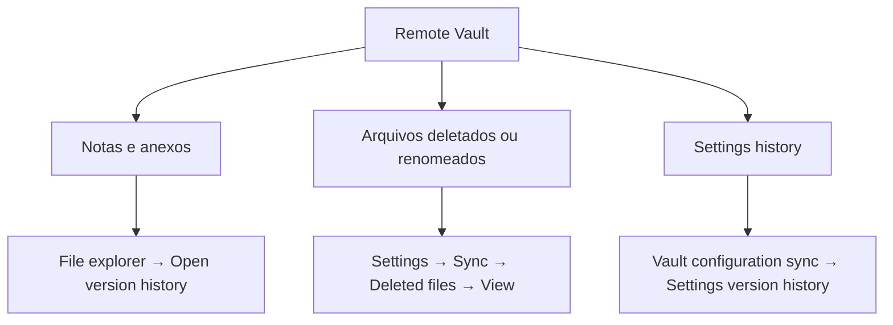

> [!abstract]
> **Version history** é o registro de todas as alterações nos arquivos sincronizados, mantido **no [[Remote Vault|remote vault]]** pelo [[Obsidian Sync]], a partir do qual notas, anexos, arquivos deletados e settings podem ser restaurados.

## Conceito

O ponto que organiza tudo o mais: o version history **é do remote vault**, não do dispositivo. Ele existe porque o Sync já precisa saber o que mudou, quando e vindo de onde para reconciliar dispositivos — o histórico é um subproduto natural dessa contabilidade. Daí decorrem três propriedades: é compartilhado entre dispositivos, carrega autoria e **conta para o limite de storage da conta**.

É por isso também que ele desaparece quando o remote vault é recriado — mudança de região, upgrade de criptografia ou redução de tamanho. O histórico não é um artefato independente que se preserve; é estado do serviço.

O contraponto local é o [[File Recovery]], que guarda snapshots completos fora do vault, nas Global settings, e **nunca sincroniza**.

## Retenção

| Item | Standard | Plus |
|---|---|---|
| Notas | 1 mês | 12 meses |
| [[Attachment\|Anexos]] | **Duas semanas** | **Duas semanas** |

> [!important] Anexos não seguem o plano
> "For attachments, older versions are stored for two weeks" — em qualquer plano. Isso tem efeito prático no downgrade: como o version history conta para o storage, remover attachments do local vault e esperar duas semanas libera espaço **preservando** o histórico dos arquivos Markdown.

## Os três escopos

- **Notas e anexos** — no File explorer, selecionar a nota e escolher **Open version history**; no mobile, long press para o menu de contexto. Escolher a versão à esquerda, conferir o conteúdo à direita, **Restore**
- **Arquivos deletados ou renomeados** — Settings → Core plugins → Sync → ao lado de **Deleted files**, **View**. O arquivo restaurado volta à sua localização original no sistema de arquivos
- **Settings history** — Settings → Sync → Vault configuration sync → **View** ao lado de *Settings version history*, escolher o arquivo de settings e **Restore**

## Características

- **Bulk restore**: selecionar múltiplas notas pelos checkboxes ou com `shift+click`. Esses arquivos **não podem ser revisados** nesse menu antes de restaurar
- Restaurar uma **setting exige reload ou restart** do Obsidian para ter efeito
- A **Sync history** da sidebar, introduzida no Obsidian 1.7, é um histórico de *edição*: mostra notas e anexos recém-criados ou modificados. Vem habilitada com o core plugin Sync, mas **não aparece na sidebar por padrão** — é preciso adicioná-la pelo comando *Sync: Show Sync history* ou por hotkey
- A Sync history **não mostra settings nem itens deletados** — esses só no version history
- No desktop, passar o mouse sobre um arquivo na Sync history mostra **quem o editou por último**, útil em vault compartilhado

## Comparação

| | Version History | [[File Recovery]] | [[Backup]] |
|---|---|---|---|
| Onde vive | **Remote vault** | Global settings, fora do vault | Fora do sistema Obsidian |
| Sincroniza | Sim, entre dispositivos | **Nunca** — é por dispositivo | Depende da ferramenta |
| Autoria | Sim, mostra quem editou por último | Não | Depende |
| Retenção | 1 ou 12 meses; anexos 2 semanas | Padrão 7 dias, snapshots a cada 5 min | Sua política |
| Tipos de arquivo | Notas, anexos, settings | Apenas `.md` e `.canvas` | Tudo |
| Conta para o storage do plano | **Sim** | Não | Não |
| Requer assinatura | Sim | Não, é core plugin | Não |
| Sobrevive a recriar o remote vault | **Não** | Sim, é local | Sim |

> [!warning]
> Nem version history nem File recovery são solução completa de backup — a própria doc do File recovery diz isso explicitamente e recomenda backup separado. Um é estado do serviço, o outro é [[Snapshot|snapshot]] local volátil.

## Veja também

- [[File Recovery]]
- [[Obsidian Sync]]
- [[Remote Vault]]
- [[Snapshot]]
- [[Backup]]
