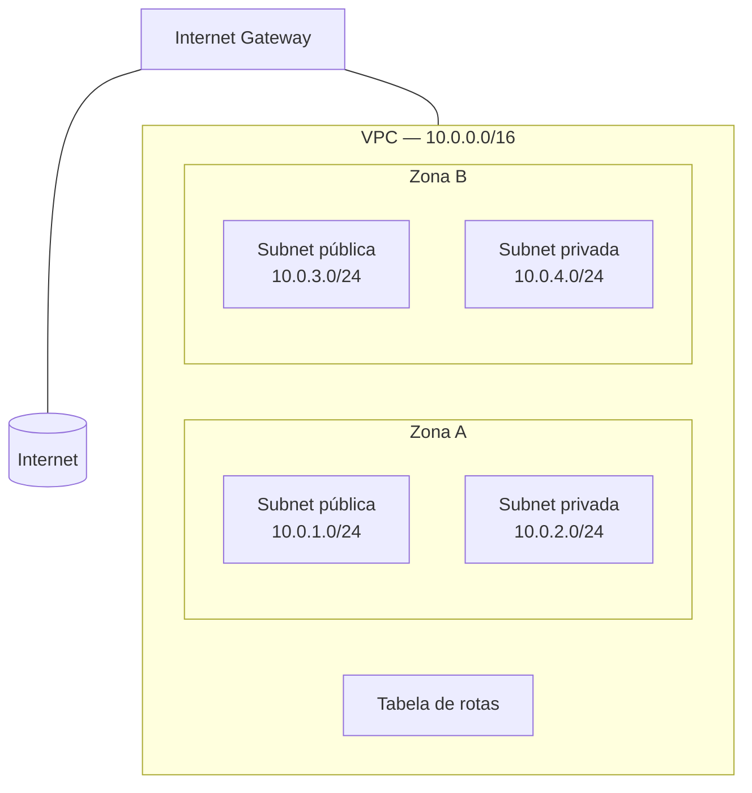

> [!abstract]
> VPC é uma **rede virtual logicamente isolada** dentro de um provedor de nuvem, que se parece com a rede que se operaria em um datacenter próprio — mas sobre infraestrutura elástica.

## Conceito

Sem VPC, recursos na nuvem seriam vizinhos indistinguíveis de recursos de terceiros. A VPC recria a fronteira de rede: um espaço de endereçamento próprio, sob controle de quem a criou, com regras explícitas sobre o que entra e o que sai.

## Componentes

| Componente | Papel |
|---|---|
| **[[Subnet]]** | Faixa de IPs dentro da VPC, sempre em uma única zona de disponibilidade |
| **Tabela de rotas** | Determina para onde vai o tráfego de cada subnet ou gateway |
| **Internet Gateway** | Conecta a VPC à internet |
| **VPC Endpoint** | Alcança serviços do provedor de forma privada, sem passar pela internet |
| **NAT Gateway** | Permite que recursos privados saiam para a internet sem receber conexões |
| **Peering / Transit Gateway** | Roteia tráfego entre VPCs e entre VPC e rede local |
| **Flow Logs** | Registra o tráfego IP das interfaces — insumo de [[Observability]] e auditoria |

## Endereçamento

O espaço da VPC é definido em notação [[CIDR]], normalmente com faixas privadas da RFC 1918 (`10.0.0.0/8`, `172.16.0.0/12`, `192.168.0.0/16`). A VPC recebe o bloco maior; cada [[Subnet]] recebe um pedaço.

> [!warning] O CIDR da VPC é praticamente irreversível
> Dimensionar apertado obriga a criar VPCs adicionais e resolver a comunicação entre elas com peering — que traz limites de rota e sobreposição de endereços. Dimensionar largo demais impede peering futuro com redes que usem faixa conflitante. É uma decisão de arquitetura, não de configuração.

## Fonte

- Amazon Web Services, [What is Amazon VPC?](https://docs.aws.amazon.com/vpc/latest/userguide/what-is-amazon-vpc.html), AWS Documentation

## Veja também

- [[Subnet]]
- [[CIDR]]
- [[Load Balancer]]
- [[Cloud Native]]
- [[Infrastructure as Code]]
- [[Bulkhead]]
- [[System Design MOC]]
