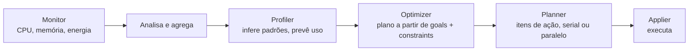

> [!abstract]
> Serviço de otimização de recursos do OpenStack: analisa o uso histórico, propõe um plano de ação e o executa para consolidar workloads em menos hardware.

## Conceito

Automatiza um ciclo que antes era manual e propenso a erro: coletar métricas históricas de uso, analisá-las em sprints regulares e decidir realocações. Em deployment grande, fazer isso na mão não escala.

## Estrutura

Fluxo do operador:

1. Criar um **goal** e associá-lo a uma **strategy**.
2. Criar um **audit template** ligado ao goal.
3. Criar um **audit** disparado pelo template.
4. O audit gera um **action plan**.
5. Executar.

Estados: audit vai de `PENDING` a `SUCCEEDED`; o action plan nasce `RECOMMENDED` e passa por `PENDING` → `ONGOING` → `SUCCEEDED`.

## Características

| Indicador | Significado |
|---|---|
| **Efficacy indicators** | Nós no escopo e contagem de migrações a executar |
| **Global efficacy** | Nós liberados ÷ nós no escopo do audit |

> [!important] O Watcher recomenda; o operador decide
> O estado `RECOMMENDED` é deliberado — o plano é revisado antes de qualquer migração de instância.

> [!tip] Agendamento e otimização são o mesmo problema
> Uma configuração bem pensada de filtros e pesos no scheduler do [[Nova]] não serve só para alocar: dá ao planner do Watcher um espaço de busca melhor.

## Veja também

- [[FinOps]]
- [[Nova]]
- [[Placement]]
- [[Capacity and Performance Management]]
