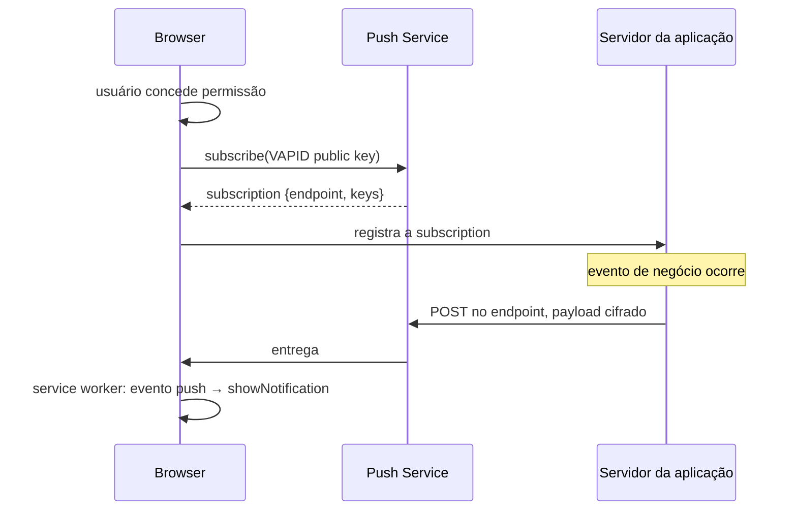

> [!abstract]
> Web Push é o protocolo que permite a um servidor entregar uma notificação ao navegador do usuário mesmo com a aplicação fechada, através de um serviço de push intermediário operado pelo fabricante do navegador.

## Conceito

A aplicação não recebe a mensagem: o **navegador** recebe. O servidor da aplicação envia ao *push service* (FCM no Chrome, Mozilla autopush no Firefox, APNs no Safari), que a entrega ao dispositivo e acorda o [[Service Worker]] correspondente, que por sua vez decide exibir a notificação.

## VAPID e criptografia ponta a ponta

O **endpoint** da subscription é uma URL pública: qualquer um que a possua poderia enviar mensagens. Dois mecanismos fecham isso:

- **VAPID** — o servidor assina cada envio com sua chave privada; a pública foi declarada na inscrição. O push service rejeita quem não corresponde
- **Payload cifrado** com as chaves da subscription (`p256dh`, `auth`). O push service **transporta sem conseguir ler** o conteúdo

## Diferença crucial em relação ao WebSocket

| | **Web Push** | **[[WebSocket]]** |
|---|---|---|
| Aplicação precisa estar aberta | Não | Sim |
| Latência | Segundos, sujeita ao push service | Milissegundos |
| Custo por mensagem | Zero para a aplicação | Conexão persistente cobrada |
| Uso adequado | Reengajamento, evento importante fora da sessão | Atualização de estado na tela em uso |

Os dois são complementares, não alternativos: WebSocket atualiza a interface de quem está olhando; push avisa quem não está.

## Ciclo de vida da subscription

- A subscription **expira e é rotacionada** pelo navegador. Um endpoint que passa a retornar `410 Gone` deve ser removido do banco imediatamente, senão a base acumula destinos mortos
- Um usuário tem uma subscription **por navegador e por dispositivo** — o modelo de dados é uma coleção por usuário, não um campo
- A permissão negada é sticky: o navegador não volta a perguntar. Pedir permissão no primeiro segundo da primeira visita é a forma mais eficiente de perdê-la para sempre

> [!important] Peça a permissão no momento em que ela faz sentido
> O pedido deve vir depois de uma ação que o justifique ("avise-me quando o relatório ficar pronto"), não no carregamento da página. A taxa de concessão muda por ordens de grandeza — e a recusa é definitiva.

## Veja também

- [[Service Worker]]
- [[Progressive Web App (PWA)]]
- [[Amazon SNS]]
- [[WebSocket]]
