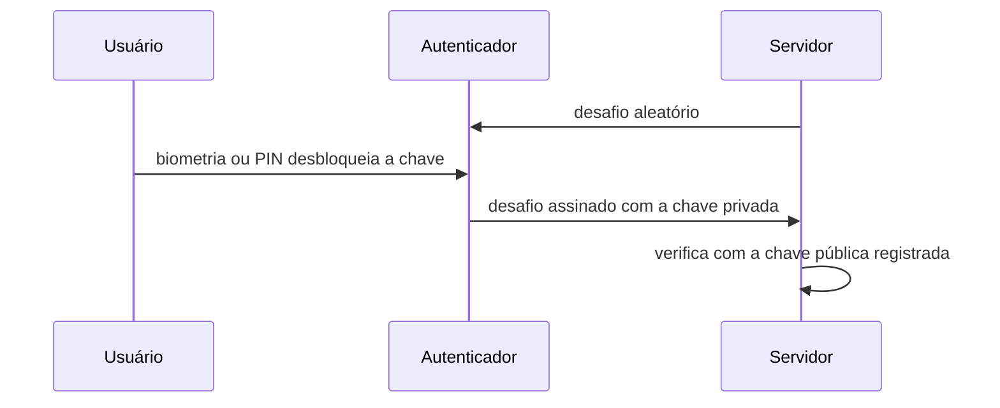

> [!abstract]
> WebAuthn é o padrão que substitui a senha por **criptografia de chave pública**: o dispositivo guarda a chave privada, o servidor guarda apenas a pública, e nada reutilizável trafega.

## Conceito

Toda falha estrutural da senha vem do mesmo fato: é um **segredo compartilhado**. Ela precisa ser conhecida pelos dois lados, o que a torna passível de vazamento, reúso entre sites, phishing e credential stuffing — e é o motivo de existir toda a complexidade descrita em [[Armazenamento Seguro de Senhas]].

WebAuthn elimina o segredo compartilhado. No registro, o autenticador gera um **par de chaves por site**; a privada nunca sai do dispositivo. No login, o servidor envia um desafio e o dispositivo o assina.

## Por que resiste a phishing

> [!important] A origem faz parte da assinatura
> A chave é vinculada ao domínio que a registrou. Um site falso em `banc0.com` **não consegue** obter uma assinatura válida para `banco.com` — o navegador se recusa a usar a chave. Essa proteção é estrutural, não depende de o usuário perceber o domínio errado.

## Passkeys

Passkeys são credenciais WebAuthn **sincronizadas** pelo ecossistema do usuário (Apple, Google, Microsoft ou um gerenciador de senhas), em vez de presas a um único dispositivo. Isso resolve o problema prático que travava a adoção: perder o celular deixava de significar perder a conta.

| | **Senha** | **Passkey** |
|---|---|---|
| Segredo compartilhado | Sim | Não |
| Reutilizável entre sites | Sim, e é o problema | Impossível por construção |
| Resistente a phishing | Não | Sim |
| Vazamento do banco expõe? | Sim, mesmo com hash | Não — só há chave pública |
| Recuperação | Redefinição por e-mail | Sincronização pelo ecossistema |

> [!tip]
> WebAuthn aparece explicitamente entre as doze práticas de [[Segurança de API]] e é o mecanismo de autenticação mais alinhado a [[Zero Trust]]: identidade forte, verificada a cada sessão, sem segredo que possa ser roubado em massa.

## Fonte

- W3C, [Web Authentication: An API for accessing Public Key Credentials — Level 3](https://www.w3.org/TR/webauthn-3/)
- FIDO Alliance, [FIDO2](https://fidoalliance.org/fido2/)

## Veja também

- [[Armazenamento Seguro de Senhas]]
- [[Authentication]]
- [[Criptografia Simétrica e Assimétrica]]
- [[Zero Trust]]
- [[Segurança de API]]
- [[OpenID Connect]]
- [[System Design MOC]]
