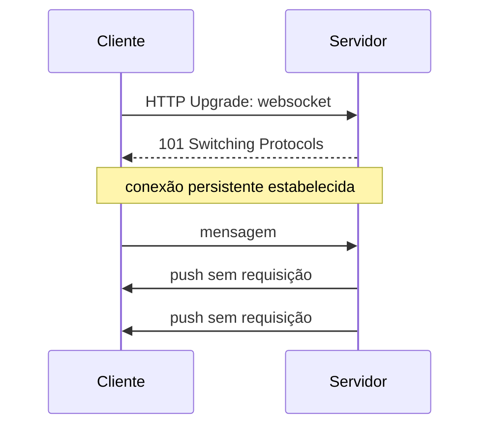

> [!abstract]
> WebSocket é um protocolo que estabelece uma conexão **full-duplex e persistente** sobre TCP, permitindo que o servidor envie dados ao cliente sem que ele peça.

## Conceito

O modelo requisição/resposta de [[HTTP]] só permite que o cliente **puxe** dados. Para saber de uma mudança, o cliente precisa perguntar de novo — e o *polling* desperdiça requisições ou atrasa a informação, sempre.

WebSocket resolve invertendo a possibilidade: depois do handshake inicial, a conexão permanece aberta e **qualquer um dos lados pode enviar** a qualquer momento.

O handshake começa como uma requisição HTTP comum com o cabeçalho `Upgrade`, o que permite atravessar a infraestrutura web existente. Após o `101`, o protocolo deixa de ser HTTP.

## Quando usar

Aplicações em que o dado precisa chegar **quando muda**, não quando é pedido: jogos online, negociação de ativos, mensageria, colaboração em tempo real, painéis ao vivo.

## Comparação

| | **REST/HTTP** | **WebSocket** | **Webhook** |
|---|---|---|---|
| Direção | Cliente puxa | Bidirecional | Servidor empurra |
| Conexão | Efêmera por requisição | Persistente | Efêmera, iniciada pelo emissor |
| Latência de notificação | Depende do polling | Imediata | Imediata |
| Custo por cliente ocioso | Zero | Uma conexão aberta | Zero |

> [!warning]
> Conexão persistente é estado no servidor. Isso conflita com a restrição *stateless* de [[REST API]] e complica o [[Load Balancer]]: é preciso afinidade de sessão ou um barramento que roteie mensagens entre as instâncias que seguram as conexões.

## Fonte

- IETF, [RFC 6455 — The WebSocket Protocol](https://datatracker.ietf.org/doc/html/rfc6455), 2011

## Veja também

- [[HTTP]]
- [[Webhook]]
- [[REST API]]
- [[Estilos de Arquitetura de API]]
- [[Event Driven Architecture]]
- [[System Design MOC]]
