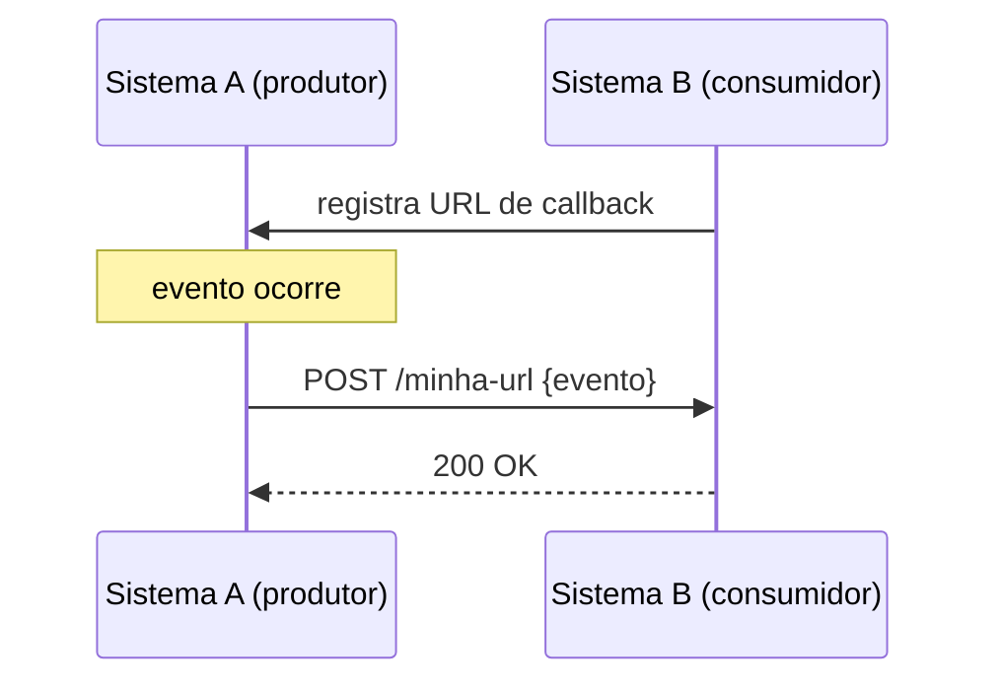

> [!abstract]
> Webhook é uma **callback HTTP**: em vez de o consumidor perguntar periodicamente se algo mudou, o produtor chama uma URL fornecida por ele no instante em que o evento ocorre.

## Conceito

É a inversão do modelo cliente-servidor para notificação — daí o apelido *reverse API*. O consumidor registra uma URL; o produtor faz um `POST` nela quando o evento acontece.

O ganho é eliminar o *polling*: sem webhook, o consumidor consulta a cada N segundos e, na esmagadora maioria das vezes, não há nada de novo.

## Características

- **Orientado a evento e assíncrono** — o produtor não espera processamento, só a confirmação de recebimento
- Exige que o consumidor exponha um **endpoint público** e disponível
- É a forma padrão de integração de plataformas SaaS: pagamento, versionamento de código, mensageria

> [!warning] Entrega não é garantida
> Se o endpoint do consumidor está fora do ar no momento do evento, a notificação se perde — a menos que o produtor implemente [[Retry Pattern]]. E, com retry, a mesma notificação chega mais de uma vez: **o consumidor precisa ser idempotente**. Ver [[Idempotência]].

> [!important] Autenticar é obrigatório
> O endpoint é público, então qualquer um pode chamá-lo forjando um evento. A prática consolidada é o produtor assinar o payload com HMAC e o consumidor verificar a assinatura antes de processar.

## Comparação

| | **Webhook** | **[[Message Queue]]** |
|---|---|---|
| Transporte | HTTP direto ao consumidor | Broker intermediário |
| Entrega garantida | Só com retry do produtor | Sim, é a função do broker |
| Consumidor indisponível | Perde ou aguarda retry | Mensagem espera na fila |
| Acoplamento operacional | Alto — o produtor precisa alcançar o consumidor | Baixo |

## Fonte

- ByteByteGo, [The Evolving Landscape of API Protocols in 2023](https://blog.postman.com/api-protocols-in-2023/), Postman Blog

## Veja também

- [[WebSocket]]
- [[Estilos de Arquitetura de API]]
- [[Message Queue]]
- [[Idempotência]]
- [[Retry Pattern]]
- [[Event Driven Architecture]]
- [[System Design MOC]]
