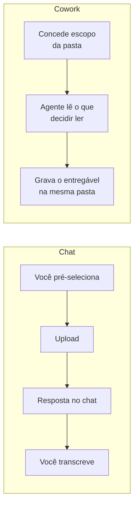

> [!abstract]
> **Work in a Folder** é o modelo de acesso do [[Claude Cowork]] ao disco: você concede a uma sessão o escopo de uma pasta e o agente lê, cria, renomeia e move arquivos ali dentro — sem upload, sem download, e sem que o conteúdo saia da máquina.

## Conceito

No chat, o arquivo é **anexo**: você seleciona o que acha relevante, envia, e depois copia a resposta de volta para onde ela precisa estar. Isso impõe dois trabalhos invisíveis — a pré-curadoria (decidir o que anexar antes de saber o que importa) e a pós-transcrição (levar a saída para o destino).

O acesso a pasta remove os dois. O material deixa de ser anexo e passa a ser **ambiente**: o agente vê o mesmo que você vê no explorador de arquivos, decide sozinho o que abrir, e escreve o entregável no lugar onde ele já vai ser usado.

A consequência menos óbvia é sobre a *qualidade do insumo*. Como não há custo em apontar para o caso bagunçado, o insumo passa a ser a pasta real — 156 documentos com nomes como `scan0042.pdf`, 180 itens espalhados na área de trabalho — e não a versão limpa que você prepararia antes. A classificação vira **conteúdo**, não nome de arquivo.

## Características

- **A pasta é a unidade de permissão** — o escopo concedido é a fronteira do que o agente alcança; ampliar é uma decisão explícita
- **Leitura por conteúdo** — o agente abre o arquivo para saber o que ele é; nome ruim não impede classificação
- **Escrita in loco** — planilhas, decks e documentos nascem no destino final, com formato nativo (`.xlsx`, `.pptx`, `.docx`)
- **Local por desenho** — o processamento acontece na máquina; nada é enviado a lugar nenhum
- **Heterogênea** — PDF, scan, imagem, planilha e código convivem na mesma varredura

> [!tip] Comece pelo escopo menor
> Conceder a área de trabalho inteira de primeira é desconfortável e desnecessário. Aponte para uma pasta só — `Downloads`, a pasta do negócio, a pasta da auditoria — e amplie depois de ver o comportamento.

## Comparação

| | Anexo no chat | Work in a Folder |
|---|---|---|
| Quem escolhe o insumo | Você, antes de saber o que importa | O agente, lendo o que está lá |
| Volume viável | Alguns arquivos | Centenas, com formatos misturados |
| Destino da saída | Download, depois transcrição | O mesmo diretório de origem |
| Requisito de higiene | Arquivos nomeados e organizados | Nenhum — a bagunça é o caso de uso |
| Onde o dado trafega | Sai da máquina | Permanece na máquina |

> [!warning] Escrita é uma ação, não uma leitura
> Renomear em lote e mover arquivos altera o estado do seu disco. Vale a mesma regra de [[Human-in-the-Loop]]: peça o **mapa de renomeação antes da execução** quando o volume for grande, e declare no prompt o que nunca deve ser apagado.

## Veja também

- [[Claude Cowork]]
- [[Plano Revisável]]
- [[Observabilidade de Sessão Agêntica]]
- [[Auditoria de Pasta contra Regras]]
- [[Agentic Workflow]]
- [[Project Workspace]]
