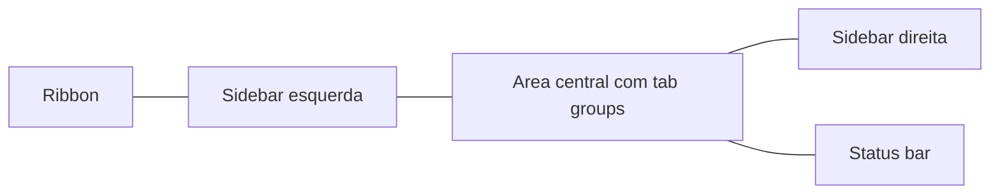

> [!abstract]
> **Workspace** é o contêiner de todos os componentes da interface do Obsidian, e o core plugin **Workspaces** permite salvar e alternar entre arranjos nomeados desse contêiner conforme a tarefa.

## Conceito

O workspace não guarda conteúdo — guarda **estado de interface**: quais arquivos e tabs estão abertos, e a largura e a visibilidade de cada sidebar. É a distinção que o separa do [[Vault]], que é a coleção de arquivos em disco.

> [!success] Modos de trabalho
> Layouts salvos rendem quando correspondem a modos distintos de trabalho, não a preferências estéticas. Um **layout de captura** — [[Daily Note|daily note]] em tela cheia, sidebars recolhidas, nenhum painel derivado — otimiza escrita sem interrupção. Um **layout de processamento** — nota ao centro, [[Backlink|Backlinks]] e Outgoing links à direita, Search à esquerda — otimiza a decisão de onde a ideia se conecta. Um **layout de revisão** — [[Graph View]] global ao lado de uma [[Base (Obsidian Bases)|base]] de notas por status — otimiza diagnóstico. Trocar de layout é trocar de intenção.

## Estrutura

Elementos no desktop: **Ribbon** vertical à esquerda, **sidebars** esquerda e direita (colapsáveis, com seus próprios tab groups e tabs), **tab groups** na área central e a **status bar** no canto inferior direito. No mobile: tabs pelo contador na Navigation bar, sidebars por swipe, Ribbon dentro da Navigation bar e a barra de edição acima do teclado.

> [!important] Assimetria do split
> Tab groups de **sidebar** só se dividem **verticalmente**; tab groups da **área central** se dividem **vertical e horizontalmente** (**Split right** / **Split down**).

## Características

- **Salvar**: **Manage workspace layouts** no Ribbon ou na Command palette → nome → **Save**. **Atualizar** um workspace é salvá-lo com o **mesmo nome**. **Carregar** e **Delete layout** ficam no mesmo painel.
- **Persistência** na [[Configuration Folder]]: `.obsidian/workspaces.json` guarda os layouts nomeados do plugin; `.obsidian/workspace.json` guarda o layout corrente. Ambos são atualizados sempre que um arquivo novo é aberto — por isso a doc sugere adicioná-los ao `.gitignore` de um vault versionado em Git.
- **Linked views** são tabs que referenciam outra tab e mudam junto com ela: **Graph view (local)**, **Backlinks** e **Outline**, abertos em *More options → Open linked view*.
- **Pinned pane** faz o oposto: um painel fixado na sidebar **congela na última nota selecionada** e não acompanha a navegação; uma nota ou base fixada fica no lugar e os links passam a abrir em tabs separadas. No editor principal, `Pin` faz os links da tab abrirem sempre em outra tab.
- **Stacked tabs**: seta no canto superior direito do tab group → **Stack notes**, deslizando as tabs uma sobre a outra — inspirado nas sliding notes de Andy Matuschak.
- **Pop-out windows** (só desktop): arrastar a tab para fora, ou **Move current tab to new window**. Cada pop-out pertence a uma janela de vault e **fecha junto com ela**; arquivos só circulam entre janelas do mesmo vault.

## Comparação

| | Workspace Layout | [[Vault]] |
|---|---|---|
| O que é | Estado da interface | Pasta com os arquivos |
| Onde persiste | `.obsidian/workspace(s).json` | O sistema de arquivos |
| Perder implica | Rearrumar painéis | Perder conteúdo |
| Versionar em Git | Costuma ir para o `.gitignore` | É o que se versiona |
| Troca | Instantânea, por layout salvo | Reabre o app noutro vault |

## Veja também

- [[Vault]]
- [[Configuration Folder]]
- [[Graph View]]
- [[Backlink]]
- [[Obsidian Plugin]]
- [[Daily Note]]
