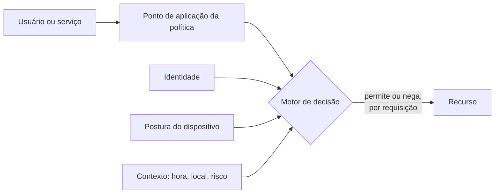

> [!abstract]
> Zero Trust abandona a premissa de que existe uma rede interna confiável: **nenhum recurso é implicitamente confiável** por estar dentro do perímetro, e toda solicitação de acesso é avaliada individualmente.

## Conceito

O modelo de perímetro trata a localização na rede como credencial: quem está dentro é confiável. Isso falha por três razões — o atacante que atravessa se move livremente, o perímetro deixou de existir com nuvem e trabalho remoto, e a ameaça interna não é coberta por definição.

Zero Trust move a decisão da **localização** para a **identidade e o contexto** de cada requisição.

## Os princípios

| Princípio | Consequência prática |
|---|---|
| **Verificar explicitamente** | Autenticar e autorizar a **cada** acesso, com todos os sinais disponíveis |
| **Menor privilégio** | Acesso mínimo necessário, por tempo mínimo. Ver [[Authorization]] |
| **Assumir violação** | Projetar como se o atacante já estivesse dentro — segmentar, cifrar, monitorar |
| **Acesso por sessão** | A confiança não é permanente; expira e é reavaliada |
| **Postura dinâmica** | A decisão considera o estado do dispositivo e o comportamento observado |

## Como se materializa

- **Identidade forte** — [[Single Sign-On (SSO)]] com MFA e, idealmente, [[WebAuthn e Passkeys]]
- **mTLS entre serviços** — cada serviço prova quem é; o [[Service Mesh]] costuma implementar isso via [[Sidecar Pattern]]
- **Microssegmentação** — [[Subnet]] e política de rede reduzem o alcance lateral, aplicando [[Bulkhead]] à topologia
- **[[Observability]]** — sem sinal contínuo não há avaliação dinâmica de postura

> [!warning] Zero Trust não é um produto
> É uma arquitetura e um conjunto de princípios. Fornecedores vendem "solução Zero Trust", mas nenhum componente isolado entrega o modelo — ele emerge da combinação de identidade, política, segmentação e observabilidade.

## Fonte

- NIST, [SP 800-207 — Zero Trust Architecture](https://csrc.nist.gov/pubs/sp/800/207/final), 2020

## Veja também

- [[Firewall]]
- [[Authentication]]
- [[Authorization]]
- [[Identity and Access Management (IAM)]]
- [[Identity Federation]]
- [[Service Mesh]]
- [[Information Security Management]]
- [[System Design MOC]]
