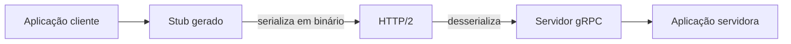

> [!abstract]
> gRPC é um framework de chamada de procedimento remoto em que o cliente invoca um método em outra máquina **como se fosse um objeto local**, com contrato definido em Protocol Buffers e transporte sobre HTTP/2.

## Conceito

RPC se chama "remoto" porque permite a comunicação entre serviços em servidores diferentes — mas do ponto de vista de quem escreve o código, parece uma chamada de função local. É essa ergonomia que o torna popular dentro de arquiteturas de [[Microservices]], onde o volume de chamadas internas é alto.

A ideia central é **definir um serviço**: quais métodos podem ser chamados remotamente, com quais parâmetros e quais tipos de retorno. O servidor implementa a interface; o cliente recebe um *stub* com os mesmos métodos.

## Contrato em Protocol Buffers

O contrato vive em um arquivo `.proto`, e o compilador `protoc` gera o código de cliente e servidor na linguagem escolhida:

```proto
service Greeter {
  rpc SayHello (HelloRequest) returns (HelloReply) {}
}

message HelloRequest {
  string name = 1;
}
```

Protobuf é ao mesmo tempo a **IDL** (linguagem de definição de interface) e o **formato de serialização**. Um serviço em Java pode ser consumido por clientes em Go, Python ou Ruby, todos gerados do mesmo `.proto`.

## Fluxo



A combinação de **codificação binária** com as otimizações de HTTP/2 — multiplexação e compressão de cabeçalho — é o que dá a gRPC a vantagem de desempenho sobre JSON sobre HTTP/1.1.

## Características

- Contrato explícito e versionado, validado em tempo de compilação
- Suporte nativo a *streaming* nos dois sentidos
- Recomenda-se **proto3** com gRPC, para cobrir toda a gama de linguagens suportadas

> [!warning] Onde não serve
> gRPC não é consumível diretamente pelo navegador — HTTP/2 puro não é exposto pelas APIs do browser, o que exige gRPC-Web e um proxy. O payload binário também é opaco a inspeção e depuração, ao contrário de JSON.

## Fonte

- gRPC Authors, [Introduction to gRPC](https://grpc.io/docs/what-is-grpc/introduction/), grpc.io

## Veja também

- [[REST API]]
- [[GraphQL]]
- [[Estilos de Arquitetura de API]]
- [[Microservices]]
- [[Service Mesh]]
- [[HTTP]]
- [[System Design MOC]]
