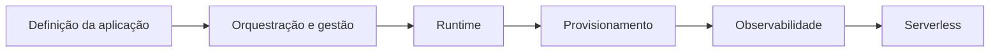

> [!abstract]
> A adoção cloud native é avaliada e planejada em seis eixos independentes, cada um com seu próprio nível de maturidade — não como um estado binário de "já somos" ou "ainda não somos".

## Quando usar

Ao diagnosticar onde uma organização realmente está antes de definir a próxima etapa de transformação. A pergunta "somos cloud native?" não tem resposta útil; "em quais dos seis eixos avançamos e em quais paramos?" tem.

## Dinâmica

1. **Mapear a posição atual em cada eixo**, com evidência e não com percepção.
2. **Identificar o eixo mais atrasado** — ele é quem define o desempenho real do conjunto.
3. **Definir o próximo incremento por eixo**, um passo de cada vez.
4. **Reavaliar periodicamente**, já que os eixos evoluem em ritmos diferentes e a defasagem entre eles é o risco a controlar.

## Os seis eixos

| Eixo | Do que trata | Sinal de imaturidade |
|---|---|---|
| **Definição e desenvolvimento da aplicação** | Como o software é escrito, empacotado e versionado | Monólito acoplado, build manual |
| **Orquestração e gestão** | [[Container Orchestration]], descoberta, malha de serviços | Contêineres geridos host a host |
| **Runtime** | Execução, rede e armazenamento dos contêineres | Estado preso à instância |
| **Provisionamento** | [[Infrastructure as Code]], automação, políticas | Recurso criado pelo console |
| **Observabilidade** | [[Logging]], [[Distributed Tracing]], métricas, alertas | Investigação por acesso manual ao servidor |
| **[[Serverless]]** | Execução sem gestão de servidor, cobrada por uso | Ausente ou adotada sem critério |

## Regras

- **Nenhum eixo compensa outro.** Kubernetes maduro com observabilidade inexistente entrega um sistema que escala e que ninguém consegue diagnosticar.
- **Provisionamento e observabilidade precedem escala.** Aumentar a carga sobre uma base sem automação e sem sinais amplifica o problema em vez de resolvê-lo.
- **Serverless é o último eixo, não o primeiro.** Adotá-lo antes dos demais transfere complexidade em vez de eliminá-la.
- O diagnóstico deve ser cruzado com [[Cloud Native Anti-Patterns]]: cada anti-padrão presente aponta o eixo que travou.

---
Ref: [[Cloud Native]], [[Cloud Native Anti-Patterns]], [[Serverless]], [[Kubernetes (K8s)]], [[DevOps]], [[Platform Engineering]], [[Transformation]]
