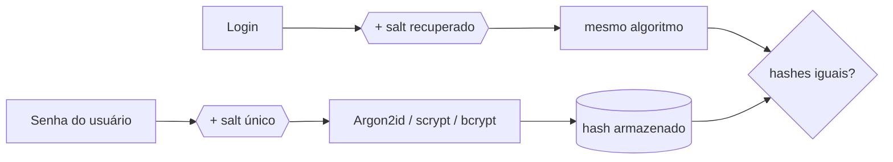

> [!abstract]
> Senhas devem ser protegidas com algoritmos de hash **lentos e adaptativos** — Argon2id, scrypt, bcrypt ou PBKDF2 — cada uma com salt único, de modo que continuem protegidas mesmo que o banco inteiro vaze.

## Quando usar

Sempre que a aplicação autenticar usuários por senha. A premissa de projeto é que **o banco será comprometido** — a questão é o que o atacante consegue fazer com o que levou.

## Dinâmica

1. Gerar um **salt único e aleatório** por senha
2. Derivar o hash com um algoritmo lento e configurável
3. Armazenar hash, salt e parâmetros — as bibliotecas modernas fazem isso em um único campo padronizado
4. Na validação, repetir o processo com o salt guardado e comparar

## Regras

**Nunca:**
- Armazenar em texto claro — qualquer acesso interno lê tudo
- Usar hash rápido (MD5, SHA-1, SHA-256 puro) — foram projetados para velocidade, exatamente o que favorece o atacante com GPU
- **Cifrar** em vez de hashear. Cifragem é reversível; hash não é. Ver [[Criptografia Simétrica e Assimétrica]]

**Sempre:**

| Elemento | Papel |
|---|---|
| **Salt** | String única e aleatória por senha. Não é secreto e pode ficar no banco. Impede rainbow tables e faz o atacante quebrar um hash por vez |
| **Work factor** | Número de iterações. Torna cada tentativa cara. Deve ser aumentado ao longo do tempo, conforme o hardware barateia |
| **Pepper** *(opcional)* | Segredo **compartilhado** entre as senhas, guardado **fora do banco**, em cofre ou HSM. Defesa em profundidade contra vazamento apenas do banco |

## Parâmetros recomendados (OWASP)

| Algoritmo | Configuração mínima | Quando usar |
|---|---|---|
| **Argon2id** | m=19 MiB, t=2, p=1 | Primeira escolha |
| **scrypt** | N=2¹⁷, r=8, p=1 | Quando Argon2id não está disponível |
| **bcrypt** | work factor ≥ 10, limite de 72 bytes | Apenas sistemas legados |
| **PBKDF2-HMAC-SHA256** | 600.000 iterações | Quando há exigência de conformidade FIPS-140 |

> [!tip] Calibragem do work factor
> Não existe número mágico: depende do servidor e do volume de logins. A regra prática é que **calcular um hash deve levar menos de um segundo**. Alto demais vira vetor de negação de serviço — o atacante esgota a CPU com tentativas de login.

> [!warning] Peppering tem um custo escondido
> Se o pepper vazar, ele precisa ser trocado. E como não é possível recalcular os hashes sem conhecer as senhas, trocar o pepper obriga **todos os usuários afetados a redefinir a senha**.

## Exemplo

Migrando um sistema legado com `md5($senha)`: no próximo login válido, re-hashear com o algoritmo novo. Para não manter hashes fracos indefinidamente à espera de usuários inativos, ou se expira a senha de quem não acessa há muito tempo, ou se aplica o algoritmo novo sobre o hash antigo — `bcrypt(md5($senha))` — substituindo por um hash direto no login seguinte.

---
Ref: [[Criptografia Simétrica e Assimétrica]], [[Segurança de API]], [[Information Security Management]], [[Gerenciamento de Sessão]]
