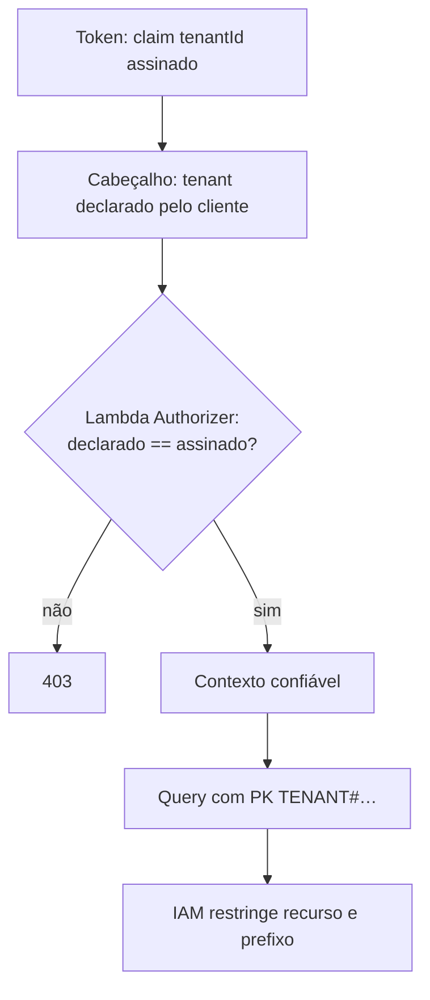

Implementar o isolamento entre organizações clientes em **todas** as camadas do caminho da requisição, de forma que nenhum ponto isolado de falha permita a um tenant alcançar dado de outro.

O resultado é um sistema em que vazar dado entre tenants exigiria a falha simultânea de quatro mecanismos independentes.

## Dinâmica / Passo a Passo

1. **Emissão** — o trigger de pré-geração de token consulta o perfil e injeta `tenantId`, papéis e `userId` interno como claims assinados ([[Token Enrichment (Custom Claims)]]).
2. **Sessão no cliente** — o frontend extrai os claims e guarda o tenant ativo no store de sessão. Se o usuário pertence a mais de uma organização, trocar de tenant é uma ação explícita que limpa o cache de dados de servidor.
3. **Requisição** — o interceptador HTTP injeta, em toda chamada: `Authorization: Bearer {token}`, `X-Tenant-Id: {tenant ativo}` e, em escritas, `X-Idempotency-Key`.
4. **Borda, camada 1** — o JWT Authorizer do gateway valida assinatura e expiração contra o JWKS. Sem invocação de função.
5. **Borda, camada 2** — o [[Lambda Authorizer]] compara o `X-Tenant-Id` recebido com o claim `custom:tenantId`. Divergiu, nega. Devolve `context = { tenantId, userId, roles }`.
6. **Handler** — lê o tenant **do contexto do autorizador**, nunca do cabeçalho:

   ```ts
   export const extractContext = (event) => ({
     tenantId: event.requestContext.authorizer?.lambda?.tenantId,
     userId:   event.requestContext.authorizer?.lambda?.userId,
     roles:    event.requestContext.authorizer?.lambda?.roles,
   });
   // ❌ const tenantId = event.headers['x-tenant-id'];  ← forjável
   ```

7. **Dados** — toda chave de acesso é prefixada: `PK = TENANT#{tenantId}#{ENTIDADE}#{id}` ([[Single-Table Design]]). Nenhuma consulta existe sem o prefixo.
8. **Infraestrutura** — a política IAM da função restringe o recurso à tabela e, quando aplicável, ao prefixo da chave, em vez de conceder acesso amplo.



## Regras

- **O cabeçalho de tenant é uma declaração de intenção, não uma identidade.** Existe só para ser confrontado com o token
- **Nenhum caminho de código acessa dado sem tenant no contexto** — incluindo jobs agendados e consumidores de fila, que precisam obtê-lo do evento
- **Revisão de código com veto**: qualquer `Query`, `Scan` ou `GetItem` sem prefixo de tenant reprova o pull request
- **Teste automatizado de vazamento**: um caso de teste tenta acessar recurso do tenant B com token do tenant A e espera 403. Roda em todo pipeline
- **Onboarding e troca de tenant limpam o cache do cliente** — dado da organização anterior visível na seguinte é vazamento, mesmo local

## Exemplo

Usuário do tenant A intercepta a própria requisição e troca `X-Tenant-Id` para o do tenant B. O JWT continua válido — a assinatura não mudou. O Lambda Authorizer compara o valor declarado com `custom:tenantId` do token, encontra divergência e nega com 403. A função de domínio nunca é invocada, não há custo de computação e o evento fica registrado na borda.

---
Ref: [[Multi-Tenancy]], [[Lambda Authorizer]], [[Token Enrichment (Custom Claims)]], [[Single-Table Design]], [[Amazon Cognito]], [[Identity and Access Management (IAM)]]
