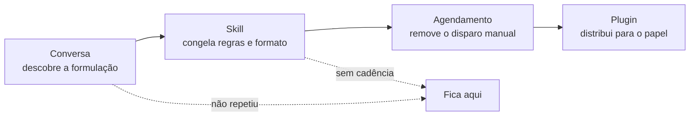

Procedimento de **maturação** de um trabalho delegado: a mesma tarefa sobe quatro degraus — conversa que funcionou, [[Agent Skill|skill]] salva, [[Scheduled Task|tarefa agendada]], [[Plugin (AI Agent)|plugin]] distribuído — e cada degrau só se justifica pela repetição observada no anterior.

É o padrão que aparece no fecho de quase todo caso de uso maduro: *"funcionou para este negócio; salve como skill para o próximo começar a um clique"*.

## Dinâmica / Passo a Passo

1. **Degrau 1 — Conversa.** Escreva o pedido inteiro, execute, corrija. Ainda é trabalho artesanal: o valor está em descobrir *qual formulação produz o resultado certo*.
2. **Degrau 2 — Skill.** Quando a formulação estabilizar, salve-a. O que é congelado são as **regras e o formato** — o agrupamento dos achados, os campos por item, a hierarquia das regras, o formato do entregável. Ver [[Criação de Skill por Conversa]].
3. **Degrau 3 — Agendamento.** Se o gatilho é o calendário e não você, agende a skill. *"Rode toda sexta às 14h sobre o que for novo na pasta e poste o resumo no canal."* Ver [[Scheduled Task]].
4. **Degrau 4 — Plugin.** Se a organização inteira faz esse trabalho, empacote skill + conectores + agentes no formato instalável. O plugin ensina ao agente o *framework do time*: quais fontes checar, quais métricas o comitê espera, como estruturar o argumento, em que formato entregar.

## Regras

- **Só sobe degrau o que já se repetiu.** Salvar como skill um fluxo executado uma vez é escrever documentação de um processo que não existe.
- **A skill congela o método, nunca os dados.** Regras, agrupamento e formato entram; a pasta do trimestre, o nome do fornecedor e os números ficam de fora — senão a skill vira um snapshot.
- **Agendar exige destino de saída.** Uma tarefa recorrente sem lugar definido para o entregável produz trabalho que ninguém encontra. Ver [[Scheduled Task]].
- **O teste do degrau 3 é a cadência, não o tempo no enunciado.** "Resuma os e-mails de ontem" é execução única.
- **Cada degrau aumenta a superfície de confiança.** Skill é código executável; plugin agrega permissões de vários componentes. A regra de procedência se multiplica ao subir.
- **A escada é reversível.** Skill que passou a errar volta a ser conversa até a formulação ser corrigida.

## Exemplo

Auditoria de marca: *"Audite os PNG e JPG desta pasta contra o manual e a folha legal…"* → funciona → *"Salve isso como uma skill chamada `brand-compliance-audit`"* → *"Agende para toda sexta às 14h e poste o resumo no `#brand-ops`"*. Renovação de crédito e revisão trimestral de reservas seguem exatamente a mesma escada: o loop é idêntico a cada ciclo, muda a pasta.

---
Ref: [[Agent Skill]], [[Criação de Skill por Conversa]], [[Scheduled Task]], [[Plugin (AI Agent)]], [[Claude Cowork]], [[Agentic Workflow]], [[Auditoria de Pasta contra Regras]]
