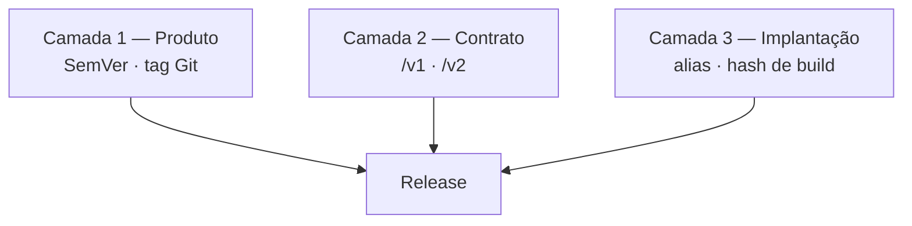

Separar explicitamente três perguntas que costumam ser confundidas em um número só: *o que foi liberado*, *que contrato o cliente fala* e *que código exatamente está rodando agora*.

O resultado é poder mudar a implantação sem mexer na versão do produto, e mudar o contrato da API sem obrigar todos os clientes a migrar de uma vez.

## Dinâmica / Passo a Passo

1. **Camada 1 — versão do produto ([[Versionamento Semântico (SemVer)]])**
   Um único `MAJOR.MINOR.PATCH` representa a liberação coordenada de todos os componentes: frontend, todos os domínios de backend e a infraestrutura.
   - Uma fonte de verdade declarada (o documento de identidade do projeto); os `package.json` são cópias propagadas
   - Tag Git `vX.Y.Z` é o marcador imutável em que o pipeline se apoia
   - Changelog descreve o efeito para quem usa

   | Mudança | Incremento |
   |---|---|
   | Quebra de contrato de API, migração destrutiva | MAJOR |
   | Funcionalidade nova, domínio novo, rota nova | MINOR |
   | Correção, ajuste de configuração, refatoração sem efeito externo | PATCH |

2. **Camada 2 — versão do contrato de API**
   Prefixo inteiro no caminho (`/v1`, `/v2`). Incrementa **isoladamente**, e só quando um contrato precisa mudar de forma incompatível enquanto o anterior continua no ar para clientes existentes. Não é SemVer e não acompanha a versão do produto.

3. **Camada 3 — versão de implantação**
   Controla o que está executando, sem cerimônia de versão por função:
   - alias de ambiente (`LIVE`, `STAGING`) apontando para uma versão publicada — rollback é repontar o alias
   - versão imutável da função, criada a cada deploy, usada só como alvo do alias
   - hash do commit injetado no build do frontend, exposto no rastreador de erros e em cabeçalho de resposta

## Regras

- **Uma fonte de verdade por camada.** Todo o resto é cópia gerada por automação; sincronização manual diverge
- **O prefixo da API não incrementa junto com o produto.** Se `/v1` virou `/v2` porque o produto virou `2.0.0`, a separação foi perdida
- **Nunca reescreva uma tag publicada.** A tag é o artefato imutável em que o pipeline confia
- **A versão de implantação nunca é escrita à mão no repositório** — é injetada pelo pipeline
- **Duas versões de contrato no ar exigem data de descontinuação declarada.** Sem prazo, `/v1` vive para sempre e o custo de manutenção dobra

## Exemplo

Correção de um cálculo em um domínio: produto vai de `1.4.1` para `1.4.2`, o prefixo permanece `/v1`, e a implantação publica uma versão nova da função e repontar o alias `LIVE`. Meses depois, o envelope de resposta precisa mudar de forma incompatível: nasce `/v2` convivendo com `/v1`, e o produto vai para `2.0.0` só quando o `/v1` é descontinuado.

---
Ref: [[Versionamento Semântico (SemVer)]], [[Versionamento de API]], [[Pipeline de CI-CD]], [[Release Management]], [[Deployment Management]]
