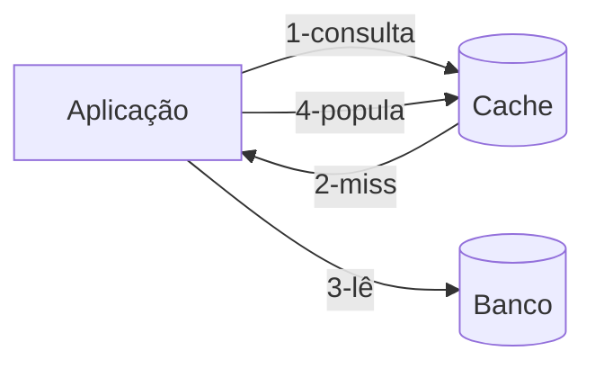
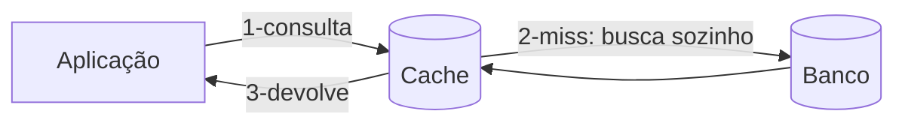

> [!abstract]
> As estratégias de cache definem **quem** escreve no cache, **quando** e **em que ordem** em relação ao banco de dados. São cinco padrões — dois de leitura e três de escrita — normalmente combinados aos pares.

## Quando usar

No instante em que um cache entra na arquitetura, a verdade passa a existir em dois lugares. Sincronizar cache e banco deixa de ser opcional: é preciso escolher explicitamente um padrão de leitura e um de escrita, ou a inconsistência aparece sozinha — e no pior momento.

## Estratégias de leitura

**Cache-aside** (lazy loading) — a aplicação é responsável pelo cache:

**Read-through** — o cache é responsável por si:

| | Cache-aside | Read-through |
|---|---|---|
| Quem busca no banco | A aplicação | O próprio cache |
| Onde fica a lógica | Espalhada no código | Concentrada na camada de cache |
| Cache indisponível | Aplicação segue lendo do banco | Caminho de leitura quebra |

## Estratégias de escrita

| Estratégia | Ordem da escrita | Consequência |
|---|---|---|
| **Write-around** | Escreve só no banco; o cache é ignorado | Evita poluir o cache com dado que ninguém vai ler. Primeira leitura sempre é *miss* |
| **Write-through** | Escreve no cache e no banco na mesma operação | Cache sempre consistente. Escrita mais lenta |
| **Write-back** | Escreve no cache e confirma; o banco é atualizado depois, em lote | Escrita muito rápida. **Perda de dado se o cache cair antes do flush** |

## Regras

1. Escolher **um padrão de leitura e um de escrita**, não um só — eles cobrem caminhos diferentes.
2. A combinação mais comum é **write-around + cache-aside**: escreve-se direto no banco e o cache se popula na primeira leitura, mantendo-se atualizado sem sincronização explícita.
3. Definir política de expiração (TTL) desde o início. Cache sem expiração é fonte de verdade acidental.
4. Só entra no cache o dado que pode ser **reconstruído**. Cache não é armazenamento durável.
5. Write-back exige que a perda dos dados em voo seja aceitável para aquele domínio.

## Exemplo

Um catálogo de produtos com leitura intensa e escrita rara: **write-around** na atualização do preço (vai direto ao banco) e **cache-aside** na leitura (a primeira consulta após a mudança sofre um miss e repovoa o cache com o valor novo). A invalidação vem de graça, sem código de sincronização.

---
Ref: [[Distributed Cache]], [[Content Delivery Network (CDN)]], [[Latency Numbers]], [[Database Index]]
