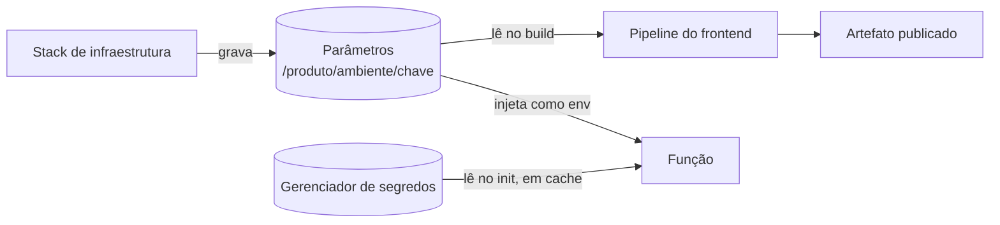

Retirar do repositório toda URL, identificador de recurso e credencial, publicando-os no deploy da infraestrutura e consumindo-os no build ou em tempo de execução.

O resultado é o mesmo artefato de código rodando em qualquer ambiente sem alteração, e nenhum segredo versionado.

## Dinâmica / Passo a Passo

1. **Classifique cada valor** em uma de três categorias — a escolha errada aqui é a origem de custo desnecessário ou de vazamento:

   | Categoria | Onde guardar | Exemplos |
   |---|---|---|
   | Configuração não sensível | Armazenamento de parâmetros (gratuito) | URL da API, identificador do user pool, região, nome de tabela |
   | Segredo | Gerenciador de segredos (pago, com rotação) | Chave de API de terceiro, credencial de banco, chave de assinatura |
   | Constante de build | Repositório | Nome do produto, enum de domínio |

2. **A infraestrutura publica**: ao criar cada recurso, a stack grava o valor resultante em um parâmetro nomeado por convenção — `/{produto}/{ambiente}/{chave}`.
3. **O build do frontend consome**: o passo de CI lê os parâmetros do ambiente-alvo e os injeta como variáveis de build. Nenhum arquivo de ambiente com valor real existe no repositório — só o exemplo com as chaves vazias.
4. **A função consome em execução**: valores não sensíveis chegam por variável de ambiente definida pela infraestrutura; segredos são lidos do gerenciador **fora do handler**, para amortizar a chamada entre invocações.
5. **Rotação**: segredos com rotação automática habilitada; a aplicação lê sempre pelo nome, nunca pela versão.

## Regras

- **Segredo nunca em variável de ambiente de função.** O valor fica legível no console para qualquer um com permissão de leitura da configuração — e aparece em exportações da infraestrutura
- **Nenhuma URL literal no repositório**, nem em arquivo de produção. Se está escrita, está errada
- **Convenção de nome é contrato**: `/{produto}/{ambiente}/{chave}` permite que o pipeline resolva o ambiente sem lógica condicional
- **O arquivo de exemplo lista todas as chaves com valor vazio** — é a documentação executável do que o ambiente exige
- **Leia o segredo na inicialização, não no handler**: uma chamada por ambiente em vez de uma por requisição
- **Todo parâmetro é criado pela infraestrutura**, nunca à mão no console — criação manual não sobrevive a recriação de ambiente

## Exemplo

O pipeline promove para produção. A stack de backend implanta e grava `/produto/prod/api-url`, `/produto/prod/ws-url`, `/produto/prod/cognito-pool-id`. O build do frontend lê esses três parâmetros, gera o bundle com os valores embutidos, publica no bucket e invalida a CDN. O mesmo commit, apontado para staging, produz um bundle diferente sem nenhuma alteração de código.

---
Ref: [[AWS Cloud Development Kit (CDK)]], [[Infrastructure as Code]], [[Pipeline de CI-CD]], [[Information Security Management]], [[FinOps]]
