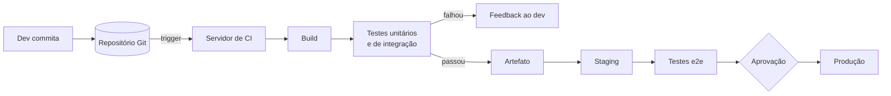

> [!abstract]
> O pipeline de CI/CD é a esteira automatizada que leva uma alteração de código do commit até a produção, integrando build, teste, empacotamento e implantação em um fluxo único e disparado por evento.

## Quando usar

Sempre que a frequência de mudança tornar a implantação manual um gargalo ou uma fonte de erro — o que acontece bem antes do que a maioria dos times supõe. Implantação manual é um dos [[Cloud Native Anti-Patterns]] justamente porque seu custo cresce com a frequência de release, penalizando exatamente o comportamento desejado.

## Dinâmica

1. O desenvolvedor commita a alteração no controle de versão.
2. O servidor de CI detecta a mudança e dispara o build.
3. O código é compilado e submetido a testes unitários e de integração.
4. O resultado é reportado ao desenvolvedor — este é o *feedback loop* que dá sentido a tudo.
5. Em caso de sucesso, o artefato é implantado no ambiente de staging.
6. Testes end-to-end validam o comportamento em staging.
7. O sistema de CD implanta em produção as mudanças aprovadas.

## Regras

- **[[Continuous Integration (CI)]] automatiza build, teste e merge.** Seu objetivo é detectar problema de integração cedo, o que só funciona com commits frequentes na linha principal.
- **[[Continuous Delivery (CD)]] automatiza a liberação.** Seu objetivo é que o software *possa* ir a produção de forma confiável a qualquer momento — a decisão de ir permanece do negócio.
- Falha em qualquer estágio interrompe o pipeline e devolve a mudança ao desenvolvimento. Pipeline que segue em frente com teste vermelho não é pipeline, é teatro.
- O artefato promovido entre ambientes é **o mesmo**, nunca reconstruído — é a aplicação de [[Immutable Infrastructure]] ao ciclo de entrega.
- A velocidade do feedback é a métrica que importa. Ver [[DORA Metrics]].

## Exemplo

**Uber:** monorepo com Bazel para build em escala, uBuild (sobre Buildkite) para empacotar serviços em contêineres, Spinnaker — criado pela Netflix — para a implantação, SLATE para ambientes de teste efêmeros e Shadower para teste de carga por replay do tráfego real de produção.

---
Ref: [[Continuous Integration (CI)]], [[Continuous Delivery (CD)]], [[DevOps]], [[Deployment Management]], [[Immutable Infrastructure]], [[Container]]
