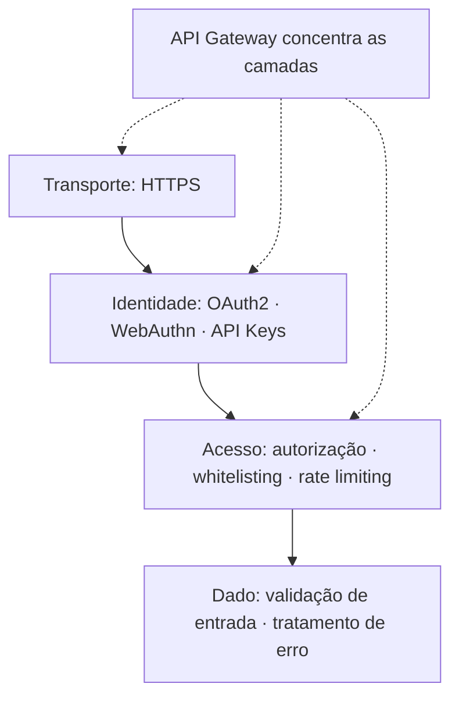

> [!abstract]
> Um conjunto de doze controles que, aplicados em camadas, cobrem as falhas mais comuns de APIs expostas. Nenhum deles é suficiente sozinho — a segurança vem da sobreposição.

## Quando usar

Em toda API exposta além do processo que a chama. A revisão vale como checklist antes de publicar e como pauta de revisão periódica.

## Dinâmica

Os controles se organizam em quatro camadas, do transporte ao dado:

| # | Controle | Por quê |
|---|---|---|
| 1 | **Usar HTTPS** | Sem [[Transport Layer Security (TLS)]] todo o resto é lido em trânsito |
| 2 | **Usar [[OAuth 2.0]]** | Delegar acesso sem compartilhar credenciais |
| 3 | **Usar WebAuthn** | Autenticação por chave pública, resistente a phishing |
| 4 | **API keys em níveis** | Chaves distintas por escopo e privilégio, não uma chave-mestra |
| 5 | **Autorização** | Autenticar diz quem é; autorizar diz o que pode. São verificações separadas |
| 6 | **[[Rate Limiting]]** | Contém abuso, força bruta e esgotamento de recurso |
| 7 | **Versionamento de API** | Permite corrigir e depreciar sem quebrar clientes |
| 8 | **Whitelisting** | Permitir o conhecido é mais seguro que bloquear o conhecido |
| 9 | **Checar o OWASP API Security Top 10** | A lista de referência das falhas reais mais frequentes |
| 10 | **Usar [[API Gateway]]** | Concentra os controles transversais em um ponto auditável |
| 11 | **Tratamento de erro** | Mensagem de erro detalhada demais entrega estrutura interna ao atacante |
| 12 | **Validação de entrada** | Base contra injeção — validar por lista de permissão, no servidor |

## Regras

- **Autorização é por objeto, não só por rota.** A falha nº 1 do OWASP API Top 10 é *Broken Object Level Authorization*: o endpoint exige login, mas não verifica se aquele usuário pode ver **aquele** registro
- **Validar sempre no servidor.** Validação no cliente é usabilidade, não segurança
- **Nunca confiar no que vem do cliente**, incluindo cabeçalhos, campos ocultos e o próprio [[JSON Web Token (JWT)]] sem verificar a assinatura com algoritmo fixo
- **Errar com pouca informação.** `401` genérico, sem revelar se o usuário existe

> [!warning] O gateway não é a segurança
> Concentrar os controles no [[API Gateway]] é boa prática, mas cria a ilusão de que o serviço atrás dele está protegido. Se o serviço for alcançável por outro caminho — outro serviço interno, um port-forward, um pod vizinho — ele está exposto sem nenhum dos doze controles.

---
Ref: [[OAuth 2.0]], [[Transport Layer Security (TLS)]], [[Rate Limiting]], [[API Gateway]], [[Armazenamento Seguro de Senhas]], [[Information Security Management]]
