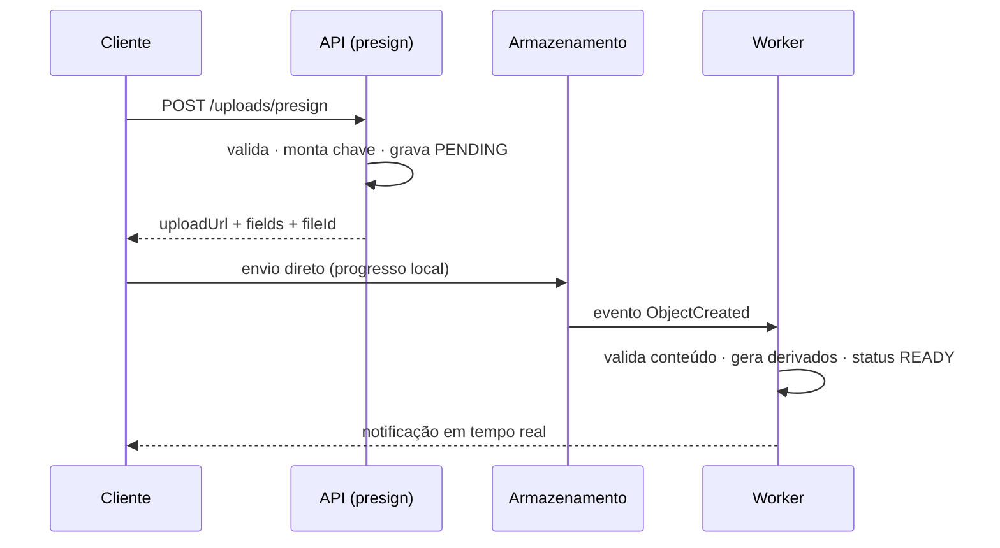

Transferir arquivos do usuário direto para o armazenamento de objetos, com o backend atuando apenas como autorizador — sem que nenhum byte do arquivo passe pela API.

O resultado é upload sem limite prático de tamanho, sem custo de computação proporcional à transferência e sem timeout de gateway.

## Dinâmica / Passo a Passo

1. **Cliente solicita autorização**: `POST /v1/uploads/presign` com `{ nome, contentType, dominio, metadata? }`. O arquivo **não** vai nesta requisição.
2. **Função de presign**:
   - extrai `tenantId` e `userId` do contexto do autorizador;
   - valida permissão, tipo e tamanho declarado contra a política do domínio;
   - gera `fileId` e **monta a chave no servidor**: `{tenantId}/{dominio}/{fileId}/{nome-sanitizado}`;
   - grava o metadado no banco com `status: PENDING`;
   - assina a URL com condições (faixa de tamanho, content-type exato, expiração curta);
   - devolve `{ uploadUrl, fields, fileId, expiresAt }`.
3. **Cliente envia o arquivo direto ao armazenamento**, com barra de progresso local. A API não participa.
4. **Evento de objeto criado** dispara o processamento assíncrono via barramento e fila: validação real do conteúdo, extração de metadados, geração de derivados.
5. **Consumidor promove o registro** para `status: READY` e publica o evento de domínio.
6. **Cliente é notificado** por [[WebSocket]] e invalida a chave de consulta correspondente.

## Regras

- **A chave é montada pelo servidor**, sempre com o tenant no prefixo e o nome do cliente sanitizado. Aceitar a chave do cliente é permitir escrita fora do escopo
- **Condições sempre presentes**: faixa de tamanho, content-type exato e expiração de minutos
- **O metadado nasce antes do arquivo** e é promovido pelo evento. Sem isso não há como distinguir upload em andamento de upload abandonado
- **Validação real acontece no worker**, não no presign: o `contentType` declarado é declaração, não prova
- **Lifecycle policy** expira objetos e registros que ficaram `PENDING` além de uma janela — senão o custo de órfãos cresce indefinidamente
- **Nunca proxie o arquivo pela API** para "poder validar antes". O ganho é ilusório e o custo é permanente

## Exemplo

Um anexo de 40 MB. Pela API, seria rejeitado pelo limite de payload do gateway. Pelo fluxo pré-assinado, a função de presign roda em dezenas de milissegundos, o browser envia direto ao bucket e o usuário vê a barra de progresso real; o worker de pós-upload gera a miniatura e marca `READY`, e a tela atualiza sozinha via tempo real.

---
Ref: [[Pre-Signed URL]], [[Amazon S3]], [[Multi-Tenancy]], [[Amazon EventBridge]], [[Amazon SQS]]
