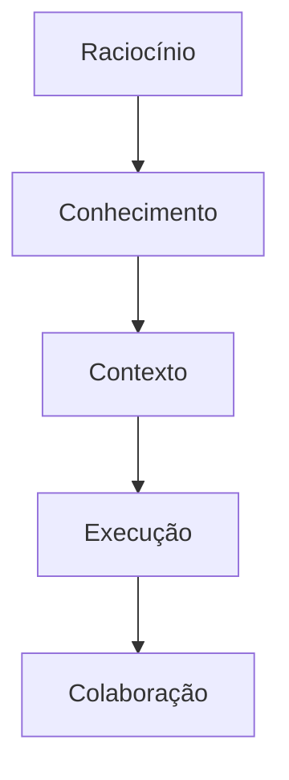
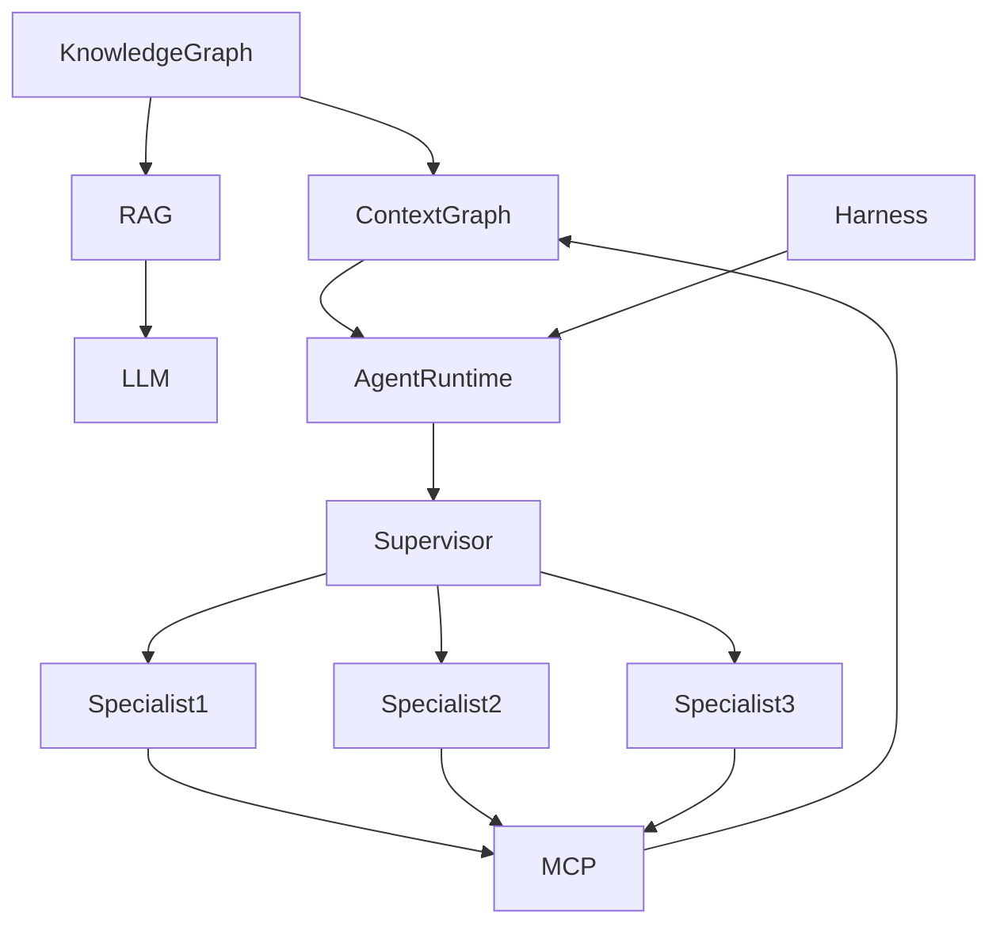
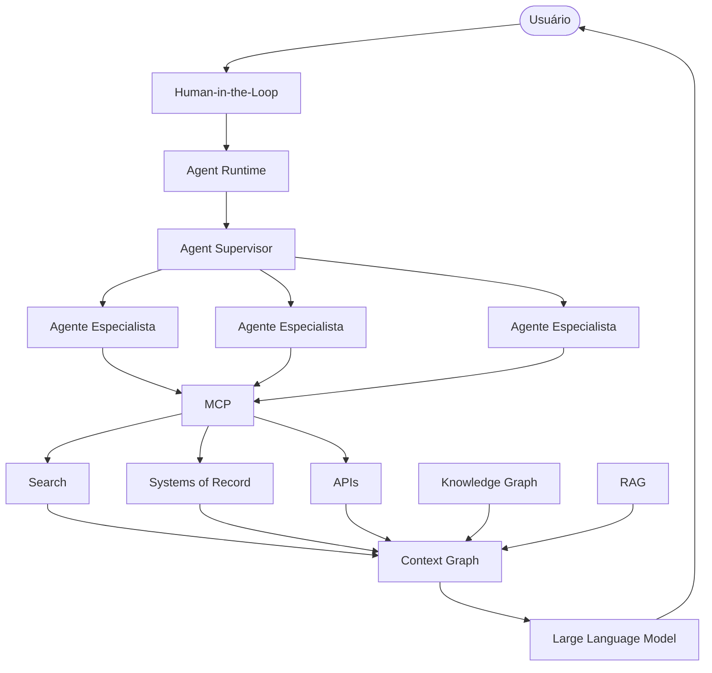
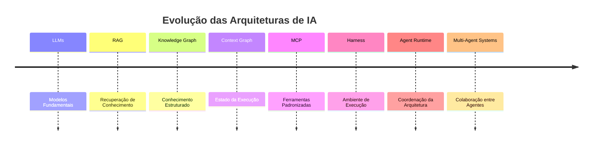

> [!abstract]
> Este MOC (Map of Content) organiza os principais conceitos envolvidos em arquiteturas modernas de IA Generativa, desde o mecanismo de raciocínio até a execução de arquiteturas multiagentes.

---

# Visão Geral

As arquiteturas modernas de IA podem ser entendidas em cinco camadas principais:

---

# 1. Camada de Raciocínio

O mecanismo responsável pela compreensão da linguagem e geração das respostas.

## Conceitos

- [[Large Language Model (LLM)]]

---

# 2. Camada de Conhecimento

Responsável por fornecer conhecimento adicional ao modelo durante a execução.

## Conceitos

- [[Retrieval-Augmented Generation (RAG)]]
- [[Knowledge Graph]]
- [[GraphRAG]]

---

# 3. Camada de Contexto

Responsável por representar o estado atual da execução.

## Conceitos

- [[Context Graph]]
- [[Model Context Protocol (MCP)]]

---

# 4. Camada de Execução

Responsável por executar e coordenar agentes.

## Conceitos

- [[Harness]]
- [[Agent Runtime]]
- [[Agent Supervisor]]

---

# 5. Camada Multiagente

Responsável pela colaboração entre agentes especializados.

## Conceitos

- [[Multi-Agent Systems]]
- [[Hierarquia de Agentes]]
- [[Agentes Especialistas]]
- [[Agentes Paralelos]]
- [[Human-in-the-Loop]]
- [[Ferramentas Compartilhadas]]

---

# Fluxo Conceitual

---

# Arquitetura Conceitual

---

# Relação entre os Conceitos

| Camada | Responsabilidade | Conceitos |
|---------|------------------|------------|
| Raciocínio | Inferência e geração | [[Large Language Model (LLM)]] |
| Conhecimento | Recuperação e organização do conhecimento | [[Retrieval-Augmented Generation (RAG)]], [[Knowledge Graph]] |
| Contexto | Estado atual da execução | [[Context Graph]], [[Model Context Protocol (MCP)]] |
| Execução | Coordenação dos agentes | [[Harness]], [[Agent Runtime]], [[Agent Supervisor]] |
| Colaboração | Trabalho distribuído | [[Hierarquia de Agentes]], [[Agentes Especialistas]], [[Agentes Paralelos]], [[Human-in-the-Loop]], [[Ferramentas Compartilhadas]] |

---

# Evolução das Arquiteturas

---

# Leituras Sugeridas

## Fundamentos

1. [[Large Language Model (LLM)]]
2. [[Retrieval-Augmented Generation (RAG)]]

---

## Organização do Conhecimento

3. [[Knowledge Graph]]
4. [[Context Graph]]

---

## Integração

5. [[Model Context Protocol (MCP)]]

---

## Execução

6. [[Harness]]
7. [[Agent Runtime]]

---

## Coordenação

8. [[Agent Supervisor]]

---

## Sistemas Multiagentes

9. [[Hierarquia de Agentes]]
10. [[Agentes Especialistas]]
11. [[Agentes Paralelos]]
12. [[Human-in-the-Loop]]
13. [[Ferramentas Compartilhadas]]
14. [[Multi-Agent Systems]]

---

# A camada de produto

Este MOC descreve a arquitetura **por dentro** — como um sistema de IA generativa é construído. O uso dessas mesmas camadas do lado de quem trabalha com a ferramenta pronta está mapeado em [[Claude Platform MOC]]:

| Camada daqui | Equivalente no produto |
|---|---|
| Raciocínio | [[Extended Thinking]], [[Context Window]], [[Constitutional AI]] |
| Conhecimento | [[Project Workspace]], [[Enterprise Search]] |
| Contexto | [[Agent Memory]], [[Connector]] |
| Execução | [[Agent Skill]], [[Agentic Workflow]], [[Scheduled Task]] |
| Colaboração | [[Claude Cowork]], [[Plugin (AI Agent)]] |

---

# Veja também

- [[Artificial Intelligence]]
- [[Agentic AI]]
- [[Multi-Agent Systems]]
- [[GraphRAG]]
- [[Claude Platform MOC]]
- [[Enterprise Architecture]]
- [[System Design MOC]]