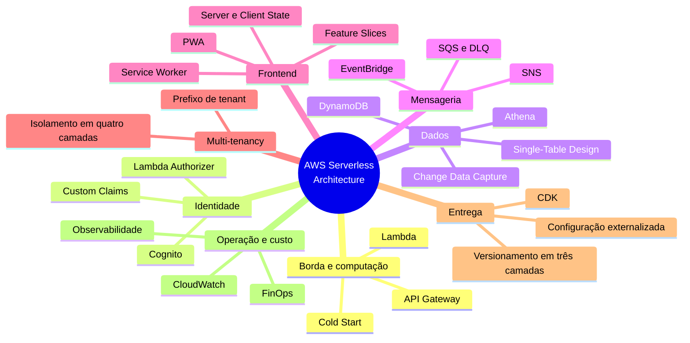
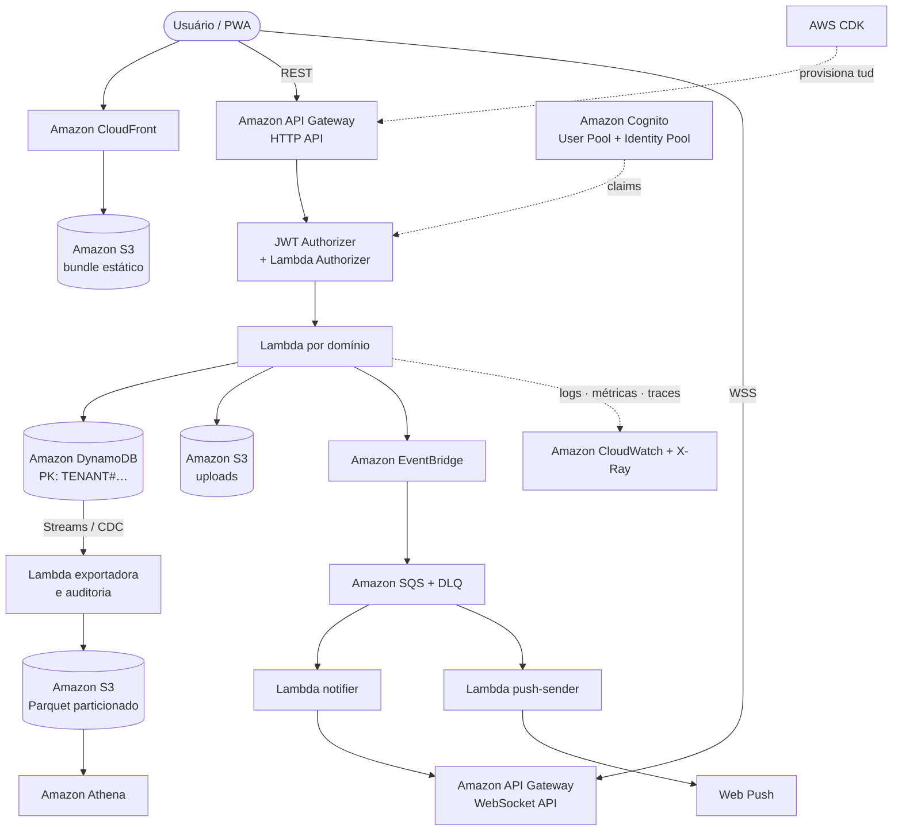

> [!abstract]
> Este mapa organiza a **arquitetura canônica de um produto SaaS multi-tenant construído sobre AWS serverless**, com frontend PWA: quais serviços a compõem, que padrões a sustentam e quais decisões são inegociáveis em cada camada.

---

# Visão Geral

A arquitetura se organiza em oito eixos. Os eixos 1 a 4 respondem por **como a requisição entra, é autorizada, persiste e reage**; os eixos 5 e 6, por **o que o usuário vê e o que acontece quando a rede falha**; os eixos 7 e 8, por **como o sistema é entregue, operado e pago**.

---

# Topologia de referência

---

# 1. Borda e Computação

Como a requisição entra e onde o código roda.

- [[Amazon API Gateway]]
- [[AWS Lambda]]
- [[Cold Start]]
- [[Serverless]]
- [[Hexagonal Architecture]]
- [[Contrato de API Padronizado]]

---

# 2. Identidade e Autorização

Quem é o usuário, a que organização pertence e o que pode fazer.

- [[Amazon Cognito]]
- [[Token Enrichment (Custom Claims)]]
- [[Lambda Authorizer]]
- [[JSON Web Token (JWT)]]
- [[Authentication]]
- [[Authorization]]
- [[Identity and Access Management (IAM)]]
- [[Segurança de API]]

---

# 3. Multi-Tenancy

O eixo transversal: atravessa identidade, dados, infraestrutura e custo.

- [[Multi-Tenancy]]
- [[Autorização Multi-Tenant Fim a Fim]]
- [[Single-Table Design]]

---

# 4. Dados

Onde o estado vive, como é consultado e como o resto do sistema fica sabendo que ele mudou.

- [[Amazon DynamoDB]]
- [[Single-Table Design]]
- [[Change Data Capture (CDC)]]
- [[Amazon S3]]
- [[Amazon Athena]]
- [[Idempotência]]
- [[Eventual Consistency]]
- [[Saga]]
- [[Outbox Pattern]]
- [[CQRS]]

---

# 5. Mensageria e Tempo Real

Como o sistema se desacopla no tempo e como o usuário fica sabendo.

- [[Amazon EventBridge]]
- [[Amazon SQS]]
- [[Amazon SNS]]
- [[Domain Events]]
- [[Event Driven Architecture]]
- [[WebSocket]]
- [[Web Push]]
- [[Message Queue]]

---

# 6. Frontend e PWA

O que o usuário vê, e o que acontece quando a rede não coopera.

- [[Progressive Web App (PWA)]]
- [[Service Worker]]
- [[Estratégias de Cache em PWA]]
- [[Server State e Client State]]
- [[Feature-Sliced Architecture]]
- [[Internationalization (i18n)]]
- [[Internacionalização de Aplicação Frontend]]
- [[Amazon CloudFront]]
- [[Pre-Signed URL]]
- [[Upload Direto com URL Pré-assinada]]

---

# 7. Entrega e Infraestrutura

Como o sistema sai do repositório e chega à produção.

- [[AWS Cloud Development Kit (CDK)]]
- [[Infrastructure as Code]]
- [[Externalização de Configuração e Segredos]]
- [[Pipeline de CI-CD]]
- [[Estratégia de Versionamento em Três Camadas]]
- [[Versionamento Semântico (SemVer)]]
- [[Versionamento de API]]
- [[Matriz de Compatibilidade de Dependências]]
- [[Checklist de Nova Funcionalidade Full Stack]]

---

# 8. Operação e Custo

Como se enxerga o que está acontecendo — e quanto isso custa.

- [[Amazon CloudWatch]]
- [[Observabilidade em Funções Serverless]]
- [[Observability]]
- [[Distributed Tracing]]
- [[Logging]]
- [[FinOps]]
- [[Modelagem de Custo AWS Serverless]]

---

# As decisões que definem esta arquitetura

| Decisão | Alternativa recusada | Por quê |
|---|---|---|
| Banco chave-valor como único armazenamento primário | Relacional gerenciado | Sem VPC, sem pool de conexão, sem migração — o que casa com o modelo de execução efêmero |
| Isolamento pool com prefixo de tenant na chave | Banco por cliente | Custo por tenant que amortiza; limites de conta não comportam silo em escala |
| Tenant no claim assinado | Consulta ao perfil por requisição | Elimina I/O do caminho crítico e permite decidir na borda |
| Barramento de eventos entre domínios | Chamada síncrona entre funções | Encadeamento síncrono multiplica custo e acopla tempos de vida |
| Upload direto ao armazenamento | Arquivo pela API | Limite de payload, custo de computação por byte transferido |
| Agregação em consulta analítica sobre exportação | Varredura na tabela transacional | Varredura cobra pelo total lido, não pelo resultado |
| Infraestrutura só por código | Ajuste no console | Drift silencioso entre o declarado e o real |

---

# Anti-padrões desta arquitetura

> [!warning] Backend
> Ler o tenant do cabeçalho HTTP no handler · chave sem prefixo de tenant · consumidor assíncrono sem DLQ · timeout padrão de 3 s · segredo em variável de ambiente · IAM com curinga · encadeamento síncrono de funções · evento publicado sem esquema registrado · agregação direto na tabela transacional · consumidor de stream escrevendo na própria tabela · alteração manual no console.

> [!warning] Frontend
> Buscar dado remoto com efeito e estado local · ler o identificador de correlação do cabeçalho em vez do corpo · enviar arquivo pela API · cachear dado sensível no dispositivo · gerar a chave de idempotência no hook em vez do serviço · uma fatia importando de outra · abrir mais de uma conexão de tempo real · URL literal no arquivo de ambiente · SDK de identidade fora do adaptador · rota sem fronteira de erro.

---

# Pontes com outros clusters do vault

| Ponte | Conecta a |
|---|---|
| [[Serverless]] · [[Cloud Native]] · [[Infrastructure as Code]] · [[Container]] | [[System Design MOC]] — empacotamento e entrega |
| [[Idempotência]] · [[Saga]] · [[Outbox Pattern]] · [[Eventual Consistency]] | [[System Design MOC]] — resiliência e dados distribuídos |
| [[OAuth 2.0]] · [[JSON Web Token (JWT)]] · [[Zero Trust]] · [[Identity Federation]] | [[System Design MOC]] — segurança e identidade |
| [[Domain Driven Design]] · [[Bounded Context]] · [[Hexagonal Architecture]] | Decomposição de domínio |
| [[Observability]] · [[Monitoring and Event Management]] · [[Service Financial Management]] | [[ITIL 5]] — operação e finanças de serviço |
| [[FinOps]] · [[Cloud Native Anti-Patterns]] | Governança de custo em nuvem |
| [[Object Storage]] · [[Data Lake]] · [[ETL]] · [[Data Pipeline]] | Cluster de dados |

---

# Aplicação

- [[Arquitetura Canônica AWS Serverless]] — o guia de referência completo que originou este cluster, com a pilha de tecnologia, a matriz de compatibilidade e o modelo de custo por serviço

---

# Perguntas de Pesquisa

> [!question] Lacunas abertas deste domínio
> - **Orquestração de fluxo longo:** máquinas de estado gerenciadas como alternativa ao encadeamento por eventos quando há compensação e espera humana.
> - **Estratégias de entrega progressiva:** implantação azul-verde, liberação canário e chaves de funcionalidade aplicadas a funções com alias.
> - **Testes de arquitetura serverless:** limites do teste local, contrato entre produtor e consumidor de eventos, e teste de integração contra ambiente efêmero.
> - **Limites de conta e cota** como restrição de projeto: concorrência por região, throughput de partição, cota de conexões simultâneas.
> - **Residência de dado e conformidade** em modelo pool: quando a exigência regulatória força o silo.

---

# Veja também

- [[System Design MOC]]
- [[ITIL 5]]
- [[Lean Inception MOC]]
- [[AI Generative Architecture]]
