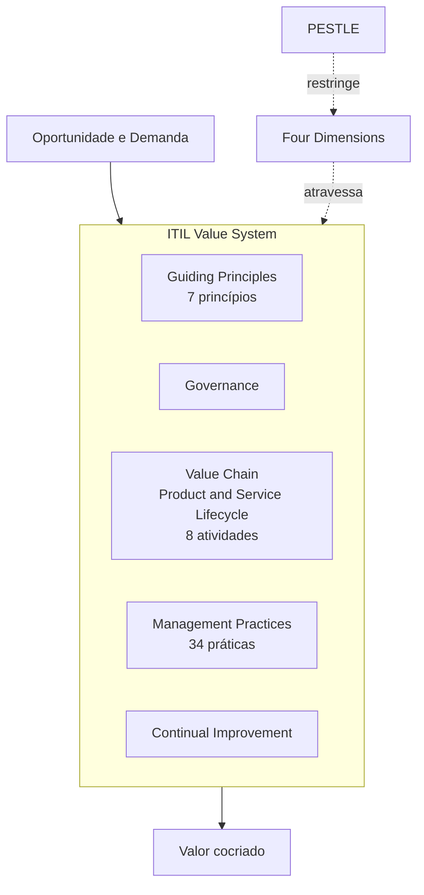
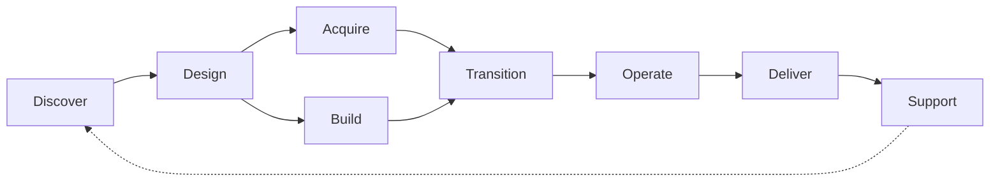

> [!abstract]
> Este MOC organiza as notas permanentes do domínio **ITIL (Version 5)** — o framework de gestão de produtos e serviços digitais. O objetivo não é resumir o framework, mas servir de ponto central de navegação entre seus conceitos, práticas e pontes com outras disciplinas da Engenharia de Software.

> [!important] O nome oficial é apenas "ITIL"
> A designação *ITIL (Version 5)* existe só para distinguir das versões anteriores. A publicação Foundation afirma explicitamente que **ITIL deixou de significar "IT Infrastructure Library"** e passou a ser descrito como *"framework e guia de boas práticas para gestão de produtos e serviços digitais"*.

---

# Visão Geral

---

# O que mudou na Versão 5

| Tema | ITIL 4 | ITIL (Version 5) |
|---|---|---|
| Escopo declarado | Gestão de serviços de TI | Gestão de **produtos e serviços digitais** |
| Sigla | IT Infrastructure Library | Deixou oficialmente de ser um acrônimo |
| Sistema de valor | Service Value System (SVS) | [[ITIL Value System]] (IVS) |
| Motor operacional | Service Value Chain — 6 atividades | [[ITIL Product and Service Lifecycle]] — 8 atividades |
| Grupos de práticas | General · Service · Technical | [[General Management Practices]] · [[Product and Service Management Practices]] |
| Práticas técnicas | Categoria própria (3 práticas) | Categoria extinta; migraram para produto e serviço |
| Quantidade de práticas | 34 | 34 (nomes inalterados) |
| Princípios orientadores | 7 | 7 (**inalterados**) |
| Modelo de relacionamento | Difuso | [[Service Relationship Model]], com [[Digital Product Vendor]] |
| IA | Menção pontual | [[ITIL AI Capability Model]] + [[ITIL AI Governance]] com publicação própria |
| Contexto industrial | Quarta Revolução Industrial | Indústria 5.0 |

> [!warning] Os nomes das 34 práticas continuam, o conteúdo não necessariamente
> Os *Official Practice Guides* revisados estão sendo publicados ao longo de 2026. Espera-se mudança substancial em várias práticas, mesmo com o nome preservado.

---

# 1 · Fundamentos

## Framework e disciplina

- [[ITIL]]
- [[IT Service Management (ITSM)]]
- [[Service Management]]
- [[Product and Service Management]]
- [[Digital Product and Service Management]]
- [[Digital Organization]]
- [[Digital Ecosystem]]

## Produto e serviço

- [[Product]]
- [[Service]]
- [[Digital Product]]
- [[Digital Service]]
- [[Service Offering]]
- [[Utility]]
- [[Warranty]]
- [[Sustainability]]

---

# 2 · Valor e Cocriação

- [[Value]]
- [[Value Co-Creation]]
- [[Outcome]]
- [[Output]]
- [[Cost]]
- [[Risk]]
- [[Feedback Loop]]

## Componentes de uma oferta

- [[Service Action]]
- [[Transfer of Goods]]
- [[Access to Resources]]

---

# 3 · Relacionamentos de Serviço

- [[Service Relationship]]
- [[Service Relationship Model]]
- [[Service Journey]]
- [[Service Quality]]

## Papéis

| Lado | Papéis |
|---|---|
| Provedor | [[Service Provider]] · [[Digital Product Vendor]] |
| Consumidor | [[Service Consumer]] → [[Sponsor]] · [[Customer]] · [[User]] |

---

# 4 · Experiência

- [[Experience]]
- [[User Experience (UX)]]
- [[Customer Experience (CX)]]
- [[Employee Experience]]
- [[Digital Experience]]
- [[Trust]]
- [[Experience Management]]

---

# 5 · Estratégia e Transformação

## Estratégia

- [[Strategy]]
- [[Vision]]
- [[Mission]]
- [[Purpose]]
- [[Digital Strategy]]
- [[VUCA]]

## Transformação

- [[Transformation]]
- [[Change]]
- [[Business as Usual (BAU)]]
- [[ITIL Transformation Model]]

---

# 6 · As Quatro Dimensões

- [[Four Dimensions of Product and Service Management]]
  - [[Organizations and People]]
  - [[Information and Technology]]
  - [[Partners and Suppliers]]
  - [[Value Streams and Processes]]
- [[PESTLE]] — os fatores externos que as cercam

---

# 7 · Product and Service Lifecycle

> [!info]
> As oito atividades **não são fases sequenciais**. São modos de trabalho recombinados em [[Value Stream]]s distintos conforme o gatilho. Como conjunto, formam o componente *Value Chain* do [[ITIL Value System]].

- [[ITIL Product and Service Lifecycle]]

| Atividade | Pergunta que responde |
|---|---|
| [[Discover (Lifecycle)]] | O que o mercado e a estratégia pedem? |
| [[Design (Lifecycle)]] | Como a solução deve ser? |
| [[Acquire (Lifecycle)]] | O que compramos ou contratamos? |
| [[Build (Lifecycle)]] | Como construímos e validamos? |
| [[Transition (Lifecycle)]] | Como colocamos em produção com segurança? |
| [[Operate (Lifecycle)]] | Como mantemos funcionando? |
| [[Deliver (Lifecycle)]] | Como o consumidor acessa e consome? |
| [[Support (Lifecycle)]] | Como restauramos e ajudamos quando falha? |

- [[Retirement]] — o encerramento, que fecha o ciclo de vida

---

# 8 · ITIL Value System

- [[ITIL Value System]]
- [[Guiding Principles]]
- [[Governance]] · [[Compliance]]
- [[Value Chain]]
- [[Management Practices]]
- [[Continual Improvement]]

---

# 9 · Princípios Orientadores

> [!info]
> Os sete princípios permaneceram **inalterados** entre o ITIL 4 e a Versão 5 — o componente mais estável do framework.

1. [[Focus on Value]]
2. [[Start Where You Are]]
3. [[Progress Iteratively with Feedback]]
4. [[Collaborate and Promote Visibility]]
5. [[Think and Work Holistically]]
6. [[Keep It Simple and Practical]]
7. [[Optimize and Automate]]

---

# 10 · Fluxos de Valor

- [[Value Stream]]
  - [[Core Value Stream]]
  - [[Enabling Value Stream]]
- [[Value Stream Mapping]]
- [[Value Stream Management]]
- [[Flow]] · [[Lead Time]] · [[Cycle Time]]
- [[Complexity Thinking]]

---

# 11 · Melhoria Contínua

- [[Continual Improvement]]
- [[Continual Improvement Model]]
- [[Continual Improvement Practice]]
- [[Metrics]] · [[Key Performance Indicator (KPI)]] · [[Critical Success Factor (CSF)]]

---

# 12 · Práticas de Gestão

- [[Management Practices]]

## [[General Management Practices]] — 14

| Prática | Prática |
|---|---|
| [[Architecture Management]] | [[Continual Improvement Practice]] |
| [[Information Security Management]] | [[Knowledge Management]] |
| [[Measurement and Reporting]] | [[Organizational Change Management]] |
| [[Portfolio Management]] | [[Project Management]] |
| [[Relationship Management]] | [[Risk Management]] |
| [[Service Financial Management]] | [[Strategy Management]] |
| [[Supplier Management]] | [[Workforce and Talent Management]] |

## [[Product and Service Management Practices]] — 20

| Prática | Prática |
|---|---|
| [[Availability Management]] | [[Business Analysis]] |
| [[Capacity and Performance Management]] | [[Change Enablement]] |
| [[Deployment Management]] | [[Incident Management]] |
| [[Infrastructure and Platform Management]] | [[IT Asset Management]] |
| [[Monitoring and Event Management]] | [[Problem Management]] |
| [[Release Management]] | [[Service Catalogue Management]] |
| [[Service Configuration Management]] | [[Service Continuity Management]] |
| [[Service Design]] | [[Service Desk]] |
| [[Service Level Management]] | [[Service Request Management]] |
| [[Service Validation and Testing]] | [[Software Development and Management]] |

---

# 13 · Conceitos Operacionais

- [[Incident]] · [[Problem]] · [[Error]] · [[Known Error]]
- [[Operating Model]]
- [[Observability]]
- [[Site Reliability Engineering (SRE)]]
- [[Continuous Integration (CI)]] · [[Continuous Delivery (CD)]]

---

# 14 · Métricas

- [[Service Level Agreement (SLA)]]
- [[Service Level Objective (SLO)]]
- [[Service Level Indicator (SLI)]]
- [[Error Budget]]
- [[DORA Metrics]]
- [[Mean Time to Restore (MTTR)]]
- [[Availability]] · [[Reliability]]

---

# 15 · Inteligência Artificial

> [!info]
> A maior novidade da Versão 5. A IA entra em três lugares distintos: como capacidade dentro da dimensão de Informação e Tecnologia, como tema da dimensão de Organizações e Pessoas, e como publicação e certificação próprias de governança.

- [[Artificial Intelligence (AI)]]
- [[Generative AI]]
- [[Agentic AI]]
- [[ITIL AI Capability Model]] — o modelo 6C
- [[ITIL AI Governance]]
- [[AIOps]]
- [[Autonomous Operations]]
- [[Human-in-the-Loop]]

---

# 16 · Modelos de Apoio

- [[ITIL Maturity Model]] — Apêndice F
- [[ITIL Transformation Model]] — Apêndice G
- [[ITIL Roles]] — Apêndice C
- [[RACI]]

---

# 17 · Pontes com Outros Clusters

## Engenharia

- [[DevOps]] · [[DevSecOps]] · [[Agile]] · [[Lean]]
- [[Platform Engineering]] · [[Infrastructure as Code]]
- [[Scrum]] · [[SAFe]] · [[PRINCE2]]

## Arquitetura

- [[Enterprise Architecture]] · [[TOGAF]] · [[COBIT]]
- [[Business Capability]] · [[Capability Mapping]]
- [[Domain Driven Design]] · [[Event Storming]]
- [[Team Topologies]] · [[Lei de Conway]]

## Resiliência

- [[Business Continuity]] · [[Disaster Recovery]]
- [[RTO]] · [[RPO]] · [[High Availability]]

## IA Generativa

- [[AI Generative Architecture]] — o MOC do cluster
- [[Large Language Model (LLM)]] · [[Retrieval-Augmented Generation (RAG)]] · [[Knowledge Graph]]
- [[Agent Supervisor]] · [[Agent Runtime]] · [[Model Context Protocol (MCP)]]

## Produto

- [[Lean Inception MOC]] — o MOC do cluster
- [[MVP]] · [[Personas]] · [[Jornadas do Usuário]] · [[Visão do Produto]]

---

# 18 · Estudos Comparativos

- [[ITIL vs DevOps]]
- [[ITIL vs SRE]]
- [[ITIL vs COBIT]]
- [[ITIL vs TOGAF]]
- [[ITIL vs Platform Engineering]]
- [[ITIL vs Scrum]]
- [[ITIL vs SAFe]]

---

# 19 · Publicações da Versão 5

> [!info]
> Notas de literatura só entram em `01 Literature` **após a leitura**. Esta tabela é o registro do escopo do esquema, não um índice de notas existentes.

| Publicação | Lançamento | Papel |
|---|---|---|
| ITIL Foundation (Version 5) | 12/02/2026 | Vocabulário, Value System, ciclo de vida |
| ITIL Experience (Version 5) | 19/03/2026 | UX, CX, EX, confiança |
| ITIL Product (Version 5) | 26/03/2026 | Gestão de produto digital |
| ITIL Service (Version 5) | 02/04/2026 | Gestão de serviço e operação |
| ITIL Strategy (Version 5) | — | Estratégia digital e direção |
| ITIL Transformation (Version 5) | — | Mudança organizacional |
| ITIL AI Governance (Version 5) | — | Governança de IA, com certificação própria |

**Qualificações:** ITIL Practice Manager · ITIL Managing Professional · ITIL Strategic Leader · ITIL Master — todas na Versão 5, além de uma qualificação dedicada a AI Governance.

---

# Perguntas de Pesquisa

> [!question]
>
> - A fusão de produto e serviço num único ciclo de vida resolve o problema do muro entre construir e operar, ou apenas o renomeia?
> - Quais das 34 práticas mudam substancialmente nos Practice Guides revisados de 2026, e quais só trocaram de categoria?
> - Como o *product operating model* altera a aplicação das práticas de portfólio e financeiro?
> - O [[Error Budget]] do SRE poderia substituir a autorização de mudança do [[Change Enablement]] para serviços com SLO maduro?
> - Quais práticas são genuinamente potencializadas por [[Agentic AI]] — e quais apenas ganham uma camada de sugestão?
> - Onde exatamente traçar o limite de [[Human-in-the-Loop]] em operações autônomas de produção?
> - Como o [[ITIL Value System]] se relaciona com [[Team Topologies]] na definição de fronteiras de time?
> - Como integrar [[TOGAF]], [[Domain Driven Design]], [[DevOps]] e ITIL numa arquitetura corporativa coerente sem quadruplicar o vocabulário?
> - A separação entre [[Deliver (Lifecycle)]] e [[Support (Lifecycle)]] muda algo na prática, ou é refinamento de modelo?

---

> [!quote]
> **Livros são temporários. Conceitos são permanentes. Conhecimento conectado gera valor.**
