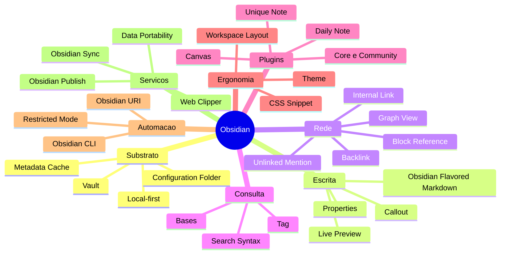

> [!abstract]
> Mapa do domínio **gestão de conhecimento pessoal em texto puro**, a partir da ferramenta em que este vault é construído: como o dado é armazenado e por que isso é uma decisão de arquitetura, como se escreve e estrutura uma nota, como notas se tornam rede, como a rede se torna consultável, e como o conjunto é estendido, sincronizado, publicado e migrado.

# Visão Geral

O domínio se organiza em oito eixos. O primeiro é o substrato e determina todos os outros; os do meio são o método de fato; os últimos definem os limites de saída de dado e de risco.

# 1 · Substrato: onde o dado vive

A camada que define tudo o que vem depois. Os arquivos são a única fonte de verdade; índice, grafo, base, vault remoto e site publicado são derivados descartáveis.

- [[Local-first]] — o dado vive primariamente no disco; sync é utilidade, não armazenamento canônico
- [[Vault]] — a pasta como unidade de namespace, permissão e transação
- [[Configuration Folder]] — `.obsidian` como configuração portável e versionável
- [[Metadata Cache]] — o índice derivado e reconstruível
- [[File Recovery]] — snapshots locais, e por que não são backup
- [[Criar e Organizar um Vault]] — a prática de montagem

# 2 · Escrita: como uma nota é feita

- [[Obsidian Flavored Markdown (OFM)]] — CommonMark + GFM + LaTeX mais um conjunto fechado de extensões
- [[Properties (Frontmatter)]] — a camada de identidade tipada e machine-readable da nota
- [[Callout]] — vocabulário semântico, extensível por CSS
- [[Live Preview]] — os três estados de visualização como fases do trabalho
- [[Attachment]] — o material não textual e onde ele aterrissa
- [[Escrever Frontmatter Consultável]] — a prática

# 3 · Rede: como notas se ligam

O eixo onde o Zettelkasten deixa de ser metáfora. Endereçamento em três granularidades, inversão automática de direção, e descoberta de arestas que o autor não sabia que existiam.

- [[Internal Link (Wikilink)]] — os dois formatos, as três políticas de caminho, o link para nota inexistente
- [[Block Reference]] — o endereço estável de uma proposição individual
- [[Embed (Transclusão)]] — reuso sem duplicação
- [[Alias (Obsidian)]] — vários nomes para o mesmo endereço
- [[Backlink]] — a direção que o Zettelkasten físico exigia indexar à mão
- [[Unlinked Mention]] — a rede parcialmente descoberta, não só intencional
- [[Graph View]] — o grafo como instrumento de diagnóstico
- [[Ligar Notas em Três Granularidades]] · [[Diagnóstico do Grafo de Conhecimento]] — as práticas

# 4 · Consulta: como a rede é interrogada

- [[Search Syntax (Obsidian)]] — a gramática que alimenta busca, filtro de backlinks, grupos do grafo e bookmarks
- [[Base (Obsidian Bases)]] — camada de consulta declarativa sobre o frontmatter, sem armazenamento próprio
- [[Tag (Obsidian)]] — classificação transversal, com hierarquia por `/`
- [[Busca Avançada no Obsidian]] · [[Modelar uma Base sobre o Frontmatter]] — as práticas

# 5 · Plugins: o núcleo mínimo e os building blocks

- [[Obsidian Plugin]] — core × community, e o modelo de risco sem sandbox
- [[Canvas]] — pensamento espacial; posição e arestas rotuladas carregam o que não cabe em frontmatter
- [[Daily Note]] — a entrada por data
- [[Unique Note (Zettelkasten Prefix)]] — a entrada por identidade, e o atrito com o endereçamento por nome
- [[Refatorar Notas com Note Composer]] — a prática que mantém a atomicidade ao longo do tempo

# 6 · Ergonomia: a interface como condição do fluxo

- [[Workspace Layout]] — modos de trabalho materializados: capturar, processar, revisar
- [[CSS Snippet]] — múltiplos overrides componíveis, escopáveis por nota via `cssclasses`
- [[Theme (Obsidian)]] — o pacote grande substituível
- [[Criar um CSS Snippet]] — a prática

# 7 · Automação e segurança

- [[Restricted Mode]] — o interruptor global, ligado por padrão
- [[Obsidian URI]] — zero instalação, 7 actions, `x-callback-url`
- [[Obsidian CLI]] — o app inteiro pela linha de comando; e o Headless `ob` sem app nenhum
- [[Automatizar o Obsidian por URI e CLI]] — a prática, e a leitura de superfície de ataque

# 8 · Serviços gerenciados e portabilidade

Construídos *sobre* o local-first, não contra ele. Cada um define um limite explícito de saída de dado.

- [[Obsidian Sync]] · [[Remote Vault]] — topologia em estrela, limites por plano, conflitos
- [[End-to-End Encryption]] — o que é cifrado, o que não é, e por que
- [[Version History]] — retenção remota, com autoria
- [[Obsidian Publish]] — o vault como site, controlado por frontmatter
- [[Obsidian Web Clipper]] — a boca do funil de literatura
- [[Data Portability]] — a saída tratada como feature, e a taxonomia das perdas
- [[Configurar Sync com Sincronização Seletiva]] · [[Publicar um Vault com Obsidian Publish]] · [[Captura Web com Template de Clipper]] · [[Migrar uma Base de Conhecimento para o Obsidian]] — as práticas

# Literatura

- [[Obsidian Help]] — documentação oficial, 173 páginas, lidas em 2026-08-07
  - [[Obsidian Help 01|01 Fundamentos e Vault]] · [[Obsidian Help 02|02 Escrita e Markdown]] · [[Obsidian Help 03|03 Ligação e Grafo]] · [[Obsidian Help 04|04 Plugins e Bases]]
  - [[Obsidian Help 05|05 Interface e Ergonomia]] · [[Obsidian Help 06|06 Extensibilidade]] · [[Obsidian Help 07|07 Serviços]] · [[Obsidian Help 08|08 Migração]]

# Pontes com outros clusters

| Ponte | Liga |
|---|---|
| [[Local-first]] | PKM à discussão de [[Vendor Lock-in]] e estratégia de saída |
| [[Metadata Cache]] | Estado derivado descartável ao padrão de [[CQRS]] e materialized view |
| [[Data Portability]] | Formato aberto à mesma tese de [[Vendor Lock-in]] e [[Multi-Cloud]] |
| [[End-to-End Encryption]] | Sync à [[Criptografia Simétrica e Assimétrica]] e ao [[Zero Trust]] |
| [[Restricted Mode]] · [[Obsidian Plugin]] | Extensibilidade ao [[Threat Modeling]] e à gestão de superfície de ataque |
| [[Version History]] · [[File Recovery]] | Recuperação ao [[Backup]], [[Snapshot]] e [[Disaster Recovery]] |
| [[Base (Obsidian Bases)]] | Consulta sobre frontmatter aos [[Tipos de Banco de Dados]] e ao [[Data Lake]] |
| [[Graph View]] | Rede de notas ao [[Knowledge Graph]] e à prática de [[Knowledge Management]] |
| [[Obsidian Web Clipper]] | Captura assistida por LLM ao [[Large Language Model (LLM)]] e ao [[Claude Cowork]] |
| [[Obsidian CLI]] | Automação agêntica sobre o vault ao [[Claude Code]] e ao [[Agentic Workflow]] |
| [[Obsidian Publish]] | Publicação ao [[Content Delivery Network (CDN)]] e a [[Compliance]] de dado público |
| [[Unique Note (Zettelkasten Prefix)]] | Identidade de nota ao [[Distributed ID Generator]] — o mesmo problema de id único sem coordenação |

# Perguntas de Pesquisa

> [!question] Lacunas conhecidas deste domínio
> - **Community plugins em profundidade** — Dataview, Templater, Style Settings, Excalidraw. A doc oficial só descreve o modelo de segurança e o diretório, não os plugins. Falta fonte primária.
> - **Documentação de desenvolvedor** (`docs.obsidian.md`) — Obsidian API, construir plugin, construir tema, a referência completa de CSS variables. Outro corpo de texto, não coberto aqui.
> - **Especificação do JSON Canvas** — nomeada em [[Canvas]], mas o schema vive em `jsoncanvas.org`. Interessa como caso de formato aberto deliberado.
> - **Bases em uso real** — a sintaxe está mapeada, a experiência de manter uma base grande não. Reler o eixo quando o vault adotar bases de fato.
> - **Vault versionado em Git** — a doc menciona Git como método de sync e recomenda `.gitignore` para `workspace.json`, mas não trata de estratégia de branch, resolução de conflito em Markdown nem CI sobre notas. Lacuna prática relevante para este vault, que já vive em repositório.
> - **Método × ferramenta** — este MOC cobre a ferramenta. O método (notas atômicas, evergreen, PARA, curadoria assistida por IA) está no README do vault e não tem notas permanentes próprias. Vale destilar as fontes canônicas de Zettelkasten e de *evergreen notes* em conceitos, com ponte para [[Knowledge Management]].

---
> [!success]
> **Livros são temporários. Conceitos são permanentes. Conhecimento conectado gera valor.** Este cluster é o único do vault que descreve o próprio meio em que ele existe — o que o torna a documentação da infraestrutura, não de um domínio de estudo.
