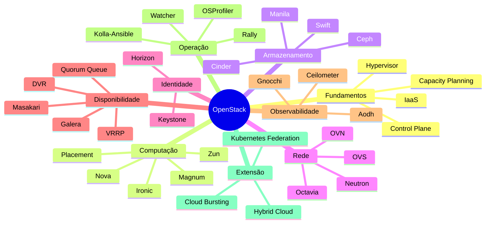

> [!abstract]
> Mapa do cluster de nuvem privada: os serviços que compõem o ecossistema [[OpenStack]], os conceitos neutros que ele materializa, e as pontes com os clusters de System Design, Cloud e AWS já existentes no vault.

# Visão Geral

# Fundamentos

O substrato conceitual — vale fora do OpenStack.

- [[Infrastructure as a Service (IaaS)]] — o modelo de entrega, e onde ele para
- [[Control Plane]] — a separação entre decidir e transportar
- [[Hypervisor]] — a camada que torna a densidade econômica
- [[Flavor]] — a unidade de oferta de uma nuvem
- [[Overcommitment]] — a aposta estatística que sustenta a densidade
- [[Capacity Planning]] — dimensionar a partir do negócio, não do hardware
- [[Multi-Tenancy]] — o isolamento que torna o compartilhamento aceitável

# Computação

- [[Nova]] — ciclo de vida da instância; o serviço mais complexo do núcleo
- [[Placement]] — inventário de recursos e pré-filtragem do agendamento
- [[Ironic]] — bare metal como serviço, sem hipervisor
- [[Magnum]] — clusters de orquestração de container como recurso
- [[Zun]] — o container em si, sem orquestrador
- [[HPC]] — a classe de workload que estressa a computação

## Segregação e agendamento

- [[Availability Zone]] — domínio de falha físico
- [[Host Aggregate]] — agrupamento por perfil de hardware
- [[Nova Cells]] — sharding de banco e fila
- [[Affinity e Anti-Affinity]] — performance × sobrevivência

# Armazenamento

- [[Cinder]] — bloco persistente
- [[Swift]] — objeto distribuído, sem SPOF
- [[Manila]] — sistemas de arquivo compartilhados
- [[Ceph]] — SDS que serve as três interfaces
- [[Glance]] — imagens e snapshots
- [[Software-Defined Storage (SDS)]] — o conceito por trás de tudo isso

Notas anteriores do vault que este cluster enriquece: [[Block Storage]], [[Object Storage]], [[File Storage]], [[Storage]], [[Snapshot]], [[Backup]].

# Rede

- [[Neutron]] — rede como recurso de primeira classe
- [[Open vSwitch (OVS)]] — o switch virtual no kernel
- [[Open Virtual Network (OVN)]] — SDN com controle desacoplado
- [[Software-Defined Networking (SDN)]] — o princípio
- [[VXLAN]] — o encapsulamento que quebrou o teto das VLANs
- [[Floating IP]] — DNAT como recurso flutuante
- [[Border Gateway Protocol (BGP)]] — roteamento dinâmico sem floating IP
- [[Distributed Virtual Routing (DVR)]] — roteamento no nó de computação
- [[Octavia]] — balanceamento com amphorae
- [[Network Functions Virtualization (NFV)]] — funções de rede como software

Pontes com o cluster de rede existente: [[Modelo OSI]], [[NAT]], [[Subnet]], [[CIDR]], [[DNS]], [[Load Balancer]], [[Virtual Private Cloud (VPC)]], [[Firewall]].

# Identidade e interface

- [[Keystone]] — autenticação, autorização e catálogo de serviços
- [[Horizon]] — o dashboard e seus limites

Pontes: [[Authentication]], [[Authorization]], [[Identity Federation]], [[Single Sign-On (SSO)]], [[OAuth 2.0]], [[Identity and Access Management (IAM)]], [[Zero Trust]].

# Alta disponibilidade

- [[Stateful vs Stateless]] — a distinção que determina o padrão
- [[Active-Active vs Active-Passive]] — os dois padrões de cluster
- [[VRRP]] — IP virtual disputado por eleição
- [[Galera Cluster]] — replicação multi-master com certificação
- [[Quorum Queue]] — fila replicada por consenso
- [[Masakari]] — HA da instância do usuário

Pontes: [[High Availability]], [[Failover]], [[Disaster Recovery]], [[Service Level Agreement (SLA)]], [[Mean Time to Restore (MTTR)]], [[Consensus]], [[Business Continuity]].

# Observabilidade e telemetria

- [[Ceilometer]] — coleta e transformação de métrica
- [[Gnocchi]] — série temporal indexada
- [[Aodh]] — alarme por limiar e por evento
- [[Time Series Database]] — a categoria de banco
- [[Centralized Logging]] — o pipeline de log
- [[Memcached]] — cache que tira carga do banco

Pontes: [[Observability]], [[Metrics]], [[Logging]], [[Distributed Tracing]], [[Monitoring and Event Management]], [[Distributed Cache]], [[Estratégias de Cache]].

# Implantação e operação

- [[Kolla-Ansible]] — um container por serviço, orquestrado por Ansible
- [[Pets vs Cattle]] — o pré-requisito mental de tudo isso
- [[Benchmarking]] — descobrir os limites antes que eles apareçam
- [[Rally]] — a ferramenta de benchmark
- [[Profiling]] — onde o tempo é gasto
- [[OSProfiler]] — tracing dos serviços
- [[Watcher]] — consolidação automatizada de workload

Pontes: [[Infrastructure as Code]], [[Immutable Infrastructure]], [[DevSecOps]], [[Pipeline de CI-CD]], [[Continuous Integration (CI)]], [[Continuous Delivery (CD)]], [[FinOps]], [[Capacity and Performance Management]].

# Estratégia de nuvem

- [[Hybrid Cloud]] — o que nem público nem privado entregam sozinhos
- [[Multi-Cloud]] — mais de um provedor
- [[Cloud Bursting]] — base no privado, pico no público
- [[Shared Responsibility Model]] — segurança da nuvem × na nuvem
- [[Vendor Lock-in]] — as duas formas e suas mitigações
- [[Cloud Management Platform (CMP)]] — administração unificada
- [[Kubernetes Federation]] — um control plane para muitos clusters

Pontes: [[Kubernetes (K8s)]], [[Container]], [[Container Orchestration]], [[Cloud Native]], [[Microservices]], [[Compliance]], [[Governance]].

# Literatura

- [[Mastering OpenStack]] — índice da obra de Omar Khedher, fonte de todo este cluster
  - [[Mastering OpenStack 01]] · [[Mastering OpenStack 02]] · [[Mastering OpenStack 03]] · [[Mastering OpenStack 04]] · [[Mastering OpenStack 05]] · [[Mastering OpenStack 06]]
  - [[Mastering OpenStack 07]] · [[Mastering OpenStack 08]] · [[Mastering OpenStack 09]]
  - [[Mastering OpenStack 10]] · [[Mastering OpenStack 11]]

# Mapas vizinhos

| MOC | O que a ponte carrega |
|---|---|
| [[System Design MOC]] | Padrões distribuídos, contêineres, rede e resiliência — vistos do lado da infraestrutura |
| [[AWS Serverless Architecture MOC]] | O mesmo trade-off de custo e controle, do lado da nuvem pública gerenciada |
| [[ITIL 5]] | Gestão de capacidade, disponibilidade e nível de serviço aplicadas à operação da nuvem |

# Perguntas de Pesquisa

> [!question]
> - **Cells v2 × sharding de banco.** O particionamento de banco e fila do [[Nova Cells]] tem paralelo direto com [[Database Sharding]]. Vale escrever a ponte explícita — mesma técnica, domínios diferentes.
> - **Placement × scheduler do Kubernetes.** Resource provider, resource class e trait parecem mapear em node capacity, resource request e taints/tolerations/node affinity. A comparação renderia uma nota-ponte forte.
> - **[[Ironic]] em profundidade.** A nota está em estágio inicial: falta introspecção de hardware, drivers de gestão (IPMI, Redfish) e o modo `nova-compute-ironic`.
> - **Heat × Terraform × Pulumi.** O livro cita o Heat como via de orquestração mas não o aprofunda. Comparar HOT com as ferramentas agnósticas fecharia a lacuna de [[Infrastructure as Code]] no cluster.
> - **Segurança do endpoint de API.** A comunidade OpenStack publica um guia por release. Nenhuma nota do vault cobre hardening de endpoint de infraestrutura — lacuna que toca [[Zero Trust]] e [[Threat Modeling]].
> - **Barbican e gestão de segredo.** Mencionado de passagem no catálogo XaaS. Conecta com [[Armazenamento Seguro de Senhas]] e [[Externalização de Configuração e Segredos]].

---
Ref: [[Mastering OpenStack]], [[OpenStack]], [[System Design MOC]], [[AWS Serverless Architecture MOC]]
