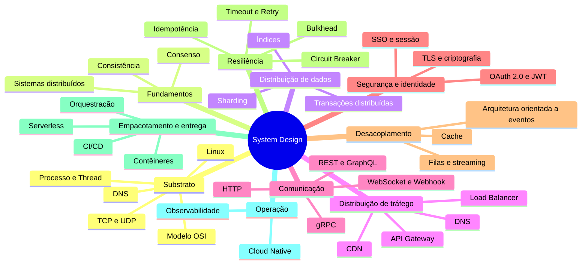
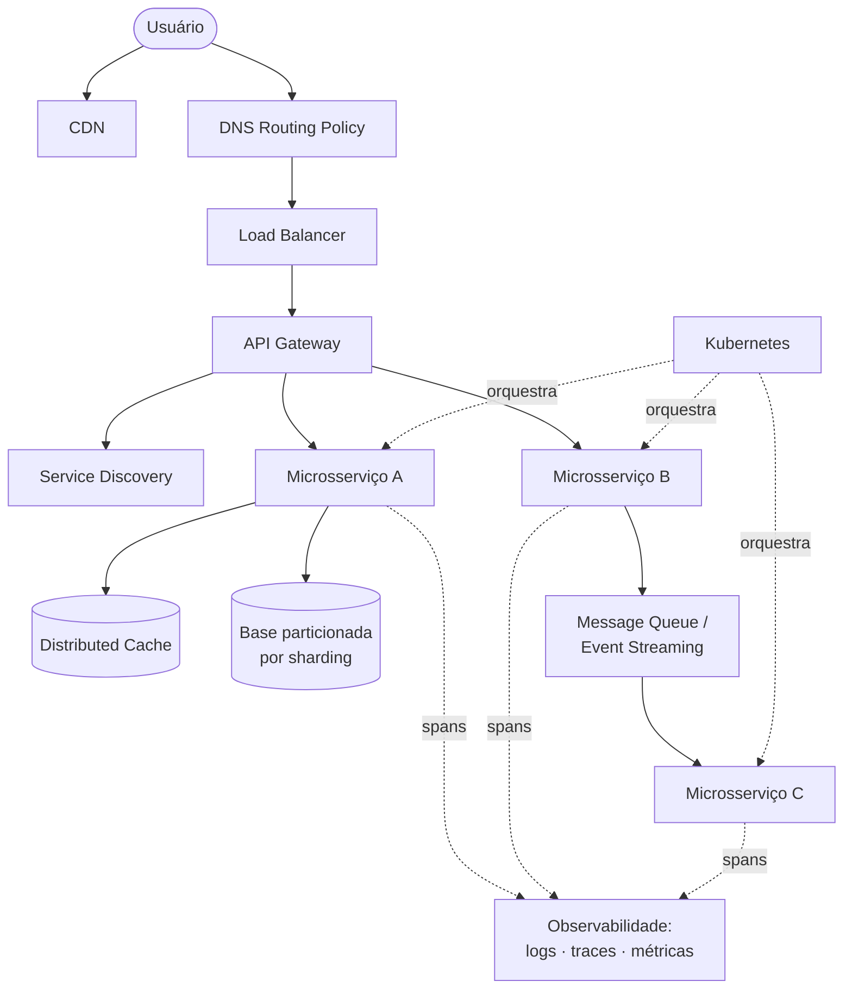

> [!abstract]
> Este MOC organiza os conceitos de **System Design**: como um sistema distribui dados e tráfego, como é empacotado e entregue, e como é operado depois que entra no ar.

---

# Visão Geral

O domínio se organiza em dez eixos. O substrato é **onde tudo roda**; os fundamentos explicam **por que sistemas distribuídos são difíceis**; os eixos 1 a 5 respondem a **como o sistema absorve carga, conversa e sobrevive à falha**; os eixos 6 a 8, a **como ele é protegido, entregue e operado**.

---

# 0. Substrato — Rede e Sistema Operacional

Onde tudo roda. É aqui que estão as causas de fenômenos que aparecem como decisões de arquitetura mais acima.

**Rede**

- [[Modelo OSI]]
- [[TCP]]
- [[UDP]]
- [[DNS]]
- [[URI, URL e URN]]
- [[Proxy]]
- [[Reverse Proxy]]
- [[Virtual Private Cloud (VPC)]]
- [[Subnet]]
- [[CIDR]]
- [[NAT]]

**Sistema operacional e computação**

- [[Processo (Computação)]]
- [[Thread]]
- [[Thread Pool]]
- [[Race Condition]]
- [[Deadlock]]
- [[Processo de Boot do Linux]]
- [[Filesystem Hierarchy Standard (FHS)]]
- [[Comandos Linux Essenciais]]
- [[Linguagem Compilada e Interpretada]]
- [[Estruturas de Dados]]

---

# 1. Fundamentos de Sistemas Distribuídos

Por que sistemas distribuídos são diferentes de tudo o mais.

- [[Distributed Systems]]
- [[CAP Theorem]]
- [[Eventual Consistency]]
- [[Consensus]]
- [[Latency Numbers]]

---

# 2. Distribuição de Dados

Como o dado deixa de caber em uma máquina só.

- [[Tipos de Banco de Dados]]
- [[Database Sharding]]
- [[Database Index]]
- [[Distributed ID Generator]]
- [[ACID]]
- [[BASE]]
- [[Two-Phase Commit]]
- [[Saga]]
- [[Outbox Pattern]]
- [[Change Data Capture (CDC)]]
- [[Data Pipeline]]
- [[Single-Table Design]]

---

# 3. Distribuição de Tráfego

Como a requisição encontra a instância certa.

- [[Load Balancer]]
- [[Content Delivery Network (CDN)]]
- [[API Gateway]]
- [[Service Discovery]]
- [[DNS Routing Policy]]
- [[Service Mesh]]

---

# 4. Comunicação entre Sistemas

Como os sistemas conversam — e quem inicia a conversa.

- [[Estilos de Arquitetura de API]]
- [[REST API]]
- [[GraphQL]]
- [[gRPC]]
- [[WebSocket]]
- [[Webhook]]
- [[HTTP]]
- [[SOAP]]
- [[Versionamento de API]]
- [[Backend for Frontend]]

---

# 5. Desacoplamento e Latência

Como se evita trabalho e como se desacopla no tempo.

- [[Distributed Cache]]
- [[Estratégias de Cache]]
- [[Message Queue]]
- [[Event Streaming Platform]]
- [[Event Driven Architecture]]
- [[Event Sourcing]]
- [[Domain Events]]
- [[CQRS]]

---

# 6. Resiliência

Como o sistema sobrevive à falha do vizinho.

- [[Timeout]]
- [[Retry Pattern]]
- [[Circuit Breaker]]
- [[Bulkhead]]
- [[Rate Limiting]]
- [[Idempotência]]
- [[Load Shedding]]
- [[Failover]]
- [[Chaos Engineering]]

---

# 7. Segurança e Identidade

Como o acesso é provado, limitado e protegido em trânsito.

- [[OAuth 2.0]]
- [[JSON Web Token (JWT)]]
- [[Single Sign-On (SSO)]]
- [[Gerenciamento de Sessão]]
- [[Identity Federation]]
- [[Transport Layer Security (TLS)]]
- [[Criptografia Simétrica e Assimétrica]]
- [[OpenID Connect]]
- [[WebAuthn e Passkeys]]
- [[Authentication]]
- [[Authorization]]
- [[Identity and Access Management (IAM)]]
- [[Armazenamento Seguro de Senhas]]
- [[Segurança de API]]
- [[Zero Trust]]
- [[Firewall]]
- [[Threat Modeling]]

---

# 8. Empacotamento, Entrega e Infraestrutura

Como o software chega à produção.

- [[Container]]
- [[Container Orchestration]]
- [[Sidecar Pattern]]
- [[Snapshot]]
- [[Kubernetes (K8s)]]
- [[Immutable Infrastructure]]
- [[Infrastructure as Code]]
- [[Pipeline de CI-CD]]
- [[Continuous Integration (CI)]]
- [[Continuous Delivery (CD)]]
- [[Serverless]]
- [[Cold Start]]

---

# 9. Arquitetura e Operação

Como o sistema é decomposto e como é mantido de pé.

- [[Microservices]]
- [[Cloud Native]]
- [[Cloud Native Anti-Patterns]]
- [[Adoção Cloud Native]]
- [[Observability]]
- [[Logging]]
- [[Distributed Tracing]]
- [[High Availability]]
- [[Disaster Recovery]]
- [[Bounded Context]]
- [[Hexagonal Architecture]]
- [[Multi-Tenancy]]
- [[FinOps]]
- [[Strangler Fig]]
- [[Arquitetura Evolutiva]]
- [[Reverse Conway Maneuver]]

---

# Arquitetura de Referência

Como os conceitos se compõem em um sistema real:

---

# Pontes com outros clusters do vault

| Ponte | Conecta System Design a |
|---|---|
| [[Lei de Conway]] · [[Team Topologies]] · [[Domain Driven Design]] | Desenho de times e fronteiras de domínio |
| [[Observability]] · [[Site Reliability Engineering (SRE)]] · [[Service Level Objective (SLO)]] | Cluster ITIL e operação de serviços |
| [[DevOps]] · [[Platform Engineering]] · [[DORA Metrics]] | Cultura e engenharia de plataforma |
| [[High Availability]] · [[Disaster Recovery]] · [[RPO]] · [[RTO]] | Cluster de Cloud e resiliência |
| [[Object Storage]] · [[Data Lake]] · [[ETL]] · [[Data Pipeline]] | Cluster de dados |
| [[Virtual Private Cloud (VPC)]] · [[Subnet]] · [[CIDR]] · [[Block Storage]] | Cluster de Cloud e infraestrutura |
| [[Information Security Management]] · [[Identity Federation]] · [[Compliance]] · [[Risk Management]] | Cluster ITIL e segurança da informação |
| [[Multi-Agent Systems]] · [[Agentic AI]] · [[Model Context Protocol (MCP)]] | Cluster de IA Generativa e Agentes |
| [[Serverless]] · [[Cold Start]] · [[Multi-Tenancy]] · [[Single-Table Design]] · [[FinOps]] | [[AWS Serverless Architecture MOC]] — arquitetura canônica AWS serverless |

---

# Fonte

**Fonte de origem do cluster:**

- [[ByteByteGo System Design Archive]] — arquivo de 2023, ~180 tópicos
  - [[ByteByteGo System Design Archive 01|Parte 1: Sistemas Distribuídos e Escalabilidade]]
  - [[ByteByteGo System Design Archive 02|Parte 2: Cloud Native, DevOps e Microsserviços]]
  - [[ByteByteGo System Design Archive 03|Parte 3: APIs, Protocolos e Segurança]]
  - [[ByteByteGo System Design Archive 04|Parte 4: Dados, Transações e Pipelines]]
  - [[ByteByteGo System Design Archive 05|Parte 5: Redes e Sistema Operacional]]

**Fontes primárias que fecharam as lacunas** — cada nota indica a sua em `## Fonte`:

| Autor / Instituição | Notas que originou |
|---|---|
| Martin Fowler | [[CQRS]], [[Event Driven Architecture]], [[Domain Events]] |
| Chris Richardson (microservices.io) | [[Saga]], [[Outbox Pattern]] |
| Werner Vogels (ACM Queue) | [[Eventual Consistency]] |
| Ongaro & Ousterhout (USENIX ATC) | [[Consensus]] |
| Martin Kleppmann (*DDIA*) | [[Two-Phase Commit]] |
| Amazon Builders' Library | [[Distributed Systems]], [[Timeout]], [[Retry Pattern]] |
| Azure Architecture Center | [[Bulkhead]], [[Rate Limiting]] |
| CNCF · Stripe | [[Serverless]] · [[Idempotência]] |
| Roy T. Fielding (dissertação) | [[REST API]] |
| GraphQL Foundation · gRPC Authors | [[GraphQL]] · [[gRPC]] |
| IETF (RFCs 6455, 6749, 7519, 8446, 9110) | [[WebSocket]] · [[OAuth 2.0]] · [[JSON Web Token (JWT)]] · [[Transport Layer Security (TLS)]] · [[HTTP]] |
| OWASP Cheat Sheet Series | [[Armazenamento Seguro de Senhas]] · [[Gerenciamento de Sessão]] · [[Segurança de API]] |
| IETF (RFCs 768, 1034/1035, 3986, 9293) | [[UDP]] · [[DNS]] · [[URI, URL e URN]] · [[TCP]] |
| ISO/IEC · Linux Foundation · AWS | [[Modelo OSI]] · [[Filesystem Hierarchy Standard (FHS)]] · [[Virtual Private Cloud (VPC)]] |
| NIST (SP 800-41, 800-63, 800-207) | [[Firewall]] · [[Authentication]] · [[Zero Trust]] |
| W3C · OpenID Foundation · FIDO | [[SOAP]] · [[OpenID Connect]] · [[WebAuthn e Passkeys]] |
| Chaos Community · Coffman et al. | [[Chaos Engineering]] · [[Deadlock]] |
| Ford, Parsons & Kua · Sam Newman · Thoughtworks | [[Arquitetura Evolutiva]] · [[Backend for Frontend]] · [[Reverse Conway Maneuver]] |

---

# Perguntas de Pesquisa

> [!success] Extração do arquivo ByteByteGo concluída
> **Fase 3** cobriu o substrato: rede (OSI, TCP, UDP, DNS, URI, proxy, VPC, subnet) e sistema operacional (processo, thread, boot do Linux, FHS, comandos, linguagens, estruturas de dados).
>
> **Fase 2** cobriu comunicação (estilos de API, REST, GraphQL, gRPC, WebSocket, Webhook, HTTP), segurança e identidade (OAuth 2.0, JWT, SSO, sessão, TLS, criptografia, senhas) e modelos de dados (ACID, BASE, tipos de banco, pipeline).
>
> Antes disso, as lacunas de **consistência e consenso**, **eventos e CQRS**, **resiliência** e **transações distribuídas** foram preenchidas a partir de fontes primárias — Fowler, Richardson, Vogels, Ongaro & Ousterhout, Kleppmann, Amazon Builders' Library, Azure Architecture Center, CNCF e Stripe. Cada nota registra a sua em `## Fonte`.

> [!success] Lacunas fechadas
> Resiliência ([[Load Shedding]], [[Chaos Engineering]], [[Failover]]), concorrência ([[Race Condition]], [[Deadlock]], [[Thread Pool]]), rede e segurança ([[NAT]], [[Firewall]], [[Zero Trust]], [[Authentication]], [[Authorization]], [[Identity and Access Management (IAM)]], [[Threat Modeling]]), identidade moderna ([[OpenID Connect]], [[WebAuthn e Passkeys]]), padrões de API ([[SOAP]], [[Versionamento de API]], [[Backend for Frontend]]) e evolução arquitetural ([[Sidecar Pattern]], [[Strangler Fig]], [[Bounded Context]], [[Arquitetura Evolutiva]], [[Reverse Conway Maneuver]]).

> [!question] Lacunas abertas deste domínio
> - **Observabilidade em profundidade:** `OpenTelemetry`, `Métrica` como nota própria (hoje só citada nos três pilares) e `SLI/SLO aplicados a serviço`.
> - **Dados:** `Data Mesh` e `Data Contract` — extensões naturais de [[Data Pipeline]]. (`Change Data Capture` foi coberto por [[Change Data Capture (CDC)]].)
> - **Entrega:** `Blue-Green Deployment`, `Canary Release` e `Feature Flag`, complementos diretos de [[Pipeline de CI-CD]].
> - **Entrega e custo:** `Blue-Green Deployment`, `Canary Release` e `Feature Flag` seguem abertos; o eixo de custo foi coberto por [[FinOps]], que liga [[Cloud Native Anti-Patterns]] ao [[Service Financial Management]] do cluster ITIL.

---

# Veja também

- [[AWS Serverless Architecture MOC]]
- [[AI Generative Architecture]]
- [[Enterprise Architecture]]
- [[ITIL 5]]
