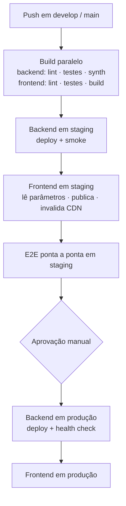

> [!abstract]
> Arquitetura de referência para produtos SaaS multi-tenant: **frontend PWA** (React + TypeScript + Vite) sobre **backend serverless AWS** (Lambda + API Gateway + Cognito + DynamoDB), organizada por princípios hexagonais e de DDD nas duas metades.

O guia original é reutilizável entre projetos: o identificador do produto aparece como marcador resolvido em tempo de tarefa, e nada nele está preso a um domínio de negócio específico. Esta nota registra **o que a arquitetura decide** e para onde cada decisão foi extraída como conhecimento permanente — o mapa navegável está em [[AWS Serverless Architecture MOC]].

---

## Para que serve

Produtos com estas características:

- múltiplas organizações clientes, com vários usuários cada — ver [[Multi-Tenancy]]
- requisitos de tempo real na interface
- upload de arquivos
- operação offline pela camada PWA
- volume inicial baixo, com necessidade de escalar sem redesenho

---

## Pilha de tecnologia

### Backend — AWS serverless

| Papel | Serviço |
|---|---|
| API REST | [[Amazon API Gateway]] HTTP API |
| API de tempo real | [[Amazon API Gateway]] WebSocket API |
| Computação | [[AWS Lambda]] (Node.js 22 / TypeScript) |
| Identidade | [[Amazon Cognito]] User Pool + Identity Pool |
| Armazenamento primário | [[Amazon DynamoDB]] |
| Fluxo de mudanças | DynamoDB Streams — ver [[Change Data Capture (CDC)]] |
| Objetos | [[Amazon S3]] |
| Analytics | [[Amazon Athena]] sobre exportações em S3 |
| Eventos de domínio | [[Amazon EventBridge]] |
| Assíncrono | [[Amazon SQS]] + [[Amazon SNS]] |
| Observabilidade | [[Amazon CloudWatch]] + X-Ray |
| Configuração e segredos | Parameter Store + Secrets Manager — ver [[Externalização de Configuração e Segredos]] |
| Infraestrutura | [[AWS Cloud Development Kit (CDK)]] (TypeScript) |
| CI/CD | CodePipeline + CodeBuild — ver [[Pipeline de CI-CD]] |
| Hospedagem | [[Amazon CloudFront]] + S3 |

### Frontend — PWA

| Papel | Tecnologia |
|---|---|
| Framework e build | React 19 + TypeScript 6 (strict) + Vite 8 |
| Camada visual | shadcn/ui + Tailwind CSS v4 + Lucide React |
| Rotas | React Router 7 (carregamento tardio por fatia) |
| Estado de servidor | TanStack Query 5 — ver [[Server State e Client State]] |
| Estado de cliente | Zustand 5 |
| Formulários | React Hook Form + Zod |
| HTTP | Axios com interceptadores |
| Autenticação | Amplify Auth v6, encapsulado em adaptador único |
| Tempo real | WebSocket nativo, em um hook único no shell da aplicação |
| PWA | vite-plugin-pwa + Workbox — ver [[Service Worker]] |
| Testes | Vitest + React Testing Library + Playwright |

> [!info] A matriz de compatibilidade é parte do guia
> Versões mínimas com justificativa (conflitos de peer dependency, suporte a major do bundler) e as mudanças incompatíveis relevantes do framework estão registradas com data de validação — ver [[Matriz de Compatibilidade de Dependências]].

---

## As decisões estruturantes

| # | Decisão | Nota permanente |
|---|---|---|
| 1 | Banco chave-valor como único armazenamento primário, uma tabela por domínio | [[Amazon DynamoDB]] · [[Single-Table Design]] |
| 2 | Isolamento de tenant imposto em quatro camadas independentes | [[Autorização Multi-Tenant Fim a Fim]] |
| 3 | Tenant, papéis e estado de onboarding injetados no token na emissão | [[Token Enrichment (Custom Claims)]] |
| 4 | Autorizador na borda comparando tenant declarado com tenant assinado | [[Lambda Authorizer]] |
| 5 | Envelope único de resposta e de erro, com identificador de correlação no corpo | [[Contrato de API Padronizado]] |
| 6 | Comunicação entre domínios por barramento de eventos, nunca por chamada síncrona | [[Amazon EventBridge]] |
| 7 | Todo consumidor assíncrono com fila e DLQ | [[Amazon SQS]] |
| 8 | Upload direto ao armazenamento por URL pré-assinada | [[Upload Direto com URL Pré-assinada]] |
| 9 | Tempo real por WebSocket que **invalida cache**, não que transporta estado | [[Server State e Client State]] |
| 10 | Agregação em consulta analítica sobre exportação particionada | [[Amazon Athena]] |
| 11 | Nenhuma URL ou segredo no repositório | [[Externalização de Configuração e Segredos]] |
| 12 | Versionamento separado em produto, contrato e implantação | [[Estratégia de Versionamento em Três Camadas]] |
| 13 | Instrumentação uniforme por middleware, com quatro alarmes obrigatórios por função | [[Observabilidade em Funções Serverless]] |
| 14 | Custo estimado por serviço antes de construir | [[Modelagem de Custo AWS Serverless]] |

---

## Estrutura de código

Backend organizado por domínio, com camadas hexagonais dentro de cada um ([[Hexagonal Architecture]]); frontend em fatias verticais espelhando os mesmos domínios ([[Feature-Sliced Architecture]]).

```
{produto}-backend/                  {produto}-web/
├── infra/                          ├── app/            router · query client
│   ├── stacks/   um por domínio    ├── features/       uma fatia por domínio
│   └── constructs/  padronizados   │   └── {fatia}/    página · hooks · service · types
└── lambda/                         ├── i18n/           locales espelhados
    ├── shared/  autorizador·helpers└── shared/         api · auth · components · hooks · store
    └── {dominio}/
        ├── *.handler.ts   adaptador primário
        ├── domain/        entidades e invariantes
        └── infrastructure/ repositório
```

A tabela **funcionalidade ↔ domínio ↔ rota ↔ armazenamento** é a fonte única de verdade do vocabulário entre as duas metades: nenhuma rota é nomeada no frontend sem estar registrada nela — o passo zero do [[Checklist de Nova Funcionalidade Full Stack]].

---

## Pipeline



A ordem é a regra: **o frontend nunca vai a produção antes de o backend correspondente estar saudável**.

---

## Modelo de custo

Arquitetura inteiramente pay-per-use, sem reserva nem custo fixo de servidor. Para um produto novo sem usuários, a fatura é praticamente zero — com três exceções que cobram desde o primeiro uso: **barramento de eventos** (por evento publicado), **gerenciador de segredos** (por segredo/mês) e **consulta analítica** (por terabyte varrido). Detalhamento por serviço em [[Modelagem de Custo AWS Serverless]] e o enquadramento cultural em [[FinOps]].

---

## O que este cluster ainda não cobre

> [!question]
> As lacunas mapeadas — orquestração de fluxo longo, entrega progressiva, estratégia de teste para serverless, limites de cota como restrição de projeto e residência de dado — estão registradas em [[AWS Serverless Architecture MOC]].

---
Ref: [[AWS Serverless Architecture MOC]], [[System Design MOC]], [[Serverless]], [[Multi-Tenancy]], [[Progressive Web App (PWA)]], [[Domain Driven Design]]
