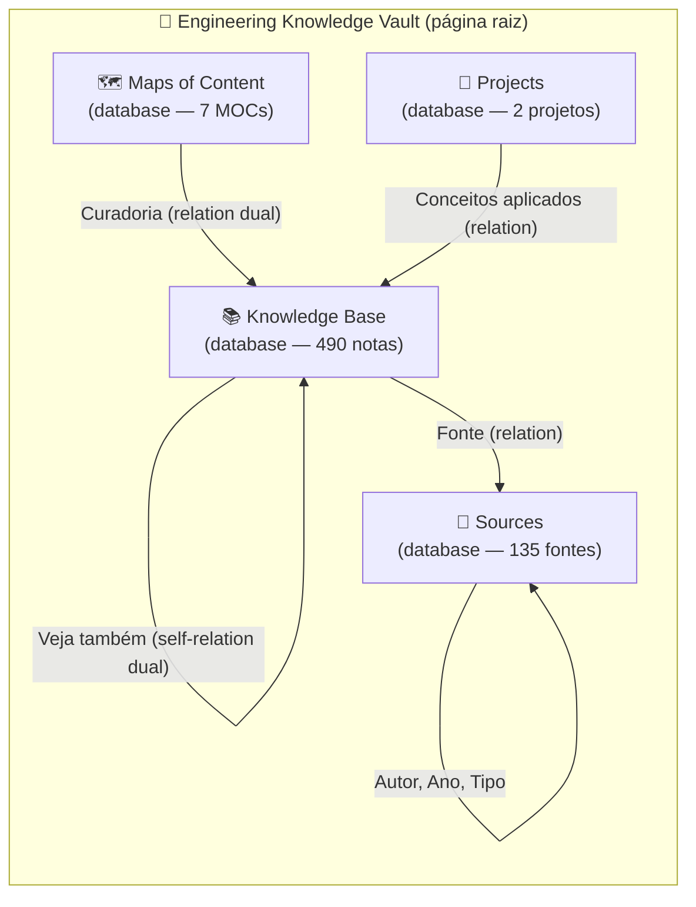
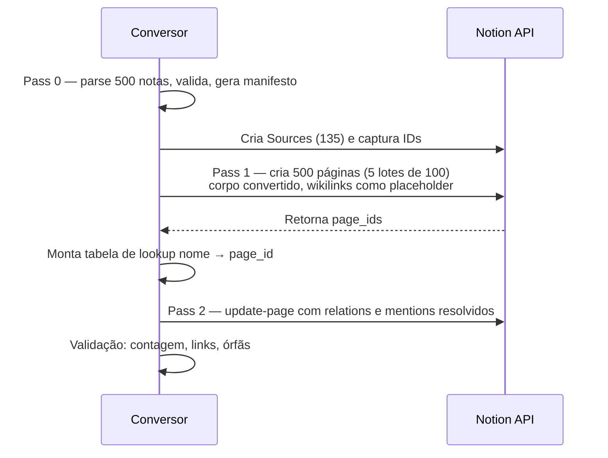

> [!abstract]
> Plano de migração das 500 notas do Knowledge-Vault para o Notion, com modelagem em databases relacionais, conversor determinístico de Obsidian-flavored para Notion-flavored Markdown, e análise honesta do que se ganha e do que se perde na transição.

## Diagnóstico da base atual

Números levantados diretamente do vault, não estimados:

| Dimensão | Valor | Impacto na migração |
|---|---|---|
| Notas `.md` | 500 (1,1 MB de texto) | 5 lotes de 100 na API |
| Com frontmatter YAML | 499 de 500 | Mapeamento para properties é quase universal |
| Wikilinks `[[ ]]` | 4.703 (527 alvos únicos) | Núcleo do valor — exige conversão em 2 passes |
| Links quebrados | 36 (0,8%) | Quase todos placeholders de template no README |
| Nomes duplicados | **0** | Resolução de link é determinística 1:1 |
| Callouts `> [!tipo]` | 777 em 10 tipos | Mapeia 1:1 para `<callout>` |
| Diagramas Mermaid | 195 notas | Suportado, mas exige saneamento de sintaxe |
| Linhas de tabela Markdown | 2.410 | **Exige reescrita em XML** — maior custo do conversor |
| Blocos de código | 304 | Passa direto |
| Embeds `![[ ]]`, Dataview, LaTeX, block refs | **0** | Elimina as três maiores fontes de dor de migração |
| Nota maior | 18.868 chars (README) | Nenhuma nota estoura limite de bloco |

**Distribuição por tipo:** `concept` 390 · `practice` 72 · `literature` 28 · `moc` 7 · `project` 2
**Por maturidade:** `evergreen` 423 · `growing` 66 · `seed` 10
**Tags:** 308 distintas (`itil` 167, `system-design` 100, `architecture` 78, `ai` 54, `openstack` 40…)
**Fontes:** 135 distintas · **Autores:** 79 distintos

A boa notícia estrutural: o vault é **muito mais limpo do que a média**. Zero Dataview, zero embeds, zero block references e zero duplicidade de nomes significam que a migração é uma transformação de texto pura, sem necessidade de resolver ambiguidade semântica. Os headings são padronizados (`Veja também` em 380 notas, `Conceito` em 348), o que permite parsing por convenção em vez de heurística.

---

## Arquitetura alvo no Notion

O erro clássico é replicar as pastas como páginas aninhadas. Isso importa a estrutura e joga fora o motivo de ir para o Notion. O modelo correto é **database-first**: as pastas viram *propriedades*, não hierarquia.



### Database 1 — Knowledge Base (o núcleo)

Recebe as 462 Permanent Notes + 28 Literature Notes. Schema:

| Property | Tipo Notion | Origem | Observação |
|---|---|---|---|
| `Name` | Title | nome do arquivo | Chave de resolução dos wikilinks |
| `Tipo` | Select | `type` | concept · practice · literature |
| `Status` | Select | `status` | seed 🌱 · growing 🌿 · evergreen 🌳 |
| `Tags` | Multi-select | `tags` | 308 opções — ver ressalva abaixo |
| `Aliases` | Rich text | `aliases` | 881 valores; vira texto pesquisável, **perde função** |
| `Fonte` | Relation → Sources | `source` | Normaliza 135 strings em entidades |
| `Autor` | Rollup (via Fonte) | `author` | Deixa de ser texto solto |
| `Criado em` | Date | `created` | |
| `Veja também` | Relation (self, DUAL) | seção `## Veja também` | **A peça mais valiosa da migração** |
| `Backlinks` | Relation sincronizada | automático | Gerada pelo DUAL da anterior |
| `Nº de conexões` | Rollup (count) | — | Detecta notas órfãs automaticamente |
| `Caminho original` | Rich text | path no repo | Rastreabilidade e rollback |

> [!important]
> A `self-relation` DUAL em `Veja também` é o que transforma 4.703 wikilinks em um grafo consultável. Sem ela, você migra texto; com ela, você migra a rede. Ela precisa ser criada em duas etapas: cria-se o database primeiro, depois usa-se `update-data-source` para adicionar a relation apontando para o próprio data source.

### Database 2 — Sources

135 registros extraídos do campo `source`. Properties: `Name`, `Tipo` (livro/curso/artigo/doc), `Autor`, `Editora`, `Ano`, `ISBN`, `Notas derivadas` (rollup). Isso resolve um problema que já existe hoje no vault: a mesma fonte aparece escrita de formas diferentes (`Mastering OpenStack (3rd Edition), Packt, 2024` vs. a versão com ISBN completo).

### Database 3 — Maps of Content

Os 7 MOCs. Aqui há uma decisão de design: manter o MOC como **prosa curada** (o texto que explica *por que* os conceitos se relacionam) e adicionar abaixo uma **linked view filtrada** do Knowledge Base. O MOC deixa de ser uma lista manual que envelhece e passa a ser narrativa + view viva.

### Database 4 — Projects

`04 Projects` com relation para os conceitos aplicados. Fecha o ciclo PARA: fonte → conceito → aplicação.

---

## O conversor: Obsidian-flavored → Notion-flavored

Este é o coração técnico. Notion-flavored Markdown **não é** CommonMark, e as diferenças que importam para este vault, em ordem de risco:

### 1. Tabelas — risco alto, volume alto

Notion não aceita tabelas em pipes. Exige XML:

```
| Domínio | Abordagem |          →    <table header-row="true">
|---|---|                              <tr><td>Domínio</td><td>Abordagem</td></tr>
| Complexo | Experimentar |            <tr><td>Complexo</td><td>Experimentar</td></tr>
                                       </table>
```

São 2.410 linhas de tabela. Agravante: **células só aceitam rich text** — nenhuma tabela pode conter lista, heading ou bloco de código. Precisa de varredura prévia para detectar violações.

### 2. Escaping — risco alto, silencioso

Fora de blocos de código, o Notion exige escape de `\ * ~ \` $ [ ] < > { } | ^`. Um `C++` ou um `array[0]` no meio do texto vira formatação corrompida sem erro nenhum. O conversor precisa escapar **fora** de code blocks e **jamais dentro** deles.

### 3. Mermaid — risco médio, 195 arquivos

Suportado via ```` ```mermaid ````, mas com regras próprias: labels com parênteses exigem aspas duplas (`A["Notion (App + API)"]`), quebras de linha usam `<br>` e não `\n`, e `\(` `\)` quebram o parser. Os 152 flowcharts precisam de lint antes da carga.

### 4. Callouts — risco baixo

Mapeamento direto e sem perda:

| Obsidian | Notion | Ocorrências |
|---|---|---|
| `> [!abstract]` | `<callout icon="📝" color="gray_bg">` | 378 |
| `> [!warning]` | `<callout icon="⚠️" color="yellow_bg">` | 139 |
| `> [!important]` | `<callout icon="🔴" color="red_bg">` | 113 |
| `> [!tip]` | `<callout icon="💡" color="green_bg">` | 58 |
| `> [!info]` | `<callout icon="ℹ️" color="blue_bg">` | 42 |
| `> [!question]` / `[!quote]` / `[!success]` / `[!note]` / `[!example]` | equivalentes | 47 |

### 5. Wikilinks — a decisão de arquitetura

Cada `[[Nota]]` tem dois destinos possíveis, e a escolha certa depende de onde ele aparece:

- **Dentro da seção `## Veja também`** (380 notas) → vira **relation property**. Some do corpo e vira dado consultável.
- **No meio do texto corrido** → vira `<mention-page url="...">`. Preserva a leitura, mantém o link clicável.

`[[Nota|texto alternativo]]` preserva o alias como texto do mention. Como não há nomes duplicados, a resolução é uma tabela de lookup `nome → page_id`, sem heurística.

### Pipeline de carga em dois passes



O segundo passe é inevitável: não se pode referenciar uma página que ainda não existe. Rate limit da API é de ~3 req/s, então ~1.000 chamadas ≈ 6-10 minutos de execução. O gargalo é o desenvolvimento do conversor, não a carga.

---

## Fases de execução

| Fase | Entrega | Esforço | Risco |
|---|---|---|---|
| **0. Higiene** | Corrigir os 36 links quebrados; normalizar as 135 strings de `source`; consolidar as 308 tags em ~60 canônicas + hierarquia | 3-4h | Baixo |
| **1. Modelagem** | 4 databases criados via MCP, com relations DUAL e rollups configurados | 2h | Baixo |
| **2. Conversor** | Script Python: parser YAML + AST Markdown → NfM; testes sobre 20 notas-amostra representativas | 8-12h | **Alto** |
| **3. Piloto** | Migrar só os 72 `practice` (subconjunto completo e autocontido). Validar visualmente | 2h | Médio |
| **4. Carga total** | 500 páginas, 2 passes, com manifesto de rollback | 1-2h | Médio |
| **5. Views** | Por Status, por Tag, por Fonte, "Órfãs" (`Nº de conexões = 0`), "Seeds a maturar", Galeria de MOCs | 2h | Baixo |
| **6. Validação** | Diff automatizado: 500 páginas presentes, 4.703 links resolvidos, 195 mermaids renderizando, 2.410 linhas de tabela íntegras | 3h | Médio |
| **7. Operação** | Definir fluxo de escrita pós-migração e, se houver, pipeline de sync | — | — |

**Total estimado: 22-28h.** A Fase 2 domina o custo e é onde o projeto morre se for subestimada.

> [!tip]
> A Fase 3 (piloto com os 72 `practice`) é inegociável. É o único ponto do plano onde um erro sistemático de conversão custa 2h em vez de 20h. Se o piloto sair limpo, o resto é volume.

---

## O que você ganha

**Consulta estruturada sem plugin.** Hoje, "todos os conceitos `seed` sobre `ai` que vieram do ByteByteGo" exige Dataview. No Notion é um filtro de três cliques, e a view fica salva. Com 500 notas isso deixa de ser conveniência e vira necessidade operacional.

**Acesso mobile de verdade** *(seu objetivo declarado)*. O app do Notion no celular é uma ferramenta de trabalho completa — leitura, edição, busca, captura. O Obsidian mobile funciona, mas depende de sync configurado e a experiência de escrita em telas pequenas é notoriamente pior. Isso muda *quando* você consegue estudar: fila do aeroporto, transporte, intervalo entre reuniões.

**Compartilhamento granular** *(seu objetivo declarado)*. Um MOC de System Design compartilhado por link com um colega, sem expor o resto. Ou o vault inteiro publicado como site. No Obsidian isso exige Publish (pago) ou um pipeline estático. No Notion é um toggle.

**IA nativa e agentes MCP** *(seu objetivo declarado)*. Este é o ganho mais assimétrico. Hoje, um agente que queira usar o vault precisa de acesso ao filesystem — funciona no seu desktop e em lugar nenhum mais. Com Notion MCP, qualquer agente autenticado consulta a base de qualquer lugar, **e escreve de volta**: cria a nota nova, preenche as properties, conecta as relations. O vault deixa de ser um repositório que a IA lê e vira um sistema no qual a IA opera. Somado à busca semântica do Notion AI sobre 500 notas curadas, você tem um RAG pronto que não precisou construir.

**Rollups que revelam o que hoje é invisível.** `Nº de conexões = 0` expõe notas órfãs automaticamente — exatamente o sintoma que o README do vault já define como problema, mas que hoje só se detecta olhando o grafo a olho nu. Contagem de notas por fonte mostra quais livros renderam conhecimento e quais foram tempo perdido.

---

## O que você perde

**O grafo visual.** O Notion não tem graph view, e não há substituto. Você troca a visualização topológica — onde clusters e pontes emergem visualmente — por consulta tabular. As relations preservam o *dado*; a *intuição visual* se perde. Para uma base explicitamente construída sobre Zettelkasten, esta é a perda mais estrutural do plano.

**Menções não-linkadas.** O Obsidian mostra quando uma nota cita "Value Stream" sem ter criado o link — é assim que a rede cresce organicamente. O Notion só conhece links explícitos. Você perde o mecanismo de descoberta de conexões latentes.

**Os 881 aliases viram texto morto.** Hoje `[[IA Generativa]]` resolve para a nota correta via alias. No Notion, alias vira uma property de texto: pesquisável, mas sem poder de resolução de link. É a perda funcional mais silenciosa da migração.

**Git.** Diff, blame, branch, PR, histórico integral e permanente. O Notion tem histórico de página com retenção limitada por plano e sem diff semântico. Você perde a capacidade de perguntar "como esta nota evoluiu ao longo de seis meses" — que é justamente a pergunta que o conceito de *evergreen note* torna interessante.

**Plain text e portabilidade.** Hoje o vault é 500 arquivos que abrem em qualquer editor, para sempre. Sair do Notion depois é possível, mas o export volta degradado: tabelas viram CSV separado, callouts viram parágrafos, relations viram texto. **A migração de volta não é simétrica.** Este é o custo real de lock-in, e ele não aparece na fase de empolgação.

**Velocidade e offline.** Digitar em arquivo local é instantâneo. O Notion tem latência de rede em cada bloco e o modo offline é parcial. Para captura rápida de ideia, é uma degradação sensível.

**O ecossistema de plugins.** Dataview, Excalidraw, Templater, Spaced Repetition. Você não usa nenhum hoje — mas fecha a porta para usar amanhã.

---

## Ressalvas técnicas

> [!warning]
> **308 tags em um multi-select é um problema de UX, não de capacidade.** O seletor fica inutilizável. Consolidar para ~60 tags canônicas na Fase 0 não é opcional — e é trabalho de curadoria humana, não automatizável com segurança.

> [!warning]
> **Escaping silencioso é a falha mais provável desta migração.** Um `[` não escapado não gera erro: gera uma página que parece certa e está sutilmente corrompida, em uma nota que você só vai reler daqui a três meses. A validação da Fase 6 precisa ser programática, não visual.

> [!important]
> **A Fase 0 melhora o vault mesmo se a migração for abortada.** Corrigir links, normalizar fontes e consolidar tags são melhorias que valem por si. Comece por ela independentemente da decisão final sobre o Notion.

---

## Decisão em aberto

Este plano descreve **como** migrar, não resolve **quem fica sendo a fonte da verdade**. As três posturas viáveis:

1. **Notion canônico** — Obsidian é aposentado. Simples de operar, aceita integralmente as perdas acima (grafo, Git, portabilidade).
2. **Obsidian canônico, Notion como espelho** — mantém Git e grafo, ganha mobile/compartilhamento/MCP para *leitura*. Custo: pipeline de sync unidirecional a manter, e escrita via agente MCP fica bloqueada ou exige caminho de volta.
3. **Híbrido por camada** — Permanent Notes ficam no Obsidian; MOCs, Projects e Literature vão para o Notion. Preserva o pensamento em texto plano e expõe a navegação. Custo: fronteira a gerenciar, e os wikilinks cruzam a fronteira.

Dado que seus objetivos declarados são **mobile/compartilhamento** e **IA nativa com agentes MCP escrevendo de volta**, a opção 2 entrega só metade — agentes não podem escrever num espelho sem quebrá-lo. A escolha real está entre a 1 e a 3, e o eixo é quanto você valoriza manter o pensamento bruto em Git.

## Veja também

- [[Knowledge Graph]]
- [[Model Context Protocol (MCP)]]
