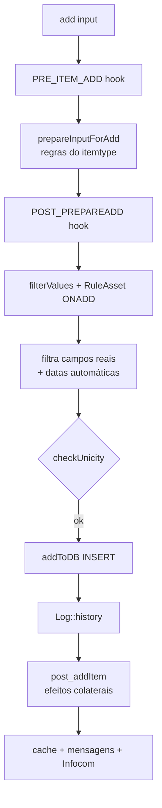

# Ciclo de vida de um item (add-update-delete)

Todo objeto que estende [[CommonDBTM (Active Record)]] passa pelo **mesmo pipeline** ao ser
criado, atualizado ou removido. Entender este fluxo é a chave para saber **onde** cada regra
de negócio é aplicada em qualquer módulo.

## Criação — `add(input, options, history)`
1. Recusa gravação se o DB for réplica (`isSlave`).
2. Trata clonagem (se `_oldID`/`id` presentes e há `clone()`).
3. Guarda `$this->input`; marca `_no_history` conforme `history`.
4. **Hook** `PRE_ITEM_ADD` (plugin pode alterar input).
5. **`prepareInputForAdd()`** — validação e regras de negócio específicas do itemtype.
6. **Hook** `POST_PREPAREADD`.
7. `filterValues()` — sanitização/segurança.
8. `assetBusinessRules(RuleAsset::ONADD)` — motor de regras (assets).
9. Copia para `$this->fields` **apenas** chaves que são colunas reais (as `_`-prefixadas
   são descartadas da persistência); auto-preenche `date_creation`/`date_mod`.
10. `checkUnicity()` → **`addToDB()`** (INSERT).
11. Se `dohistory`: `Log::history(... HISTORY_CREATE_ITEM)`.
12. **`post_addItem()`** — efeitos colaterais (relacionamentos, notificações, etc.).
13. Invalida cache de listas, mensagens de UI, auto-cria Infocom quando aplicável.

## Atualização — `update(input, history, options)`
Análogo, via `prepareInputForUpdate()` → cálculo de `$updates`/`$oldvalues` →
`updateInDB()` → `Log::history` (por campo alterado) → `post_updateItem()`.

## Remoção — `delete()` / `restore()` / purge
`delete()` faz **soft-delete** (flag `is_deleted`) por padrão; `force=true` remove de fato;
`restore()` reverte o soft-delete. Purge remove definitivamente e dependências.

Ver diagrama ampliado em [[Ciclo de vida CommonDBTM (view)]].

> [!note] Ganchos de regra de negócio
> Ao extrair requisitos de qualquer módulo, procure a lógica em `prepareInputForAdd`,
> `prepareInputForUpdate`, `post_addItem`, `post_updateI