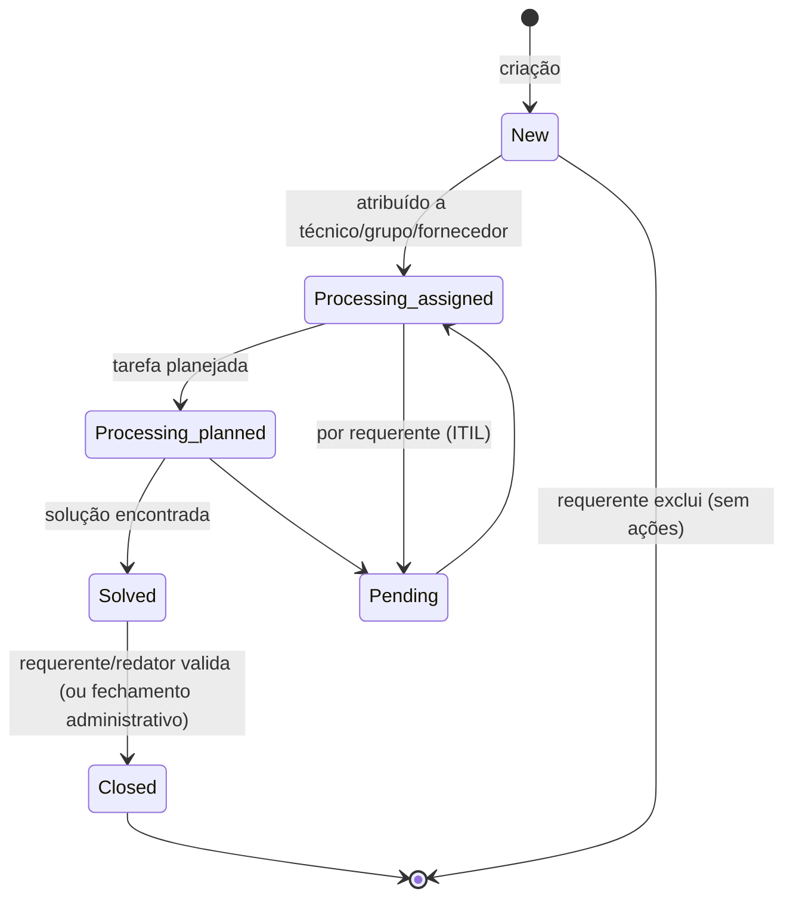

# Ciclo de vida do ticket (visão do usuário)

O ciclo de vida é definido a **nível de perfil**, numa matriz de ciclo de vida (menu **Administration > Profiles**), que também pode ocultar status por perfil.

## Tipos
Todo ticket é **incident** ou **request** (campo *Type*). O tipo governa ações (regras de negócio, templates, gestão de problemas) e a lista de categorias disponíveis.

## Status (fixos, ITIL)
Seis status, **não parametrizáveis nem modificáveis**: **New**, **Processing (assigned)**, **Processing (planned)**, **Pending**, **Solved**, **Closed**.

## Máquina de estados

> [!note] Regras de transição
> - O **técnico** pode mudar o status a qualquer momento, em especial para **Pending** — mas o ITIL recomenda que o Pending seja acionado **pelo requerente** (ex.: pedido incompleto ou indisponibilidade).
> - O **requerente** pode **excluir** o ticket enquanto estiver em **New** e nenhuma ação tiver ocorrido.
> - Ver [[Fechamento automático e administrativo de tickets]] (E1) para a transição Solved → Closed sem validação.

## Priorização
A prioridade é calculada automaticamente por matriz a partir da **urgência** (definida pelo requerente) e do **impacto** (avaliado pelo técnico). Ver [[Priorização (urgência × impacto)]].

## Ver também (código)
- [[Ciclo de vida de um Ticket (máquina de estados)]] · [[Ticket]] · [[CommonITILObject (base de service desk)]]
