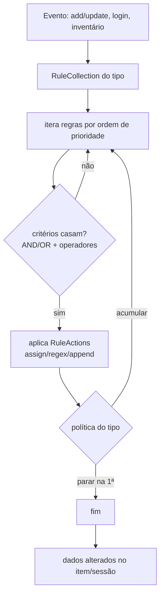

# Execução de uma regra (criteria → action)

Como a `RuleCollection` processa as regras de um tipo (deriva de [[Motor de Regras (engine)]]).

Operadores de critério incluem igualdade, contém, começa/termina, regex (`FIND`), existência e
**sob/na árvore** (`UNDER`) para entidades e localizações ([[EV-1-031 · Motor de regras Rule RuleCollection Criteria Action|EV-1-031]]).
