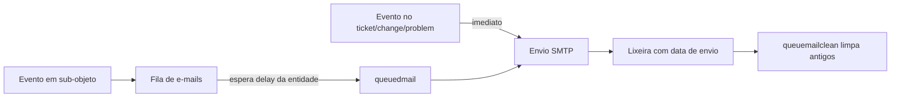

Fluxo de uma notificação de e-mail que passa pela fila.

## Passos
1. Um evento em um **sub-objeto** (follow-up, tarefa, pedido de validação…) gera uma notificação e a **coloca na fila** (`glpi_queuednotifications`). Eventos no próprio ticket/change/problem (ex.: mudança de impacto) são **enviados imediatamente**, sem fila.
2. A entrada aguarda o **delay** configurado na entidade (ex.: 20 min → data de envio = criação + 20 min). Isso consolida múltiplas modificações rápidas em uma só notificação.
3. A ação automática **`queuedmail`** envia os e-mails pendentes cuja data de envio chegou.
4. Enviada, a entrada é movida para a **lixeira** com a data de envio (uma entrada por destinatário).
5. A ação automática **`queuemailclean`** limpa a fila, mantendo apenas registros recentes.

> [!note] Ponte doc×código
> Detalha a etapa de fila do código [[Fluxo de notificação (event → fila → envio)]]. Ver [[Fila de e-mails (mailqueue)]], [[Campos de notificação e alarmes da entidade]] e [[Ações Automáticas (CronTask)]].
