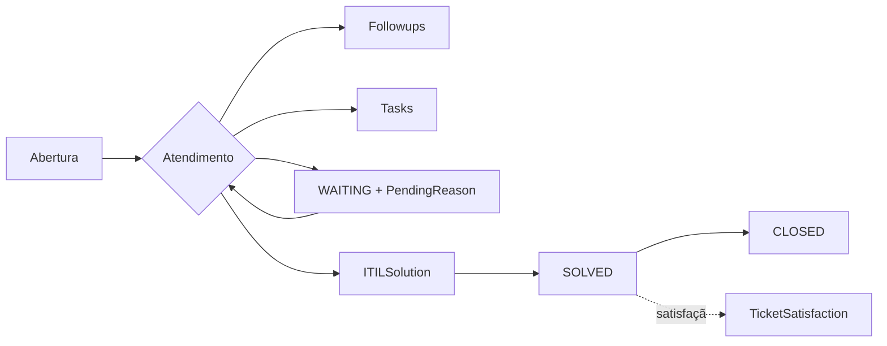

# Fluxo de followups, tarefas e solução

Durante o atendimento, o objeto ITIL acumula artefatos-filhos que compõem a **timeline**
(todos herdam de `CommonDBChild`, ligados ao objeto-pai):

- **Followup** (`ITILFollowup`) — comentário/acompanhamento; pode ser privado ou público
  (visível ao solicitante). Não muda o status por si só.
- **Task** (`CommonITILTask`) — tarefa com responsável, categoria, **duração** e agenda
  (planejável); pode colocar/tirar o objeto de PLANNED.
- **Pendência** — ao entrar em WAITING, associa-se um `PendingReason` (motivo padronizado),
  possivelmente com reativação automática após prazo.
- **Solution** (`ITILSolution`) — solução proposta; ao ser aplicada, leva o objeto a SOLVED
  (e pode virar artigo na base de conhecimento).

Cada artefato passa pelo [[Ciclo de vida de um item (add-update-delete)]] e gera histórico
e notificações aos [[Modelo de Atores ITIL|atores]].
