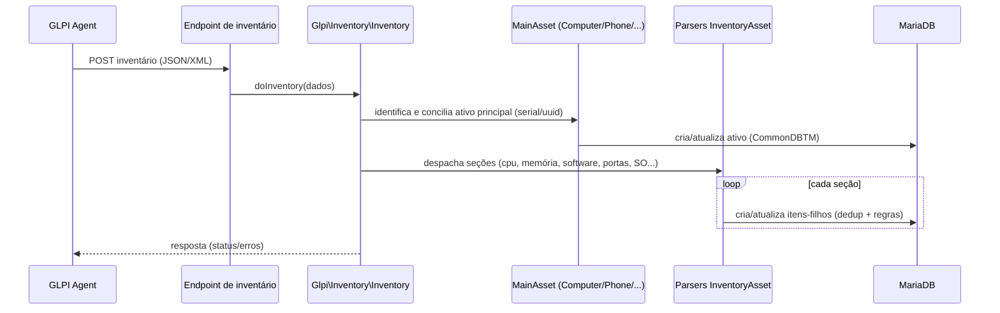

# Fluxo de inventário nativo

Sequência do processamento de um inventário recebido de um agente (deriva de
[[Inventário automático (processo)]] e [[EV-1-021 · Inventário nativo orquestra parsers InventoryAsset|EV-1-021]]).

Cada escrita passa pelo [[Ciclo de vida de um item (add-update-delete)]] e respeita entidade,
histórico e regras de importação.
