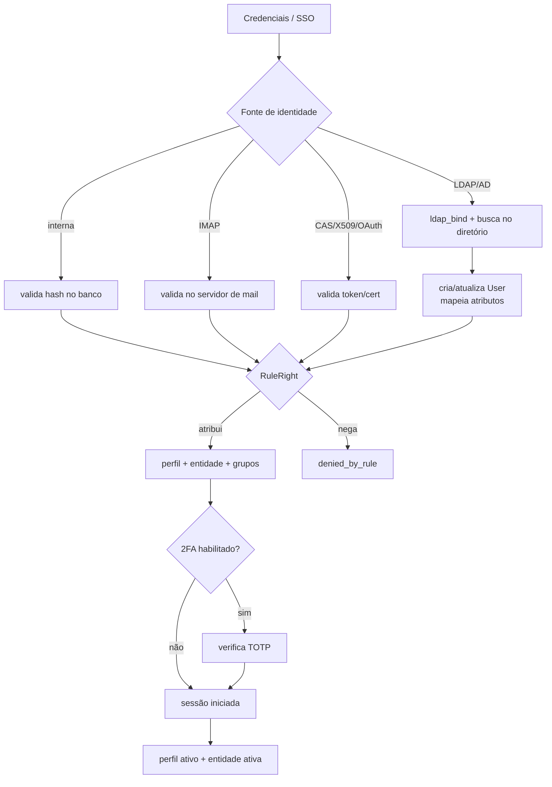

# Fluxo de login e provisionamento

Deriva de [[Autenticação (Auth)]] e [[Tipos de Regra|RuleRight]].

```mermaid
flowchart TD
    A[Credenciais / SSO] --> B{Fonte de identidade}
    B -- interna --> C[valida hash no banco]
    B -- LDAP/AD --> D[ldap_bind + busca no diretório]
    B -- IMAP --> E[valida no servidor de mail]
    B -- CAS/X509/OAuth --> F[valida token/cert]
    D --> G[cria/atualiza User\nmapeia atributos]
    C --> H{RuleRight}
    E --> H
    F --> H
    G --> H
    H -- atribui --> I[perfil + entidade + grupos]
    H -- nega --> X[denied_by_rule]
    I --> J{2FA habilitado?}
    J -- sim --> K[verifica TOTP]
    J -- não --> L[sessão iniciada]
    K --> L
    L --> M[perfil ativo + entidade ativa]
```
