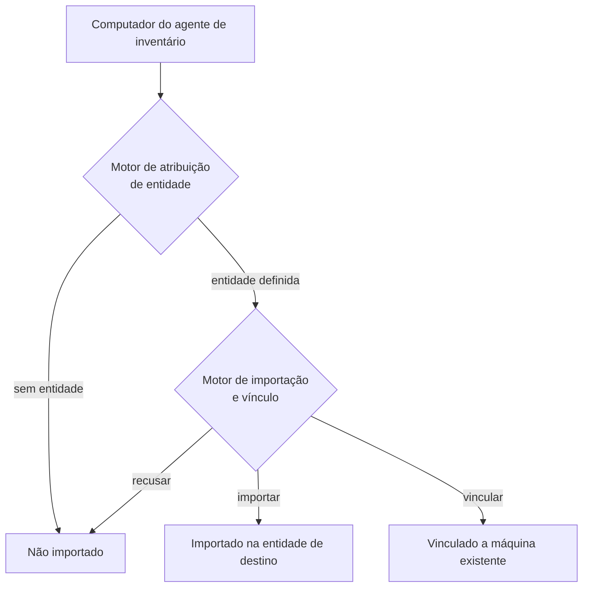

Ao chegar do agente de inventário, um computador passa por **dois motores de regras encadeados**.

## Passos
1. **Motor de atribuição de entidade**: o computador é avaliado. Se **não retorna entidade**, a máquina **não é importada**. Se retorna, o processo continua.
2. **Motor de importação e vínculo**: conforme as regras, o computador é **importado** na entidade de destino, **vinculado** a outro já presente no GLPI, ou **não importado**.

## Observações
- Ambos os motores **param na primeira regra correspondente** → ordenar bem as listas.
- A busca por máquina já presente ocorre **apenas na entidade de destino**.
- As regras de atribuição a entidade só rodam na **importação inicial**; depois disso, mudança de entidade exige **transfer** manual ou o modelo de transferência automática por inventário (aba Assets da entidade).

Ver [[Regras de atribuição de item a entidade (inventário)]], [[Regras de importação e vínculo de computadores]] e [[Fluxo de inventário nativo]].
