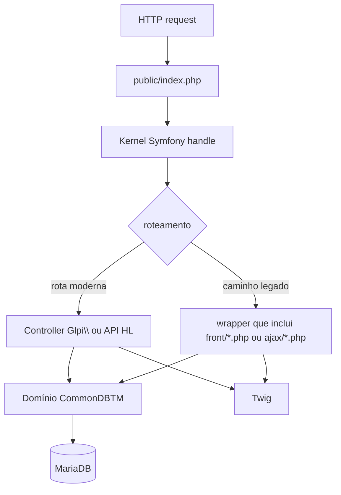

# Arquitetura de execução (request lifecycle)

Resolve [[INV-1-001 · Roteamento Symfony vs entrypoints legados]].

`public/index.php` é o **front controller único**: toda requisição é convertida em
`Symfony\Request` e entregue a `Kernel::handle()` ([[Kernel e Bootstrap]]). Não há mais acesso
direto aos scripts legados — o kernel decide o destino:

- **Rotas modernas** → controllers no namespace `Glpi\` (inclui a [[API REST e GraphQL]]).
- **Caminhos legados** (`/front/ticket.php`, `/ajax/...`) → o kernel os embrulha e executa o
  script legado, preservando compatibilidade durante a migração
  ([[ADR - Arquitetura híbrida Symfony + Active Record legado]]).
- Requisições do **agente** e da **API** entram pelo mesmo front controller.
