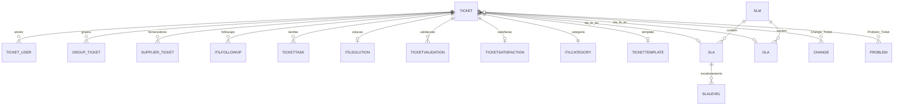

# Modelo de dados do Service Desk (view)

Relações centrais em torno do [[CommonITILObject (base de service desk)]] (usando Ticket
como exemplo).

```mermaid
erDiagram
    TICKET ||--o{ TICKET_USER : atores
    TICKET ||--o{ GROUP_TICKET : grupos
    TICKET ||--o{ SUPPLIER_TICKET : fornecedores
    TICKET ||--o{ ITILFOLLOWUP : followups
    TICKET ||--o{ TICKETTASK : tarefas
    TICKET ||--o| ITILSOLUTION : solucao
    TICKET ||--o{ TICKETVALIDATION : validacoes
    TICKET ||--o| TICKETSATISFACTION : satisfacao
    TICKET }o--|| ITILCATEGORY : categoria
    TICKET }o--o| TICKETTEMPLATE : template
    TICKET }o--o| SLA : sla_ttr_tto
    TICKET }o--o| OLA : ola_ttr_tto
    SLM ||--o{ SLA : contem
    SLM ||--o{ OLA : contem
    SLA ||--o{ SLALEVEL : escalonamento
    TICKET }o--o{ CHANGE : Change_Ticket
    TICKET }o--o{ PROBLEM : Problem_Ticket
```
