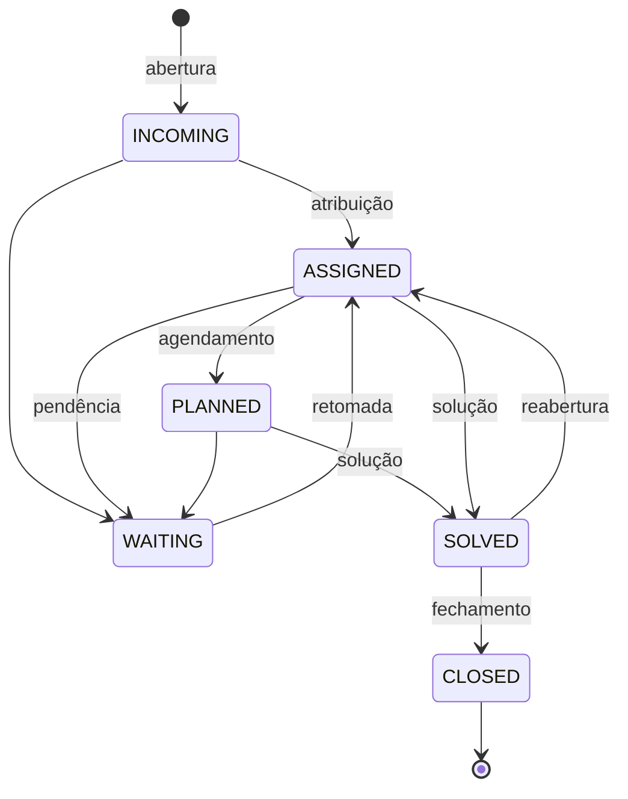

# Máquina de estados do Ticket (view)

Deriva de [[Ciclo de vida de um Ticket (máquina de estados)]]. Transições sujeitas à matriz
por perfil.

```mermaid
stateDiagram-v2
    [*] --> INCOMING: abertura
    INCOMING --> ASSIGNED: atribuição
    INCOMING --> WAITING
    ASSIGNED --> PLANNED: agendamento
    ASSIGNED --> WAITING: pendência
    PLANNED --> WAITING
    WAITING --> ASSIGNED: retomada
    PLANNED --> SOLVED: solução
    ASSIGNED --> SOLVED: solução
    SOLVED --> CLOSED: fechamento
    SOLVED --> ASSIGNED: reabertura
    CLOSED --> [*]
```
