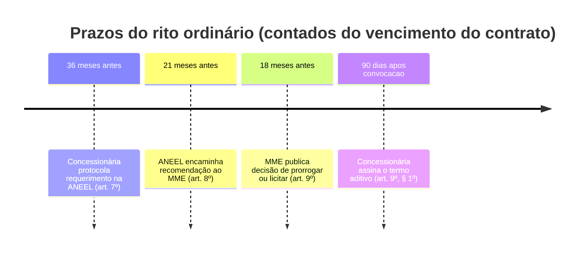

# Capítulo III — Da Instrução Processual (arts. 7º a 12)

Dois ritos coexistem: o **ordinário** (arts. 7º a 9º), com prazos contados regressivamente do vencimento do contrato, e o de **antecipação dos efeitos da prorrogação** (arts. 10 a 12), aberto por janela curta após a publicação da minuta.

## Rito ordinário — contagem regressiva do termo contratual

| Dispositivo | Regra |
|---|---|
| art. 7º | Requerimento dirigido à ANEEL com **no mínimo 36 meses** de antecedência, com comprovação de regularidade fiscal, trabalhista e setorial e qualificações jurídica, econômico-financeira e técnica |
| art. 7º, § 1º | Quem já havia requerido antes do Decreto **ratifica em 30 dias** da publicação da minuta, com concordância integral |
| art. 7º, § 2º | Perder o prazo do requerimento **implica licitação** da concessão |
| art. 8º | ANEEL recomenda ao MME com **mínimo de 21 meses** de antecedência, avaliando os critérios do art. 2º |
| art. 9º | Decisão do MME publicada até **18 meses** antes do termo (art. 4º, § 4º, da Lei 9.074/1995) |
| art. 9º, § 1º | Assinatura do termo aditivo em **90 dias** da convocação |
| art. 9º, § 2º | O **MME** celebra o termo aditivo |

## Rito de antecipação (arts. 10 a 12)

| Dispositivo | Regra |
|---|---|
| art. 10, caput | Requerimento de antecipação em **30 dias** da publicação da minuta do termo aditivo |
| art. 10, § 1º | ANEEL aprova e divulga a minuta em **120 dias** da publicação do Decreto |
| art. 10, § 2º | Recomendação da ANEEL ao MME em **60 dias** do requerimento |
| art. 10, § 3º | Decisão do MME informada em **30 dias** da recomendação |
| art. 10, § 4º | Assinatura em **60 dias** da convocação *(prazo menor que os 90 dias do rito ordinário)* |

## Art. 11 — quem não passa no teste na antecipação

| Falha | Remédio |
|---|---|
| Gestão econômico-financeira | [[Aporte de Capital na Concessão\|Aporte de capital]] na forma e montante da ANEEL (inciso I) |
| Continuidade do fornecimento | Propor ao MME, em **30 dias** da publicação da minuta, um [[Plano de Resultados]] com ações e investimentos de base anual até o marco de 18 meses antes do termo contratual (inciso II) |

- § 1º — o MME pode fixar **condições adicionais e metas específicas** para o plano de resultados.
- § 2º — o termo aditivo conterá cláusula prevendo prorrogação no advento do termo vigente, **vinculada** ao atendimento dos critérios e demais condições.

**Art. 12** — os prazos dos arts. 8º e 9º podem ser flexibilizados para concessões vincendas em **2025 e 2026**, se a concessionária tiver manifestado concordância com as condições de prorrogação.

---
Ref: [[Decreto 12.068-2024]], [[Requerimento de Prorrogação da Concessão de Distribuição]], [[Plano de Resultados]]
