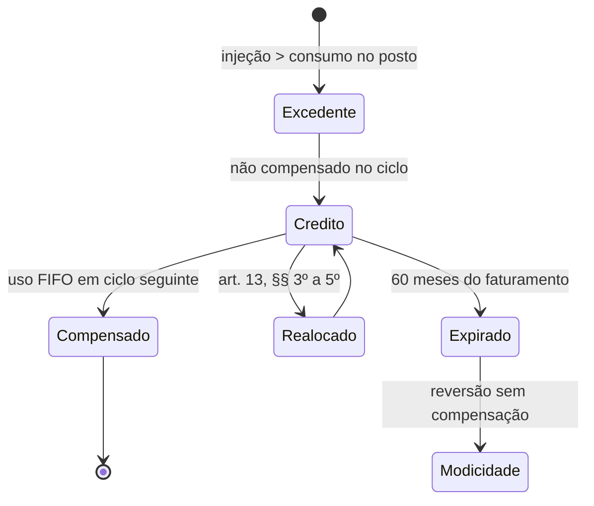

> [!abstract]
> Excedente de energia elétrica **não compensado** pela unidade consumidora participante do SCEE no ciclo de faturamento em que foi gerado, registrado e alocado para uso em ciclos subsequentes, ou vendido à concessionária ou permissionária em que está conectada a central consumidora-geradora.

## Conceito

O crédito é energia estocada em conta, não dinheiro. O art. 13, § 1º é explícito: os créditos são determinados **em termos de energia elétrica ativa** e sua quantidade **não se altera com a variação das tarifas**. O consumidor-gerador assume, portanto, risco de quantidade — não de preço.

O prazo de **60 meses** é o principal mecanismo de disciplina do sistema: impede acumulação indefinida e devolve à coletividade, via modicidade tarifária, o que não foi consumido.

## Base normativa

| Norma | Dispositivo | O que estabelece |
|---|---|---|
| Lei 14.300/2022 | art. 1º, VI | Define crédito de energia elétrica |
| Lei 14.300/2022 | art. 13, caput | Validade de **60 meses**; expirados revertem à modicidade tarifária sem compensação |
| Lei 14.300/2022 | art. 13, § 1º | Créditos em energia ativa; não variam com a tarifa |
| Lei 14.300/2022 | art. 13, § 2º | **FIFO** — usam-se sempre os créditos mais antigos |
| Lei 14.300/2022 | art. 13, § 3º | No encerramento da relação contratual, mantidos em nome do titular; realocáveis a outra UC do mesmo titular na mesma distribuidora |
| Lei 14.300/2022 | art. 13, § 4º | Não solicitar alocação em **30 dias** implica realocação automática para a UC de maior consumo |
| Lei 14.300/2022 | art. 13, § 5º | Em múltiplas UCs ou geração compartilhada, o titular pode pedir a distribuição do saldo com **30 dias** de antecedência do fim da relação contratual |

## Ciclo de vida

## Características

- Denominado em **energia ativa (kWh)**, imune à variação tarifária
- Validade de **60 meses** contados do faturamento em que foi gerado
- Consumo em ordem **FIFO** (mais antigos primeiro)
- Sobrevive ao encerramento da relação contratual, com regras de realocação
- Limitado pelo **valor mínimo faturável** (art. 16): a compensação não pode zerar a fatura

## Veja também

- [[Excedente de Energia Elétrica]]
- [[Sistema de Compensação de Energia Elétrica (SCEE)]]
- [[Alocação e Uso de Créditos de Energia no SCEE]]
