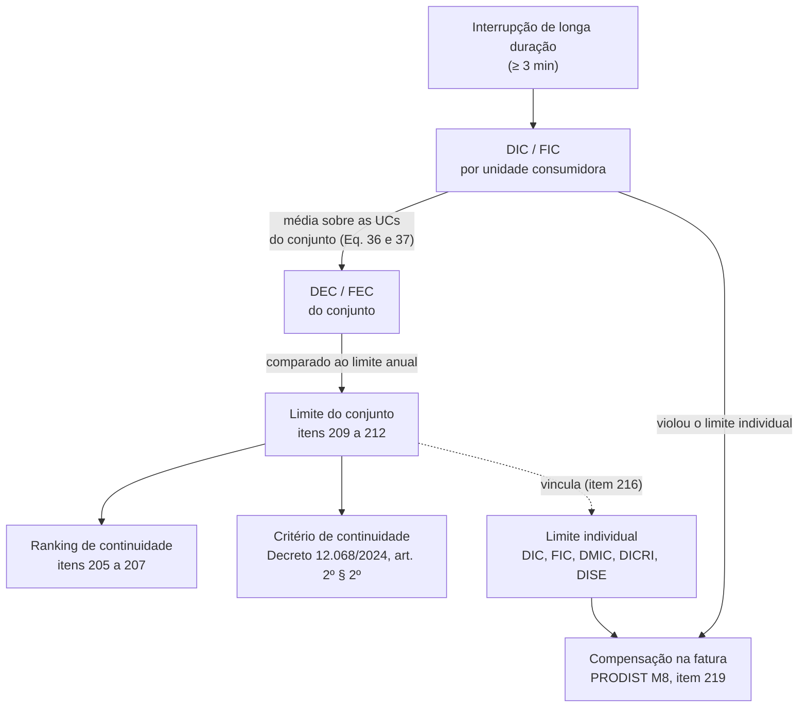

> [!abstract]
> Média da duração (DEC) e da frequência (FEC) das interrupções de longa duração por unidade consumidora, apurada para cada **conjunto de unidades consumidoras** e comparada a um limite anual que a ANEEL fixa conjunto a conjunto na revisão tarifária.

## Conceito

DEC e FEC são a régua com que o regulador mede a qualidade do serviço de distribuição. Não medem uma interrupção: medem quanto tempo, e quantas vezes, o **consumidor médio de um recorte geográfico** ficou sem energia ao longo de um período.

O recorte é o **conjunto de unidades consumidoras** — agrupamento definido pela distribuidora e homologado pela ANEEL, que é a unidade de apuração de toda a qualidade do serviço. Isso é o que distingue a camada coletiva da individual: o mesmo evento de interrupção alimenta o DIC de cada consumidor atingido e, por média, o DEC do conjunto.

A distinção não é acadêmica. É dela que decorre a consequência: a violação do limite **individual** gera [[Compensação por Violação dos Limites de Continuidade]] automática na fatura; a violação do limite **coletivo** não gera compensação nenhuma — alimenta o ranking de continuidade e o critério de [[Serviço Adequado (Distribuição)]].

## Base normativa

| Norma | Dispositivo | O que estabelece |
|---|---|---|
| PRODIST Módulo 8 | item 176, Eq. 36 e 37 | DEC = Σ DIC(i) ÷ NUC; FEC = Σ FIC(i) ÷ NUC, apurados por conjunto |
| PRODIST Módulo 8 | item 177 | Só entram interrupções de **longa duração** — iguais ou maiores que 3 minutos |
| PRODIST Módulo 8 | item 186 | Parcelas comparadas ao limite: origem interna ao sistema de distribuição, fora de Dia Crítico |
| PRODIST Módulo 8 | item 187 | Situações expurgadas da apuração (falha na instalação do consumidor, Dia Crítico, entre outras) |
| PRODIST Módulo 8 | item 191 | Parcelas expurgáveis apuradas em separado (emergência, dia crítico, origem externa) |
| PRODIST Módulo 8 | item 202, Eq. 38 a 40 | **Agregação temporal ponderada** pelo número de unidades consumidoras de cada mês |
| PRODIST Módulo 8 | itens 205 a 208 | Ranking da continuidade das distribuidoras, pelo Desempenho Global de Continuidade (DGC) |
| PRODIST Módulo 8 | itens 209 a 211 | Limites anuais derivados dos atributos físico-elétricos da BDGD, por análise comparativa entre conjuntos semelhantes, fixados em resolução específica |
| PRODIST Módulo 8 | item 212 | Vigência dos limites: do ano seguinte à revisão tarifária até o ano da revisão seguinte, devendo **propiciar melhoria** dos limites globais |
| PRODIST Módulo 8 | item 213 | Conjunto subdividido ou reagrupado recebe limites com base no histórico dos conjuntos de origem |
| PRODIST Módulo 8 | item 216 | Limites individuais de DIC, DMIC, DICRI e DISE vinculados ao limite anual de DEC; limite de FIC vinculado ao de FEC |

Arquivo original: `docs/ANEEL/PRODIST/PRODIST-Modulo-08.pdf`

## Estrutura

## Características

- **Média, não caso.** Um conjunto pode estar dentro do limite com uma minoria de consumidores muito mal atendida.
- **Aditivo no tempo, com ressalva.** A agregação de meses em ano é ponderada pelo NUC mensal (item 202); com NUC estável, equivale à soma dos meses.
- **Limite relativo, não absoluto.** O limite não é uma meta de engenharia: sai de análise comparativa entre conjuntos com atributos físico-elétricos semelhantes (item 210). Conjuntos rurais extensos recebem limites mais altos.
- **Limite móvel e descendente.** O item 212 exige que a revisão propicie melhoria dos limites globais — a régua encurta a cada ciclo tarifário.
- **Vários DEC, não um.** DECip, DECxp, DECxn, DECine e outros segregam a interrupção por origem e programação; só as parcelas do item 186 entram na comparação com o limite.

## Comparação

| | Indicador **coletivo** (DEC, FEC) | Indicador **individual** (DIC, FIC, DMIC, DICRI, DISE) |
|---|---|---|
| Unidade de apuração | Conjunto de unidades consumidoras | Cada unidade consumidora |
| Natureza | Média | Caso |
| Quem fixa o limite | ANEEL, na revisão tarifária (item 211) | Derivado do limite coletivo (item 216) |
| Consequência da violação | Ranking, critério de prorrogação, eventual auto de infração | **Compensação automática na fatura** (item 219) |
| Aparece em dados abertos como | `DEC`, `FEC` e parcelas, por conjunto e mês | Agregado nas rubricas `PGUC*` e `QTUC*` de compensação |

## Dados de contexto

- [[Transgressão dos Limites Coletivos de Continuidade]] — quantos conjuntos encerram o ano acima do limite
- [[Evolução da Transgressão dos Limites de DEC e FEC (2020–2025)]] — a trajetória da conformidade
- [[A transgressão do limite coletivo não tem consequência financeira direta]] — o que acontece com quem transgride
- [[A transgressão crônica se concentra e não muda de dono]] — onde a transgressão mora

## Veja também

- [[Compensação por Violação dos Limites de Continuidade]]
- [[Serviço Adequado (Distribuição)]]

---
Ref: [[PRODIST Modulo 08]], [[Serviço Adequado (Distribuição)]]
