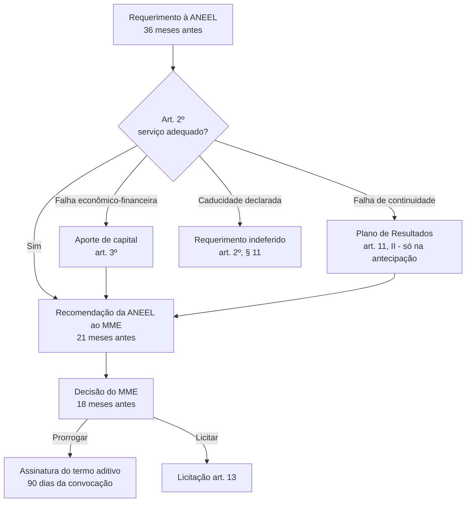

> [!abstract]
> Ato pelo qual o Poder concedente estende, por até **30 anos**, o prazo de concessão de distribuição de energia elétrica que ainda não tenha sido objeto de prorrogação, condicionado à demonstração de prestação de [[Serviço Adequado (Distribuição)|serviço adequado]] e à aceitação expressa das condições do [[Termo Aditivo ao Contrato de Concessão|termo aditivo]].

## Conceito

A prorrogação deixou de ser um direito quase automático e virou um **exame de desempenho**. O Decreto 12.068/2024 estabelece que a concessão só se estende se a concessionária provar, sobre uma janela de cinco anos, que entregou continuidade de fornecimento e sustentabilidade econômico-financeira.

A alternativa é a [[Licitação de Concessão de Distribuição|licitação]] — e o art. 7º, § 2º torna essa alternativa automática: perder o prazo de requerimento implica licitar.

Existem dois ritos: o **ordinário**, com prazos contados regressivamente do vencimento contratual; e o de **antecipação dos efeitos**, aberto por 30 dias após a publicação da minuta do termo aditivo, com prazos comprimidos.

## Base normativa

| Norma | Dispositivo | O que estabelece |
|---|---|---|
| Lei 9.074/1995 | art. 4º, § 3º e § 4º | Base legal da prorrogação e do prazo de publicação da decisão |
| Decreto 12.068/2024 | art. 1º | Prorrogação ou licitação por **30 anos** |
| Decreto 12.068/2024 | art. 2º | Condições: serviço adequado + aceitação expressa |
| Decreto 12.068/2024 | art. 3º | Aporte de capital como alternativa à falha econômico-financeira |
| Decreto 12.068/2024 | arts. 7º a 9º | Rito ordinário: 36 / 21 / 18 meses |
| Decreto 12.068/2024 | arts. 10 a 12 | Rito de antecipação |

## Fluxo

## Comparação

| | Prorrogação | [[Licitação de Concessão de Distribuição]] |
|---|---|---|
| Iniciativa | Requerimento da concessionária | Decorrência de não prorrogar ou de extinção |
| Prazo | Até 30 anos | Até 30 anos |
| Condição | Serviço adequado + aceitação do termo aditivo | Diretrizes do MME, conduzida pela ANEEL |
| Bens | Permanecem com a concessionária | Sem reversão prévia; indenização paga pelo vencedor |

## Veja também

- [[Serviço Adequado (Distribuição)]]
- [[Termo Aditivo ao Contrato de Concessão]]
- [[Caducidade da Concessão de Distribuição]]
- [[Requerimento de Prorrogação da Concessão de Distribuição]]
