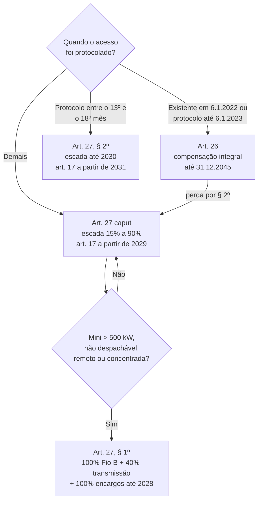

> [!abstract]
> Regime transitório que divide o universo da geração distribuída em dois: quem já estava no sistema até 6 de janeiro de 2023 mantém a compensação integral até 31 de dezembro de 2045 (art. 26); quem entrou depois passa a pagar percentual crescente das componentes tarifárias de distribuição sobre a energia compensada (art. 27).

## Conceito

Antes da Lei 14.300, a energia compensada abatia **todas** as componentes da tarifa, inclusive as que remuneram a rede física. O efeito é que o consumidor-gerador usava a rede como bateria sem pagar por ela — custo que se redistribuía aos demais consumidores.

A Lei corrige isso sem retroagir. Cria um **direito adquirido de longa duração** (art. 26) para quem investiu sob a regra anterior, e uma **escada de convergência** (art. 27) para os entrantes, até o regime permanente do art. 17.

O "Fio B" é o apelido setorial da parcela tarifária que remunera os ativos de distribuição — precisamente o que o art. 27 escalona: remuneração dos ativos, quota de reintegração regulatória (depreciação) e custo de operação e manutenção.

## Base normativa

| Norma | Dispositivo | O que estabelece |
|---|---|---|
| Lei 14.300/2022 | art. 17 | Regime permanente: incidem todas as componentes não associadas ao custo da energia, abatidos os benefícios sistêmicos |
| Lei 14.300/2022 | art. 17, § 2º | CNPE fixa diretrizes de valoração em 6 meses; ANEEL calcula em 18 meses |
| Lei 14.300/2022 | art. 26 | Direito adquirido até 31.12.2045 para existentes e para quem protocolou acesso em até 12 meses |
| Lei 14.300/2022 | art. 26, § 2º | Hipóteses de perda do direito |
| Lei 14.300/2022 | art. 26, § 3º | Prazos de início da injeção |
| Lei 14.300/2022 | art. 27 | Escada de percentuais do Fio B para os entrantes |
| Lei 14.300/2022 | art. 27, § 1º | Regime agravado para minigeração > 500 kW não despachável concentrada |
| Lei 14.300/2022 | art. 27, § 2º | Protocolo entre o 13º e o 18º mês: art. 17 só a partir de 2031 |
| Lei 14.300/2022 | art. 25 | CDE custeia temporariamente as componentes não remuneradas |

## Estrutura

## Escada do art. 27, caput

| Ano | % das componentes de remuneração de ativos, depreciação e O&M |
|---|---|
| 2023 | 15% |
| 2024 | 30% |
| 2025 | 45% |
| **2026** | **60%** |
| 2027 | 75% |
| 2028 | 90% |
| 2029+ | Regime pleno do art. 17 |

## Hipóteses de perda do direito do art. 26 (§ 2º)

| Evento | Efeito |
|---|---|
| Encerramento da relação contratual | Perde — **exceto** troca de titularidade, em que o direito segue com o novo titular |
| Irregularidade no sistema de medição atribuível ao consumidor | Perde |
| Aumento de potência protocolado após os 12 meses | Perde **apenas na parcela do aumento** |
| Descumprimento dos prazos de injeção do § 3º | Perde |

> [!question]
> O art. 17, § 2º condiciona o regime permanente à valoração dos benefícios sistêmicos da GD pelo CNPE e pela ANEEL. Esses atos foram editados dentro dos prazos de 6 e 18 meses? Sem eles, qual o abatimento efetivamente aplicado a partir de 2029?

## Dados de contexto

- [[Atendimento a Pedidos de Conexão MMGD pós-Lei 14.300 (ANEEL)]] — pedidos protocolados na janela de 12 meses do art. 26 — quem entrou no regime de transição
- [[Relação de Empreendimentos de MMGD (ANEEL)]] — `DthAtualizaCadastralEmpreend` e a data de conexão situam o empreendimento antes ou depois do marco

> [!warning] Fichado, não medido
> Os conjuntos acima estão **fichados** em `knowledge-vault/03 Datasets/`, com fonte e schema. Nenhum foi baixado e nenhum valor foi extraído — não há número aqui para citar. Quando houver, o indicador ou a série entram no `context-vault/` e são linkados daqui.

## Veja também

- [[Sistema de Compensação de Energia Elétrica (SCEE)]]
- [[Conta de Desenvolvimento Energético (CDE)]]
- [[Minigeração Distribuída]]
- [[Lei 14.300-2022 06]]
