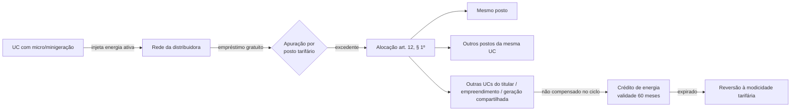

> [!abstract]
> Sistema no qual a energia ativa injetada por unidade consumidora com micro ou minigeração distribuída na rede da distribuidora local é **cedida a título de empréstimo gratuito** e posteriormente compensada com o consumo de energia elétrica ativa, ou contabilizada como crédito de energia de unidades consumidoras participantes.

## Conceito

O SCEE é o mecanismo que dá valor econômico à energia que a GD injeta na rede. A escolha jurídica que o define está em três palavras do art. 1º, XIV: **empréstimo gratuito**. Não é venda de energia — o consumidor-gerador não vira agente comercializador, não contabiliza na CCEE, não emite fatura. Ele empresta energia à rede e recebe de volta em abatimento de consumo.

Essa qualificação explica o resto do desenho: a compensação é feita **em energia ativa**, não em moeda (art. 13, § 1º); o [[Crédito de Energia Elétrica|crédito]] não varia com a tarifa; e ao expirar não gera indenização, revertendo à modicidade tarifária.

## Base normativa

| Norma | Dispositivo | O que estabelece |
|---|---|---|
| Lei 14.300/2022 | art. 1º, XIV | Define o SCEE |
| Lei 14.300/2022 | art. 9º | Quem pode aderir; veda consumidores livres e especiais |
| Lei 14.300/2022 | art. 12 | Ordem de alocação do excedente por posto tarifário |
| Lei 14.300/2022 | art. 13 | Crédito válido por 60 meses; ordem FIFO; reversão à modicidade |
| Lei 14.300/2022 | art. 16 | Compensação limitada pelo valor mínimo faturável |
| Lei 14.300/2022 | art. 19 | Bandeiras tarifárias **não** incidem sobre energia compensada |
| Lei 14.300/2022 | art. 20 | Iluminação pública pode participar |
| Lei 14.300/2022 | arts. 26 e 27 | Regimes de transição aplicáveis ao faturamento |

## Fluxo

## Quem pode e quem não pode aderir

| Pode (art. 9º) | Não pode (art. 9º, p.ú.) |
|---|---|
| UC com micro ou minigeração, local ou remota | Consumidores **livres** que exerceram a opção dos arts. 15 e 16 da Lei 9.074/1995 |
| Integrantes de [[Empreendimento com Múltiplas Unidades Consumidoras]] | Consumidores **especiais** do art. 26, § 5º, da Lei 9.427/1996 |
| Com [[Geração Compartilhada]] ou integrantes dela | |
| [[Autoconsumo Remoto]] | |

**Vedação adicional (art. 10):** a distribuidora não pode incluir consumidor cujo aluguel ou arrendamento do terreno seja pactuado em **real por unidade de energia elétrica** — trava contra o arrendamento disfarçado de venda de energia.

## Dados de contexto

- [[Relação de Empreendimentos de MMGD (ANEEL)]] — cadastro de todos os empreendimentos habilitados, com `DscModalidadeHabilitado` distinguindo as quatro modalidades e `QtdUCRecebeCredito` medindo o alcance da compensação

> [!warning] Fichado, não medido
> Os conjuntos acima estão **fichados** em `knowledge-vault/03 Datasets/`, com fonte e schema. Nenhum foi baixado e nenhum valor foi extraído — não há número aqui para citar. Quando houver, o indicador ou a série entram no `context-vault/` e são linkados daqui.

## Veja também

- [[Crédito de Energia Elétrica]]
- [[Excedente de Energia Elétrica]]
- [[Alocação e Uso de Créditos de Energia no SCEE]]
- [[Regra de Transição do Fio B]]
