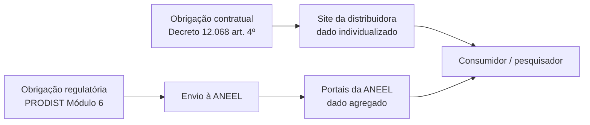

> [!abstract]
> Mapa das **obrigações de informação e das fontes de dados** do setor de distribuição. Separa duas coisas que se confundem: o que a distribuidora é contratualmente obrigada a publicar, e o que a ANEEL disponibiliza de forma agregada.

# Visão Geral

# Obrigações contratuais de publicação — Decreto 12.068/2024

| Inciso do art. 4º | O que a distribuidora deve publicar |
|---|---|
| VI e XXIII | Indicadores de duração e frequência de interrupções **efetivamente percebidas**, **sem expurgos** |
| XXV | Canal dedicado a órgão central dos Poderes Públicos municipal, distrital e estadual |
| XXVII | Disponibilidade de carga, carregamento atual e projetado, fluxos de potência e informações que facilitem a conexão, inclusive de GD |
| XXVIII | Valores de indenização nas faturas por violação de indicadores de continuidade individual |
| § 1º | Indicadores dos incisos V, VI e VII mantidos por **até 5 anos**, com meio de o usuário obter os **seus** indicadores individuais |

Ver [[Termo Aditivo ao Contrato de Concessão]] e [[Decreto 12.068-2024 02]].

# Portais e centrais de conteúdo da ANEEL

| Recurso | Conteúdo | Endereço |
|---|---|---|
| **PARA** — Portal ANEEL de Relatórios Abertos | Workspaces por área de controle, busca por TAG, metadados por relatório | `portalrelatorios.aneel.gov.br` |
| Central — Distribuição | Relatórios interativos e para download | `gov.br/aneel/.../distribuicao` |
| Central — MMGD | Painel BI de GD instalada e enquadramento ao REIDI | `gov.br/aneel/.../micro-e-minigeracao-distribuida` |
| Central — P&D e EE | Indicadores dos programas PROPDI e PROPEE | `gov.br/aneel/.../ped-e-ee` |
| Central — Tarifas | Informações econômico-financeiras e tarifas | `gov.br/aneel/.../tarifas-e-informacoes-economico-financeiras` |
| Contratos de concessão | Íntegra dos contratos de distribuição | `antigo.aneel.gov.br/contratos-de-distribuicao` |

# Proteção de dados

- Decreto 12.068/2024, art. 4º, XVI a XVIII — dados pessoais custodiados pela concessionária, LGPD, articulação com a ANPD e compartilhamento não discriminatório. Ver [[Decreto 12.068-2024 02]].

# Fontes

- [[Obrigações das Concessões e Acesso a Informações]]
- [[Decreto 12.068-2024]]
- [[PRODIST Modulo 06]] — a origem regulatória de quase toda série publicada sobre distribuição
- [[PRODIST Modulo 10]] — a BDGD, base dos dados geoespaciais da rede
- [[MOC - Distribuição Técnica (PRODIST)]]

# Perguntas de Pesquisa

> [!question]
> - ~~O **PRODIST Módulo 6** define o que a distribuidora envia à ANEEL.~~ ✅ Coletado e lido — ver [[PRODIST Modulo 06]]. Resta extrair as tabelas de periodicidade e prazo, que a extração de texto quebrou.
> - ~~A **REN 1.148/2026** instituiu relatórios mensais de prazos comerciais e o ranking anual do IASC.~~ ✅ Coletada (`docs/ANEEL/REN-1148-2026.pdf`, 12 p.) — leitura pendente.
> - A **BDGD** ([[PRODIST Modulo 10]]) é a fonte dos dados geoespaciais da rede, mas sua especificação campo a campo vive no *Manual de Instruções da BDGD* e no *DDA*, fora da norma. Localizar.
> - Que datasets do PARA são efetivamente reutilizáveis (formato aberto, licença, granularidade)? Vale um levantamento próprio em `05 Projects`.
> - Os indicadores "sem expurgos" do inciso VI são publicados por qual granularidade — conjunto elétrico, município, unidade consumidora?
