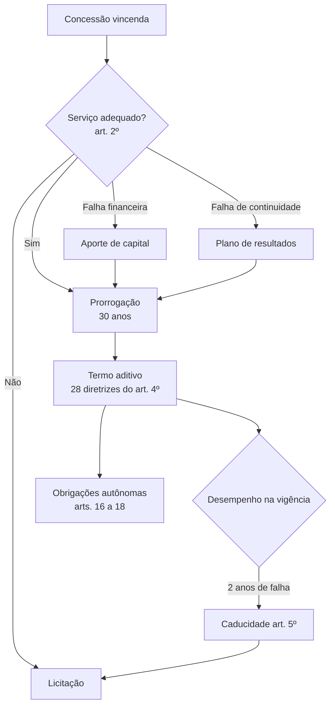

> [!abstract]
> Mapa do eixo **concessões de distribuição**: sob que condições uma concessão é prorrogada, o que o contrato passa a exigir, e o que acontece quando a concessionária falha. Base normativa central: Decreto 12.068/2024.

# Visão Geral

# Prorrogação e licitação

- [[Prorrogação da Concessão de Distribuição]]
- [[Serviço Adequado (Distribuição)]]
- [[Aporte de Capital na Concessão]]
- [[Plano de Resultados]]
- [[Caducidade da Concessão de Distribuição]]
- [[Licitação de Concessão de Distribuição]]
- [[Requerimento de Prorrogação da Concessão de Distribuição]] *(prática)*
- [[Licitação de Concessão de Distribuição Não Prorrogada]] *(prática)*

# Obrigações contratuais

- [[Termo Aditivo ao Contrato de Concessão]]
- [[Separação Tarifária e Contábil]]
- [[Compartilhamento de Infraestrutura de Postes]]
- [[Área de Elevada Complexidade ao Combate às Perdas]]
- [[Rede Nacional dos Consumidores de Energia Elétrica (Renacon)]]

# Fontes

- [[Decreto 12.068-2024]] — índice
  - [[Decreto 12.068-2024 01]] · [[Decreto 12.068-2024 02]] · [[Decreto 12.068-2024 03]] · [[Decreto 12.068-2024 04]] · [[Decreto 12.068-2024 05]]
- [[Obrigações das Concessões e Acesso a Informações]] — briefing de origem do recorte
- [[PRODIST Modulo 08]] — os indicadores de continuidade que condicionam a prorrogação
- [[MOC - Distribuição Técnica (PRODIST)]]

# Perguntas de Pesquisa

> [!question]
> - ~~Quais os **indicadores de continuidade** que operacionalizam o art. 2º, § 2º? Depende do PRODIST Módulo 8, não coletado.~~ ✅ Parcialmente resolvido: os indicadores são **DEC e FEC**, definidos em [[PRODIST Modulo 08]], itens 176 e 177, decompostos em DECip/FECip e DECind/FECind pelo item 186. Os **limites anuais** continuam em aberto — não estão no Módulo 8, mas em ato próprio da ANEEL ainda não localizado.
> - Qual o **indicador econômico-financeiro** do art. 2º, § 3º e sua metodologia de cálculo?
> - Qual a lista oficial das concessionárias que assinaram termo aditivo, e onde está consolidado o valor de investimento comprometido?
> - Que critérios a ANEEL usa para **delimitar** as áreas de elevada complexidade do art. 4º, XIV, "d" e XV?
> - A regulação conjunta ANEEL–Anatel do art. 16, § 2º foi editada?
> - Qual o ato administrativo que formaliza a exclusão do grupo Enel do pacote de renovação antecipada?
